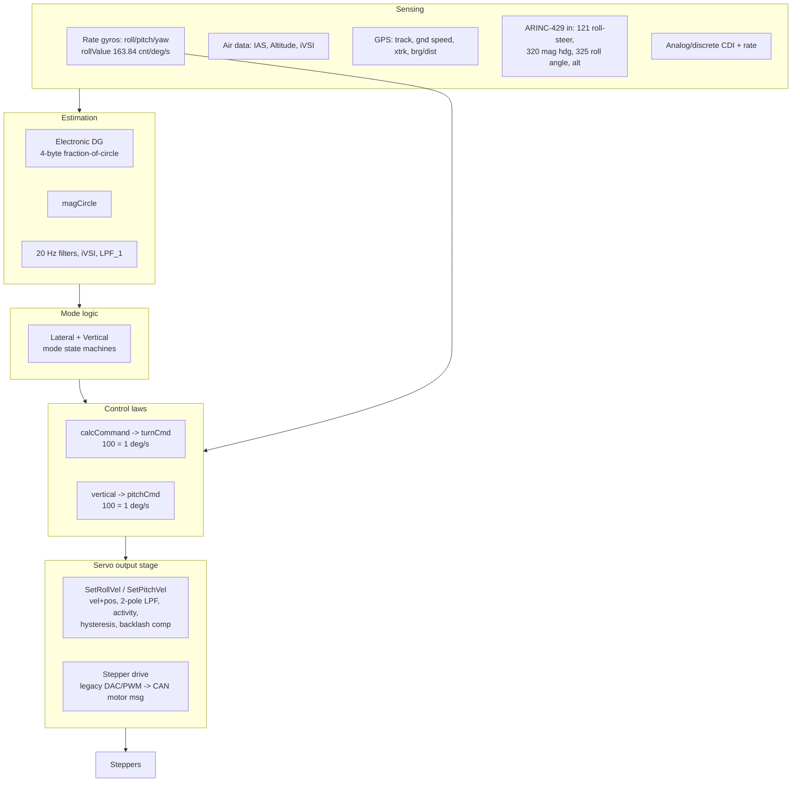
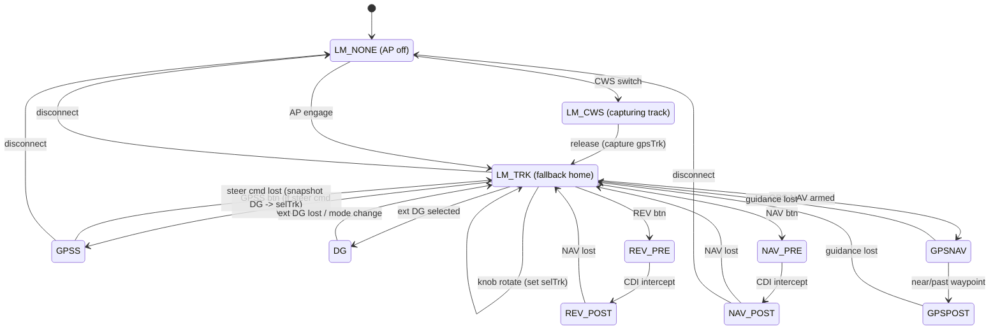

# TruTrak Vizion — Control Logic Map (v0.1)

**Status:** Working draft / reverse-engineering in progress
**Purpose:** Behavioral specification and test oracle for a modern, drop-in
replacement for the 2‑1/4" round and flat‑pack Vizion autopilot.
**Source of truth:** `TT AP Sources/` (Freescale 68HCS12 assembly, DigiFlight /
Sorcerer / Vizion‑380 lineage, version era ≈ A.43, 2003–2011).

> Citations below are `File:line` against the uploaded `TT AP Sources/` tree.
> Line numbers are from the version reviewed and should be re-verified when the
> sources are vendored into this repo.

---

## 0. Design intent for the revival (decisions locked)

These constraints frame every entry in this document. The map exists to make a
**behavioral port** possible, not a redesign.

| # | Decision | Rationale |
|---|----------|-----------|
| D1 | **Preserve the rate-based inner loop.** Command a *turn rate* / *pitch rate*, close the inner loop on a rate signal. | Proven, robust, drives a stepper-through-slip-clutch well, and is the basis of "behaves like a Vizion." |
| D2 | **Attitude is a bounded *protection* layer only** — bank/pitch limiting, envelope, wings-level recovery. Never the primary control reference. | Keeps cost low, keeps the box source-agnostic, avoids re-tuning the whole feel. |
| D3 | **Keep the stepper servo drive.** Inherit the installed plant (stepper + clutch + cable + airframe) and harness/connector. | Required for true drop-in; the output stage ports over largely intact. |
| D4 | **Talk to anything.** Preserve all existing steering/deviation inputs (RS‑232 NMEA, ARINC‑429, discrete/analog CDI). | Rate-command interoperates with any GPS/EFIS that emits a steering or deviation signal. |
| D5 | **Preserve the tuned parameter set.** Gains encode years of flight tuning. | The port must carry gains + units forward verbatim, then re-scale deliberately. |

Target processing: modern Cortex‑M4F/M7 class MCU (FPU) → retire hand-rolled
fixed-point and the assembly RTOS in favor of C + float + small RTOS/superloop,
**while preserving the control-law structure and gains**.

---

## 1. System architecture (as-built)

Hand-written assembly on a Freescale 68HCS12 (16-bit, banked/paged flash), with
a **preemptive priority RTOS** written in assembly.



**Concurrency (RTOS):** `Kernel.inc` defines a TASK struct (linked ready list,
timer wakeup list, per-task page register), semaphores (`MAX_SEM`), and
`createTask/signal/wait/setPri`. Tasks coordinate through semaphores rather than
one superloop.

| Task / ISR | Rate | Role |
|---|---|---|
| Timer ISR (`tim_int`) | ~250 Hz (4 ms) | Servo velocity loop, switch debounce, timers |
| 20 Hz filter (`Start20Hz`, `p20Hz.asm`) | 20 Hz | Low-rate filtering, GPSS buffer, mode housekeeping |
| Main loop (`mainLoop`, `DFCMain.asm`) | event/10 Hz | Mode logic, display, `calcCommand` |
| RS‑232 out (`StartOutput`) | streaming | Status/telemetry |
| GPS monitor (`GPSMonitor*.asm`) | per-sentence | Parse NMEA / protocol |
| CAN (`CAN.asm`) | per-msg | Smart-servo motor messages |
| Talker (`Talker.asm`) | event | Audio annunciation |

*Timer tick inferred from `DFC_IRQ.asm` "number of 4mSec periods" comments — verify exact prescaler.*

---

## 2. Mode model (the `mode` byte)

A single byte `mode` is bit-packed (`Vizion 380 Flat/Switches.asm:38-63`):

```
 bit 7   bits 6..4          bits 3..0
 [ E ] [ vertical mode ] [ lateral mode ]
   |         |                  |
   |         |                  +-- LATERAL_MASK = $0F
   |         +--------------------- VERTICAL_MASK = $70
   +------------------------------- entry/display-mode flag ($80)
```

### 2.1 Lateral modes (`LM_*`, sequential 0..10)

| Val | Mode | Meaning |
|----:|------|---------|
| 0 | `LM_NONE` | AP off; initial until CWS or ENT |
| 1 | `LM_CWS` | AP off; CWS pressed, capturing gpsTrk |
| 2 | `LM_TRK` | Track mode — follow selected ground track (**universal fallback**) |
| 3 | `LM_DG` | External DG/HSI — follow external turn command |
| 4 | `LM_GPSNAV` | GPS NAV, CDI centered to waypoint |
| 5 | `LM_GPSPOST` | GPS NAV, near/past waypoint |
| 6 | `LM_GPSS` | GPS Steering — follow ARINC/RS‑232 bank command |
| 7 | `LM_NAV_PRE` | Intercepting NAV CDI via calculated vector |
| 8 | `LM_NAV_POST` | NAV CDI captured, hold centered (low gain) |
| 9 | `LM_REV_PRE` | Like NAV_PRE, steer *away* from needle |
| 10 | `LM_REV_POST` | Like NAV_POST, steer *away* from needle |

Free-gyro **wing-leveler / bank-hold** is a sub-behavior of the `selTrk` path
(`DoSelTurn`) when no GPS/mag reference is present and `selBank ≠ 0`
(`DFCMain.asm:1688`).

### 2.2 Vertical modes (`VM_*`, value = index << 4)

| Mode | Meaning |
|------|---------|
| `VM_NONE` | No vertical mode |
| `VM_HOLD` | Altitude hold |
| `VM_AS_SELECT` | Climb/descend to selected alt at selected airspeed |
| `VM_VS_SELECT` | Climb/descend to selected alt at selected ft/min |
| `VM_SPEED` | VS entered manually while in hold |
| `VM_CAPTURE` | Following glideslope (GS) |
| `VM_VNAV` | Selected alt at selected distance |
| `VM_GPSS` | External unit giving pitch/vertical command (VGPSS) |

---

## 3. Lateral mode state machine

Events come from buttons/knob/timeouts via the action table
(`DFCMain.asm:383-399`): `altAction` (AP), `GPSSAction` (GPSS), `NAVAction`,
`REVAction`, `TRKAction`, `modeAction`, `rotAction` (knob turn),
`knobAction` (ENTER), `revertAction` (idle timeout), `vsUp/vsDn/HOLD/ASEL/VNAV`.



**Invariants worth preserving verbatim:**

- **TRK is the safe harbor.** Any loss of GPSS/GPS‑NAV/NAV guidance snapshots the
  current DG heading into `selTrk` and reverts to `LM_TRK`
  (`DFCMain.asm:1660-1670`, `lostLatGuidance`). The aircraft keeps flying its
  current heading rather than dropping the servo.
- **Lateral↔vertical coupling:** setting *any* lateral mode while in `VM_CAPTURE`
  (glideslope) forces vertical to `VM_HOLD` (`SetLatMode`, `DFCMain.asm:5198`).
- `SetLatMode` toggles only the lateral nibble and always clears the entry-mode
  bit — modernized code must keep mode fields independent.

---

## 4. Lateral control law (`calcCommand`, `DFCMain.asm:1233`)

Output is `turnCmd` (signed, **100 = 1 °/s**, positive = turn right),
`DFC_IRQ.asm:203`. The active branch depends on lateral mode:

1. **Selected-track / DG (`DoSelTurn`, `DoDGTurn`)**
   - Error = `selTrk − DG` in circle units.
   - Low-pass filter the error (`LPF_1`, `TrkError_LPF`), filter constant
     **scheduled on IAS** (`DGCONST` from `currIAS`, `DFCMain.asm:1454+`).
   - Add a **track-rate (derivative) term**, zeroed when |error| > 45°
     (`$2000`/`$E000` guards) to avoid nonsense during large captures.
   - Gain via lookup `TRKRATEGAINtbl`; convert to command by ×`#3584/65536`
     (≈ 7/128) → command 300 at 30° error.
2. **GPSS (`DoGPSSTurn`, `DFCMain.asm:1560`)**
   - Take external bank command `gpssRoll`, scale by `gpssGain/8`, saturate to
     ±8192.
   - Add a rate term now **airspeed-scheduled**: gain = `TAS[kt·8]/60`
     (`DFCMain.asm` 2.36B block), saturate to ±8192.
   - If ARINC label 325 (roll angle) is present, form a closed-loop bank error
     (`DoGPSSErrorTurn`).
3. **NAV / REV (LOC/VOR)** add a **rate (CDI-movement) term** beyond the bank
   limiter (`addNavRate`, `DFCMain.asm:~1990+`): LOC uses `locRateGain`; VOR uses
   4× fixed radio rate with a 1 °/s clip for station passage; REV reverses sense.
4. **Cross-track intercept geometry:** intercept angle = `arcSin(64·xTrkErr[nm]/gs[kt])`,
   `xTrkErr` clipped to 127 nm to prevent overflow (`DFCMain.asm:2794`).

**Bank limiter** (applied to the command, not attitude), `DFCMain.asm:1782-1830`:

| `MaxBank` | Turn-cmd clamp | ≈ bank @ 200 kt |
|---|---|---|
| 0 (LO) | 225 | ~22° |
| 1 (MED)| 300 | ~25° |
| 2 (HI) | 375 | ~28° |

GPSS uses a separate `gpssMaxBank` (~25°).

---

## 5. Vertical control law (summary — expand in v0.2)

- **ALT HOLD:** `altErr = selAlt − currAlt`, scaled by user `altGain` (0..8),
  combined with **iVSI** (integrated/inferred vertical speed, computed
  proportional to altitude), plus turbulence filtering → `pitchCmd`.
- **VS / VS_SELECT:** fly a selected ft/min toward selAlt.
- **VNAV:** compute required VS to reach `selAlt` at `selDist`.
- **GS CAPTURE (`VM_CAPTURE`):** arm/couple timers (`gsTimer`, `vgsTimer`),
  go-around pitch-up on leaving coupling (`gaTimer`); auto-drops to HOLD on
  lateral mode change.
- **VGPSS (`VM_GPSS`):** vertical steering from ARINC deviation.

---

## 6. Servo output stage (`SetRollVel` `DFC_IRQ.asm:1888`, `SetPitchVel`)

This is the part that ports over most directly (D3). Per axis:

1. Scale commanded velocity by **activity setting** (`latGain`/`vrtGain`, 0..12,
   log-encoded offset-by-6) via `actTable`.
2. Saturating multiply (hand-rolled overflow guard `rOVF`).
3. **2-pole low-pass** (`rv1`, `rv2`).
4. **Servo velocity limiter** (`servoLimit`).
5. **Deadzone / hysteresis:** 50-count hysteresis to suppress noisy dither.
6. **Lost-motion / backlash compensation:** on a commanded direction reversal,
   inject `16·sign(dir)·lostMotion` for ~400 ms (`rDZ_*`). This compensates gear
   backlash in the stepper/clutch drive — **must be reproduced.**
7. Result → `rollVel`/`pitchVel`; **position = ½∫velocity** (`rollPos`/`pitchPos`).
8. Emit to drive — **this build drives BOTH paths every servo tick, in parallel**
   (confirmed):
   - **Stepper (legacy, the one we need for 2‑1/4"/flat-pack):** `DoMotors`
     (`DFC_IRQ.asm:2193`, called from the ISR at `:3059`) integrates velocity →
     `rollPos`/`pitchPos`, indexes the 8-entry **gray-code phase table**
     `grayTable` (half-step aware), merges roll (high nibble) + pitch (low
     nibble) into one byte, and shifts it out over SPI0 to an **MC33291 octal
     low-side driver** that energizes the stepper phases. Includes a v2.20c
     inrush-limiting sequence on 0→1 phase transitions (`SERVO_PORT` holds the
     previous pattern for ~1 µs).
   - **CAN smart-servo (later designs):** `MotorCANMsgBuffer` populated in
     `SetRollVel` + `DoMotors`; transmitted via `CAN_TxMessage`
     (`CAN.asm:598`, called from `DFCMain.asm:1096/8789/8888`).
   - **Oldest analog drive retired:** `DAC_67Out` servo-voltage path is commented
     out; the DAC survives only for the yaw-damper output.

> **Full bit-level treatment of this stage:** see
> [`STEPPER_OUTPUT_STAGE.md`](STEPPER_OUTPUT_STAGE.md) — inner rate loop,
> velocity conditioning (activity table, LPF, limiter, hysteresis, backlash),
> position integration, gray-code phase output, MC33291 mapping, and the
> modern-hardware reproduction plan.
>
> **Backward-compat scheme (confirmed):** not a stepper-vs-CAN config switch —
> both drivers run unconditionally from the same velocity/position math each
> tick, and the airframe harness consumes whichever it is wired for. The `config`
> bits gate yaw damper / alt selector / ext-DG only, not servo type. **This is
> the correct both-worlds source version.** For the revival, replicate the
> stepper chain: **velocity → ½∫ position → gray-code phase table → phase
> driver** (MC33291 or modern equivalent).

---

## 7. Units & fixed-point dictionary

The single most portable asset. Every constant below must survive the port.

| Quantity | Representation | Notes |
|---|---|---|
| Heading / track / bearing | **circle units**: 65536 = 360° | `DG` is 4-byte fraction of circle; `BrgToCir`/`CirToHdg` convert |
| Turn / pitch command | signed, **100 = 1 °/s** | `turnCmd`, `pitchCmd` |
| Roll rate (gyro) | **163.84 counts/°/s**, signed | `rollValue` |
| Airspeed | **kt · 8** | `currIAS`, `currTAS` (since v2.16) |
| Altitude | **ft MSL**, signed (4 ms-bits = negative) | `currAlt`; `filterAlt` carries fraction |
| Baro | inHg · 100 | `baroSet` (2992 = 29.92) |
| Activity / gain | 0..12, **log offset-by-6** (6⇒×1, >6⇒×9/8, <6⇒×7/8) | `latGain`, `vrtGain` |
| Cmd→bank scale | `×3584/65536` (≈7/128) | 300 cmd ≈ 30° track error |
| GPSS saturation | ±8192 | repeated inline (candidate for one routine) |

---

## 8. Envelope protection & interlocks

The safety layer — where attitude protection (D2) will augment, not replace.

- **Airspeed envelope** (vertical modes, `DFCMain.asm:2325-2445`, `CAS_1:3702`):
  climbing won't allow IAS < `minAS` (stall guard); descending won't allow
  IAS > `maxAS` (overspeed). `absMaxAS = 399 kt`. `minAS` not enforced below
  ~50 kt actual (avoid ground false-trip).
- **MIN AS annunciation also drops the yaw damper** (`HISTORY` 2.19).
- **Gyro centering hold-off:** in TRK, when |command| > 250 for a sustained
  maneuver, set `turnTimer` (150 → ~30 s) so the roll gyro doesn't capture an
  offset mid-turn (`DFCMain.asm:1869+`). *This kludge is a prime candidate to
  replace with a real attitude reference under D2.*
- **Disconnect / CWS** paths; press-and-hold semantics (`cwsSem`, `yokeSem`).

**Modernization note (D2):** add attitude-based bank/pitch limiters and a
wings-level recovery as an outer *clamp* on `turnCmd`/`pitchCmd`, and replace the
`turnTimer` centering hack with attitude-referenced centering. Attitude never
becomes the command reference.

---

## 9. I/O & interfaces (for "talk to anything", D4)

| Interface | Direction | Content |
|---|---|---|
| RS‑232 NMEA (`GPSMonitor*.asm`) | in | GPS track, gnd speed, xtrk, brg/dist |
| ARINC‑429 (`arinc_int`) | in | 121 roll steering, 320 mag hdg, 325 roll angle, selected/baro alt |
| Analog/discrete CDI | in | LOC/VOR deviation + rate (`ATD0DR2H`) |
| External DG/HSI | in | `ATD0DR4H`, `dgGain` |
| RS‑232 status (`StartOutput`) | out | Mode/airspeed/trim telemetry |
| CAN (`CAN.asm`) | out | Smart-servo motor messages |
| Audio (`Talker.asm`) | out | Voice annunciation |
| Display + knob/buttons | i/o | UI |

---

## 10. Open questions / next revisions

- [x] **Servo drive:** RESOLVED — this build drives both the legacy gray-code
      stepper (MC33291/SPI) and CAN smart-servo in parallel every tick; harness
      picks. Confirmed correct both-worlds source. Revival targets the stepper
      chain (§6).
- [ ] Vendor the `TT AP Sources/` tree into the repo (or a ref/ subfolder) so
      citations resolve and diffs are traceable — confirm IP/licensing first.
- [ ] Full **parameter/EEPROM map** (`EEDEFINES.h`, `EEPROM.asm`): every gain,
      offset, limit with address + default + units.
- [ ] v0.2: complete **vertical** state machine + laws (VNAV, GS capture, VGPSS).
- [ ] Confirm timer-tick rate/prescaler (assumed 4 ms / 250 Hz).
- [ ] Enumerate exact button/event → transition guards from the action routines.
- [ ] Catalog target variants (Vizion 380 Flat/Round, Model 100, RV‑10) and their
      conditional-assembly differences.

## 11. Old → new mapping (guiding the port)

| As-built (68HCS12 asm) | Revival (Cortex-M4F, C) | Under decision |
|---|---|---|
| Rate gyros | MEMS IMU rate channels (better source, same law) | D1 |
| No attitude ref; `turnTimer` centering hack | AHRS attitude → protection clamps + centering | D2 |
| Hand fixed-point (circle units, kt·8) | float, but **keep gains & scaling documented** | D5 |
| Assembly RTOS + semaphores | small RTOS / timed superloop | — |
| DAC/PWM→CAN stepper drive | match installed-base drive exactly | D3 |
| Repeated inline saturation | one vetted `saturate()` | maintainability |
| Demo/`fMode` hooks in flight path | compiled out / separate build | safety |

---

*v0.1 — extracted from `TT AP Sources/`. Sections §5, §8, §10 flagged for
expansion. Treat every gain/threshold here as authoritative-to-verify against the
source before it drives code.*
