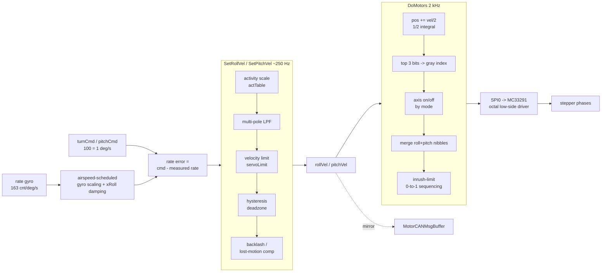

# Stepper Output Stage — Deep Dive (v0.1)

**Scope:** The complete signal chain from a control-law rate command to physical
stepper motor phases, as implemented in the Vizion 68HCS12 sources. This is the
part the revival must reproduce for the 2‑1/4" round and flat-pack targets, since
those use the legacy stepper drive (see `CONTROL_LOGIC_MAP.md` §6).

**Source:** `TT AP Sources/DFC_IRQ.asm` (drive + servo math),
`Vizion 380 Flat/Switches.asm` (port + chip mapping). Citations are `File:line`.

---

## 0. The chain at a glance



Two cascaded loops plus an open-loop integrator:

1. **Inner rate loop** (per axis, ~250 Hz): `velocity = f(cmd − measured rate)`.
2. **Velocity conditioning** (`SetRollVel`/`SetPitchVel`): activity, filtering,
   limiting, deadzone, backlash.
3. **Position integrator + phase driver** (`DoMotors`, 2 kHz): integrate velocity
   into a position accumulator, map to gray-code phases, drive the MC33291.

---

## 1. Timing / cadence

`DFC_IRQ.asm:3040-3060`:

| Layer | Rate | Notes |
|---|---|---|
| Timer ISR | **2 kHz (500 µs)** | Alternates: ODD 1 kHz `_checkTimers`, EVEN 1 kHz `_debounce` |
| `DoMotors` | **2 kHz** | Runs every timer ISR — phase update / microstep clock |
| `Read_TLC` | 2 kHz | Reads one ADC channel per tick, round-robin |
| Rate loop (`SetRollVel`/`SetPitchVel`) | **~250 Hz (4 ms)** | Driven by gyro ADC sample cadence (round-robin ÷ channels); matches the "number of 4mSec periods" comments |
| 20 Hz filter task | 20 Hz | — |

So the **phase output updates at 2 kHz** while the **rate loop closes at ~250 Hz**.
The position integrator running faster than the rate loop is what smooths the
microstep motion.

---

## 2. Inner rate loop

### 2.1 Roll (`newRollValue`, `DFC_IRQ.asm:759`)

Turn-rate autopilot. The measured roll rate is scaled with **airspeed
scheduling** and a **roll-damping factor**:

- Gyro × `85/256` below 90 kt, × `127/256` at/above 90 kt (`CPD #720` = 90 kt in
  kt·8).
- Further modulated by `xRoll` roll-damping (0..8), V2.34 (`(8+xRoll)/8` via
  `EMUL`/`LSRD`).
- An airspeed term (`×25/256` of TAS) sets the bank-for-command relationship
  (≈25° bank at ≥200 kt).
- `ROLL_GAIN = 156/256` converts the 163 count/°/s gyro into command units where
  **100 = 1 °/s** (`DFC_IRQ.asm:110`).
- Velocity ≈ `turnCmd − scaledRollRate` → `SetRollVel` (`:873`).

### 2.2 Pitch (`newPitchValue`, `DFC_IRQ.asm:~880`)

- Measured = `pitchValue − pitchAdj` (gyro minus the closed-loop pitch-trim
  adjustment), × `PITCH_GAIN = 156/256`, with rounded ÷256.
- Command = `pitchCmd`, plus **+100 (1 °/s nose-up)** while `gaTimer` (go-around)
  is active.
- Velocity = `pitchCmd − scaledPitchRate` → `SetPitchVel`.

> The inner loop is a rate loop: gyro is the feedback, command is a rate. This is
> the "rate inner loop" the revival preserves (D1). Swapping in a MEMS rate
> channel means feeding a cleaner `measured rate` here — the structure is
> unchanged.

---

## 3. Velocity conditioning (`SetRollVel` `:1888`, `SetPitchVel` `:2000`)

Identical structure per axis except where noted. Input = signed velocity, output
= `rollVel`/`pitchVel`.

### 3.1 Pitch comfort limiter (currently OFF)
Gated by `LIMITER: SET 0` — clamps pitch velocity to `−117..+183` when enabled
(`DFC_IRQ.asm:2000-2008`). Disabled in this build; note for revival.

### 3.2 Activity scaling — `actTable` (`DFC_IRQ.asm:1850`)
Velocity × `actTable[gain]`, where `gain` = `latGain`/`vrtGain` (0..36) and

```
actTable[N] = 2^((N-6)/6) × 256
```

| N | multiplier | | N | multiplier |
|--:|--:|--|--:|--:|
| 0 | 0.50× | | 18 | 4.00× |
| 6 | **1.00×** | | 24 | 8.00× |
| 12 | 2.00× | | 30 | 16.0× |
| — | — | | 36 | 32.0× |

A logarithmic "activity"/authority knob: every +6 steps doubles servo
aggressiveness. Product is saturating (overflow → clamp to ±max).

### 3.3 Multi-pole low-pass
- **Roll: 2-pole** (`rv1`, `rv2`).
- **Pitch: 3-pole** (`pv1`, `pv2`, `pv3`) — pitch gets extra smoothing.
- Each pole is a running `(x + state)/2` (a first-order IIR, α=½). States init to
  `$8000` (unsigned mid-scale) at startup (`DFC_IRQ.asm:3644-3648`).

### 3.4 Velocity limiter — `servoLimit`
Clamp to `±servoLimit`. Set once at init to **`$1FFF` (8191)** (`:3650`). Max
commanded step velocity.

### 3.5 Deadzone / hysteresis
If `|velocity| < 50` → treated as zero (suppresses dither/noise on the phases).

### 3.6 Lost-motion / backlash compensation
On a **commanded direction reversal** (sign change while `|velocity| > 50`):
- Load a countdown = **100 ticks × 4 ms = 400 ms** into `rollDir`/`pitchDir`
  (bit 7 = new direction sign).
- While counting, inject extra velocity = `16 × sign(dir) × (lostMotion & $1F)`.

This pre-winds the drive to take up gear/clutch backlash on reversals so the
control surface responds immediately. `lostMotion` (roll) / `pLostMotion` (pitch)
are EEPROM-backed (see §6).

- **Roll** clears the half-step bit (`ANDB #$FE`) — roll always full-step here.
- **Pitch** enables half-steps when `pLostMotion` bit 7 = 1 (`ORAB #1`).

Output stored to `rollVel`/`pitchVel` and mirrored to `MotorCANMsgBuffer+0/+2`
for the parallel CAN path.

---

## 4. Position integrator + phase driver (`DoMotors`, `DFC_IRQ.asm:2193`, 2 kHz)

### 4.1 Integrate velocity → position ("½ integral")
Per axis, every 2 kHz tick:

```
D = rollVel
D = ASR(D)              ; velocity / 2  (signed)  -> the "1/2 integral"
if (bit0 set) -> half-step path (keeps low position bits for odd gray indices)
rollPos += D            ; 16-bit position accumulator
```

`rollPos`/`pitchPos` are free-running 16-bit accumulators. Velocity is halved
before accumulation — hence the "position = ½∫velocity" comment (`:244`).

### 4.2 Position → gray-code phase index
The **top 3 bits of the 16-bit position** select an 8-entry phase table:

- Full-step path masks to the top 2 bits (`ANDA #%11000000` then `LSR×5`) →
  even indices {0,2,4,6} = the 4 full-step patterns.
- Half-step path skips the mask → all 8 indices, adding the 4 intermediate
  half-step patterns.

`grayTable` (`DFC_IRQ.asm:2287`), 4 phase bits per motor, gray-coded so only one
bit changes per step:

| idx | pattern (PNPN) | type |
|----:|:--------------:|------|
| 0 | `1010` | full |
| 1 | `0010` | half |
| 2 | `0110` | full |
| 3 | `0100` | half |
| 4 | `0101` | full |
| 5 | `0001` | half |
| 6 | `1001` | full |
| 7 | `1000` | half |

Interpretation: a **4-phase unipolar stepper**; the MC33291 octal (8-output)
low-side driver energizes 4 phases per motor (roll + pitch = 8).

### 4.3 Per-axis enable gating (by flight mode)
- **Roll energized only if** lateral mode ≥ `LM_TRK` (`CMPB #LM_TRK; BCC`). In
  `LM_NONE`/`LM_CWS` the roll phases are de-energized and the CAN motor bits
  cleared (`rollAxisOff`, `:2216`).
- **Pitch energized unless** `VM_NONE` (`:2237`).

This is how "AP off" releases the servo — the phases simply stop being driven.

### 4.4 Merge + output
- Roll → low nibble, pitch → high nibble of one byte.
- **Inrush limiting (v2.20c, `:2255-2278`):** to avoid simultaneous 0→1 on
  several phases (current spike), first output `newPattern AND previousPattern`
  (only bits that stay on / turn off), hold ~1 µs (`LDAB #14 / DECB` delay), then
  output the full new pattern. Previous pattern kept in `SERVO_PORT`.
- Bits are inverted (`EOR #$FF`) on the way out because MC33291 is **low-side**
  (a set output pulls the phase to ground).
- Shifted out over **SPI0** with chip-select `MC33291_CS` on port `PTH` bit 3
  (`Vizion 380 Flat/Switches.asm:172-174`).

---

## 5. Port / chip mapping (Vizion 380 Flat target)

| Symbol | Value | Meaning |
|---|---|---|
| `MC33291_PORT` | `PTH` | Chip-select port |
| `MC33291_DDR` | `DDRH` | Direction |
| `MC33291_CS` | `%00001000` (PTH.3) | Active-low CS (driven by `BCLR`/`BSET`) |
| SPI | `SPI0*` | Serial shift to the driver |
| `SERVO_PORT` | RAM byte | Shadow of last phase pattern (for inrush seq) |

*Round / other targets may remap these — confirm per target `Switches.asm`.*

---

## 6. Tunable parameters (EEPROM-backed)

| Param | EE addr | Role | Default/notes |
|---|---|---|---|
| `lostMotion` | 14 | Roll backlash takeup (0..31) | `DFCMain.asm:4148,4213` |
| `pLostMotion` | 15 | Pitch backlash (0..31); **bit 7 = half-step enable** | `:4150,4217,4290` |
| `latGain` / `vrtGain` | — | Activity/authority index 0..36 into `actTable` | set via setup UI |
| `servoLimit` | (init) | Max step velocity | `$1FFF` fixed at init |
| `ROLL_GAIN`/`PITCH_GAIN` | (const) | 156/256 gyro→cmd scale | assembled constant |
| torque | — | Servo drive torque | `DFCMain.asm:4131` (`chgTork`) |

These plus the airspeed-schedule constants (§2) are the tuning DNA — carry
forward verbatim, then rescale deliberately (D5).

---

## 7. Reproducing this on modern hardware

Recommended structure for the Cortex‑M revival (preserves behavior bit-for-bit
where it matters):

1. **Keep the two-loop + integrator structure.** Rate loop at ≥250 Hz, position
   integrator/phase update at ~2 kHz (or hand to a timer/DMA).
2. **Velocity conditioning stays in firmware** — activity table, multi-pole LPF,
   limiter, hysteresis, and especially **backlash comp**. These are the "feel"
   and must match. Port `actTable` and the ½-α IIRs directly.
3. **Phase generation — two options:**
   - *Faithful:* replicate the gray-code table + half-step + inrush sequencing,
     driving a modern octal low-side driver (MC33291 is NXP, may still be
     sourceable; else an equivalent). Lowest behavioral risk.
   - *Modernized:* generate step/dir from the position integrator and use a
     microstepping driver IC (handles phase sequencing + current control in HW).
     Simpler board, but validate that microstep detent/torque and the backlash
     takeup still feel identical. The inrush-limit trick becomes unnecessary
     (driver does current control).
4. **Preserve the mode→enable gating** (roll off below `LM_TRK`, pitch off in
   `VM_NONE`) as the servo-release mechanism.
5. **Attitude protection (D2)** clamps `turnCmd`/`pitchCmd` *upstream* of this
   whole stage — the output stage is untouched by it.

---

## 8. Open items

- [ ] Confirm exact gyro ADC channel cadence → verify the 250 Hz rate-loop
      figure (assumed from round-robin + "4 ms period" comments).
- [ ] Confirm MC33291 sourcing / pick modern equivalent; decide faithful vs.
      step/dir phase generation (§7.3).
- [ ] Map torque control (`chgTork`) fully — how drive current/torque is set.
- [ ] Round-target `Switches.asm` port map vs. Flat (may differ).
- [ ] Decide whether to re-enable the pitch comfort limiter (§3.1) in the port.

---

*v0.1 — extracted from `TT AP Sources/`. Bit-level details (gray table, masks,
inrush sequence) verified against `DFC_IRQ.asm`; timing figures marked assumed
should be re-confirmed on the bench.*
