# AHRS PFD — Pilot's User Manual

**Software version 0.1 · Hardware: Raspberry Pi Pico W + Pi Zero 2W · Display: 640 × 480 DSI**

---

## Contents

1. [Screen Overview](#1-screen-overview)
2. [Airspeed Tape](#2-airspeed-tape)
3. [Altitude Tape and VSI](#3-altitude-tape-and-vsi)
4. [Attitude Indicator](#4-attitude-indicator)
5. [Heading Tape](#5-heading-tape)
6. [Status Badges](#6-status-badges)
7. [Setting Bugs](#7-setting-bugs)
8. [Setup Menu](#8-setup-menu)
9. [Flight Profile — V-Speeds and Callsign](#9-flight-profile--v-speeds-and-callsign)
10. [Display Settings](#10-display-settings)
11. [AHRS / Sensors](#11-ahrs--sensors)
12. [Connectivity](#12-connectivity)
13. [System](#13-system)
14. [Terrain Data Download](#14-terrain-data-download)
15. [Obstacle Data Download](#15-obstacle-data-download)
16. [Demo Mode](#16-demo-mode)

---

## 1. Screen Overview

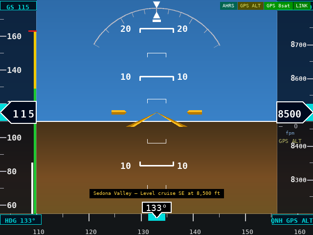

The display is divided into five fixed zones:

| Zone | Width / Height | Content |
|------|---------------|---------|
| Left tape | 74 px wide | Airspeed |
| Right tape | 82 px wide | Altitude + VSI |
| Centre AI | remainder | Attitude + synthetic terrain |
| Bottom strip | 44 px tall | Heading tape |
| Top strip | 22 px tall | Bug readouts |

Everything is rendered at 30 fps directly on the DSI framebuffer — there is no operating-system UI underneath.

---

## 2. Airspeed Tape

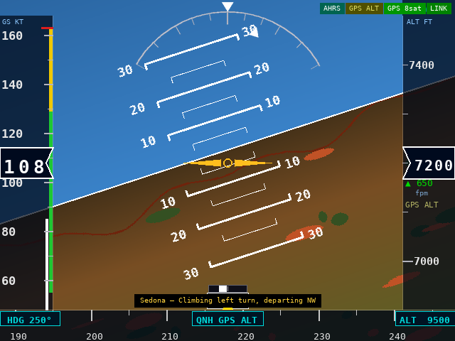

### Reading the tape

The tape scrolls so that current airspeed is always at the centred Veeder-Root drum readout.  The drum shows two-digit resolution; the tenths digit rolls smoothly so over-speed trends are obvious at a glance.

### Colour arcs (right edge of tape)

| Arc | Colour | Meaning |
|-----|--------|---------|
| White | White | VS0 – VFE — flap operating range |
| Green | Green | VS1 – VNO — normal operating range |
| Yellow | Yellow | VNO – VNE — caution / structural |
| Red line | Red | VNE — never-exceed |

The drum numerals turn **yellow** above VNO and **red** above VNE to reinforce the overspeed warning.

### GS bug (ground-speed target)

A cyan chevron marker on the tape tracks the GS bug.  The button at the **top** of the airspeed tape shows the bug value (`090` kt, etc.) or `---` when not set.  Tap it to enter a new value with the numpad.

---

## 3. Altitude Tape and VSI

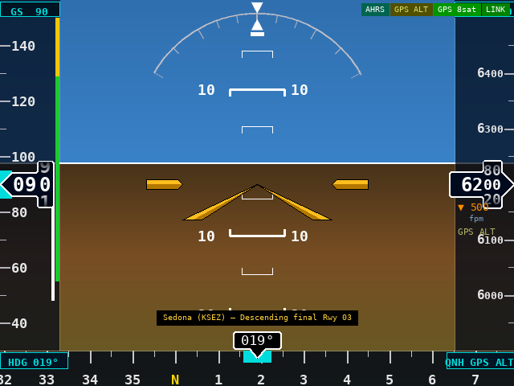

### Altitude tape

Current altitude is shown in the Veeder-Root drum on the right side.  The tape scrolls in 50 ft increments (minor ticks) with labels every 100 ft.

The **altitude bug** chevron (magenta) marks the selected target altitude.  Tap the bug button at the **top** of the alt tape to change it.  Entry is in hundreds of feet — type `85` and the display shows `8500 ft`.

### Baro setting

The cyan box at the **bottom-right** of the heading strip shows the current baro setting:

- **`29.92 IN`** — when the BME280 pressure sensor is active, in inHg (default)
- **`1013 hPa`** — when the baro unit is set to hPa in Display Settings
- **`GPS ALT`** — when no baro sensor is present; GPS altitude is used directly

Tap the box to adjust the baro setting with the numpad.  See [Section 7 — Adjusting Baro](#adjusting-baro) for entry details.

### VSI (vertical speed indicator)

A thin green / amber bar runs along the inner edge of the alt tape.  It deflects upward for climbs and downward for descents.  The scale is ±2000 fpm.  The bar turns amber above ±1500 fpm to indicate a high rate.

---

## 4. Attitude Indicator

### Synthetic vision background

When SRTM terrain tiles are loaded, the AI background shows a rendered ground/sky split derived from real elevation data.  Terrain within **500 ft** of current altitude is tinted **yellow**; terrain within **100 ft** is tinted **red**.

When no terrain data is available the background is the traditional blue-over-brown split.

### Pitch ladder

Grey pitch bars are drawn at ±5°, ±10°, ±15°, ±20°, ±30°.  The bars narrow as pitch increases, consistent with the GI-275 style.  The horizon bar is white.

### Roll arc and pointer

A graduated arc at the top of the AI shows bank angle.  A moving doghouse (inverted triangle) rides outside the arc and points to the roll scale.  A fixed doghouse inside the arc is the wings-level reference.

Tick marks are at 10°, 20°, 30°, 45°, and 60° either side.  The 45° positions are indicated by hollow triangles.

### Aircraft symbol

An amber swept-delta wing symbol sits fixed at the AI centre, always pointing toward the horizon bar.

### Slip ball

A white ball in the slip/skid indicator sits at the bottom of the AI.  Ball centred = coordinated flight.  Ball displaced = rudder correction needed.

### Terrain / obstacle proximity alert

A banner appears centred at the top of the display whenever terrain or an obstacle is within a critical clearance margin.

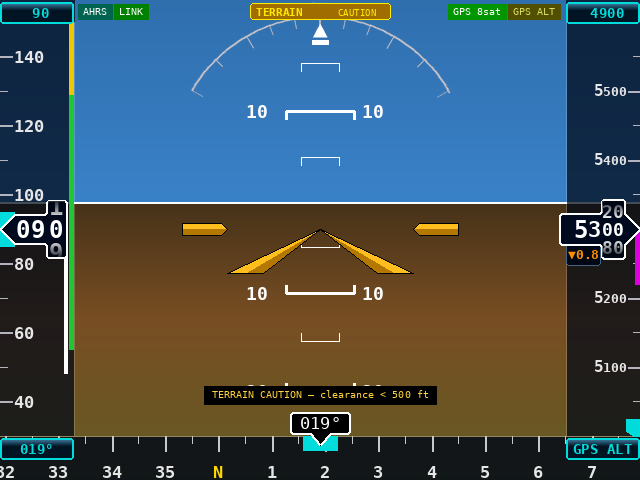

**TERRAIN  CAUTION** (amber, steady) — terrain or obstacle MSL height is within **500 ft** below aircraft altitude.

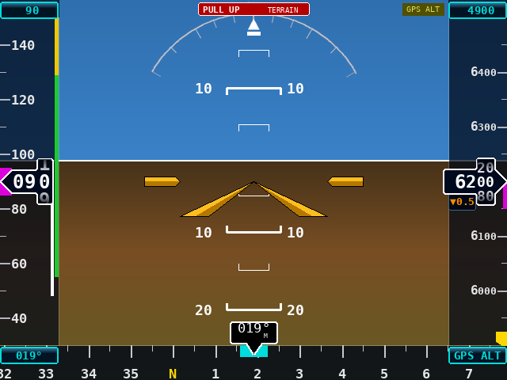

**PULL UP  TERRAIN** (red, 1 Hz flash) — terrain or obstacle MSL height is within **100 ft** below aircraft altitude.

Requires a valid GPS fix and either SRTM terrain tiles (Section 14) or obstacle data (Section 15) to be loaded.  Obstacle alerts trigger within **3 nm** of the aircraft.

---

## 5. Heading Tape

The heading tape runs across the bottom of the screen.  Current magnetic heading is shown in a white box at centre.

**Track pointer** — when GPS fix is valid, a cyan tick mark on the tape shows GPS ground track.  Drift between the heading pointer and the track tick indicates wind or crab angle.

**Heading bug** — a cyan marker on the tape tracks the HDG bug.  The button at the **bottom-left** of the heading strip shows the selected heading (`133°`) or `---°`.  Tap it to enter a new heading.

---

## 6. Status Badges

Badges appear **only when something requires attention** — the strip is blank during normal flight.

| Badge | Colour | Meaning |
|-------|--------|---------|
| `AHRS FAIL` | Red | IMU data absent or invalid |
| `NO LINK` | Red | SSE stream from Pico W is not connected |
| `NO TER` | Amber | No SRTM terrain tiles loaded — SVT shows flat ground |
| `NO OBS` | Amber | No FAA obstacle data loaded |
| `EXP OBS` | Orange | Obstacle data is more than 28 days old — update recommended |
| `GPS ALT` | Dim yellow | No barometric sensor; altitude derived from GPS |
| `NO GPS` | Dim yellow | No GPS fix |

---

## 7. Setting Bugs

The PFD has three settable bugs — altitude, heading, and ground-speed.

### Entering a value with the numpad

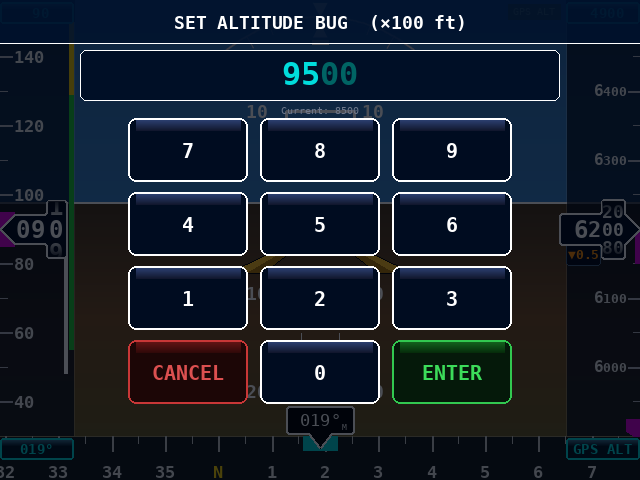

Tap the cyan readout button for the bug you want to change.  The **numpad** overlays the live PFD so you can watch the tapes while you type.

| Key | Action |
|-----|--------|
| `0–9` | Append digit to entry |
| `⌫` (backspace) | Delete last digit |
| `ENTER` | Accept and return to PFD |
| `CANCEL` | Discard and return to PFD |

**Altitude bug** entry is in hundreds of feet.  Type `85` to set `8500 ft` — the dim `00` suffix always shows the implied trailing zeros.  The current bug value is shown in the box above the keys.

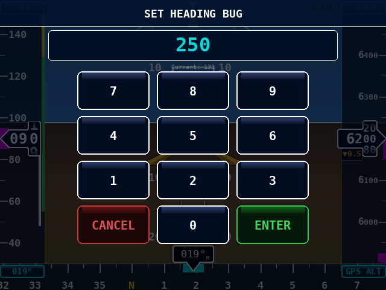

**Heading bug** is entered as a three-digit value (`0–360`).  Type `133` for 133°.

**GS bug** is entered as a whole-number knot value.  Type `090` for 90 kt.  Sub-knot precision is not needed for a speed bug, so no decimal is inserted.

### Adjusting baro

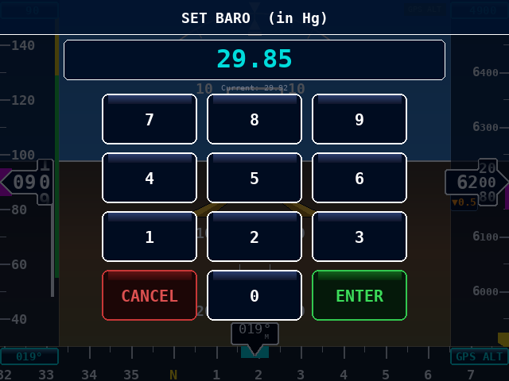

Tap the **cyan baro box** at the bottom-right of the heading strip to open the baro numpad.  Entry format depends on the pressure unit selected in Display Settings:

**inHg mode** — type four digits; the decimal is inserted automatically after the second digit:

| Typed | Displayed | Stored |
|-------|-----------|--------|
| `2` | `2` | — |
| `29` | `29` | — |
| `299` | `29.9` | — |
| `2992` | `29.92` | 1013.2 hPa |

Press `ENTER` to accept.  The altimeter corrects immediately.

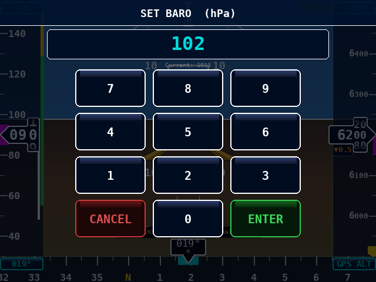

**hPa mode** — type up to four digits as a plain integer (e.g. `1013`).  No decimal is inserted.

### Tapping the tape directly

You can also tap anywhere on the **heading tape** to jump the bug directly to that bearing.  Similarly, tapping the **altitude tape** sets the bug to the tapped altitude (rounded to the nearest 100 ft).

### Clearing a bug

Enter `0` and press `ENTER` to clear any bug (the button reverts to `---`).

---

## 8. Setup Menu

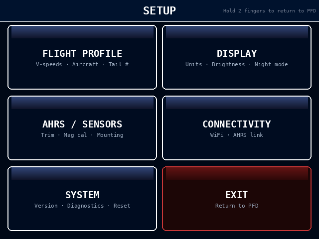

The setup menu is reached by **two-finger press-and-hold** anywhere on the PFD for at least 0.8 seconds.  The touchscreen must detect two simultaneous contact points.

The six tiles are:

| Tile | Screen |
|------|--------|
| FLIGHT PROFILE | V-speeds, aircraft callsign |
| DISPLAY | Units, brightness |
| AHRS / SENSORS | Horizon trim, mounting |
| CONNECTIVITY | AHRS URL, WiFi credentials |
| SYSTEM | Version info, terrain data, display mode |
| EXIT | Return to PFD |

Tap **EXIT** (bottom-right) at any time to return to the PFD.

---

## 9. Flight Profile — V-Speeds and Callsign


Set your aircraft's performance numbers here.  Values take effect immediately on the speed tape.

### V-speeds

| Field | Default | Meaning |
|-------|---------|---------|
| VS0 | 48 kt | Stall speed — flaps full |
| VS1 | 55 kt | Stall speed — clean |
| VFE | 85 kt | Maximum flap extension speed |
| VNO | 129 kt | Maximum structural cruising speed |
| VNE | 163 kt | Never-exceed speed |
| VA  | 105 kt | Maneuvering speed (at gross weight) |
| VY  | 74 kt | Best rate of climb |
| VX  | 62 kt | Best angle of climb |

Defaults are Cessna 172S values.

Tap any V-speed box to open the numpad and enter a new value.

### Aircraft callsign

Tap the **CALLSIGN** box.  The keyboard opens:

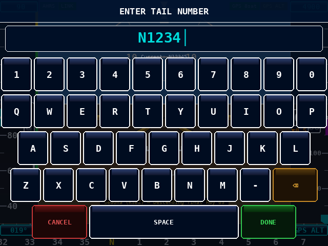

Type the tail number or callsign and tap **DONE**.  Tap **CANCEL** to discard changes.

### Reset defaults

The **RESET DEFAULTS** button at the bottom-right restores all V-speeds and callsign to the factory defaults shown above.

---

## 10. Display Settings

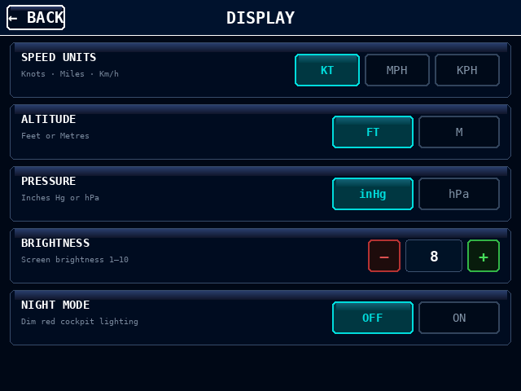

### Speed units

Select **KT** (knots), **MPH** (statute miles per hour), or **KPH** (kilometres per hour).  All V-speed arcs and the GS bug scale together with the tape.

### Altitude units

Select **FT** (feet) or **M** (metres).  The altitude tape, bug entry, and terrain clearance thresholds all convert automatically.

### Pressure units

Select **inHg** or **hPa** for the baro readout at the bottom of the heading strip.  The internal value is always stored in hPa; only the label changes.

### Brightness

Tap **−** or **+** to step the display backlight between levels 1 (minimum) and 10 (maximum).  Changes apply immediately via the sysfs backlight interface.

### Night mode

Reserved for a future software update.

---

## 11. AHRS / Sensors

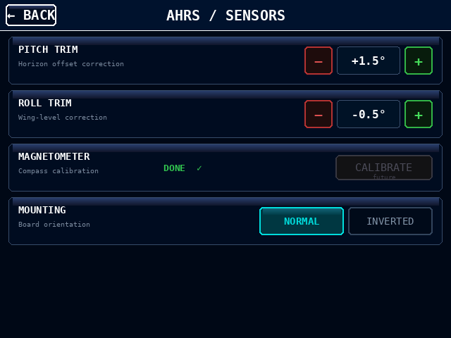

### Pitch trim

Corrects a horizon that appears pitched up or down when the aircraft is parked on level ground.  Tap **−** or **+** to adjust in 0.5° steps.  Positive values tilt the horizon bar up; negative values tilt it down.

**Procedure:** taxi to a known-level surface, note whether the horizon bar is above or below the aircraft symbol, and adjust until they align.

### Roll trim

Corrects a horizon that is tilted (wings-not-level) while the aircraft is stationary.  Tap **−** or **+** in 0.5° steps.

### Magnetometer calibration

*Reserved for a future software update.*  The CALIBRATE button is shown but not yet active.

### Mounting orientation

If the Pico W sensor board is mounted with the **label facing down**, select **INVERTED**.  The display will flip pitch and roll signs to compensate.  Select **NORMAL** for upright mounting (label facing up or toward you).

---

## 12. Connectivity

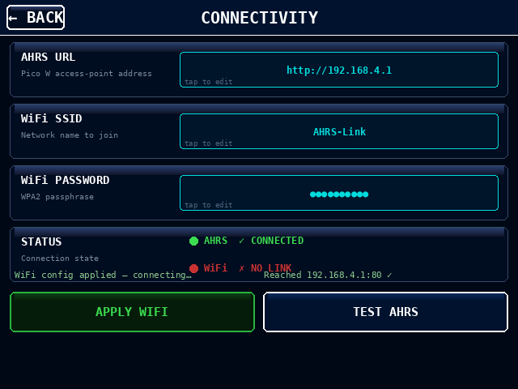

### AHRS URL

The HTTP address of the Pico W access point — default `http://192.168.4.1`.  Tap to edit with the keyboard.  The SSE stream reconnects automatically when you press **DONE**.

### WiFi SSID

The name of the network the Pi should join.  Change this if you want the Pi to connect to a home network for software updates or terrain data downloads.  Tap **APPLY WIFI** to write the configuration.

### WiFi PASSWORD

The WPA2 passphrase for the selected network.  The value is masked as `●●●●●●●●●` while displayed; it is stored in plain text in `wpa_supplicant.conf`.

### Status indicators

- **AHRS ✓ CONNECTED** / **✗ NO LINK** — live SSE stream health, updated every frame
- **WiFi ✓ CONNECTED** / **✗ NO LINK** — current association status, polled every 5 seconds

### APPLY WIFI

Writes `/etc/wpa_supplicant/wpa_supplicant.conf` with the new SSID and password, then calls `wpa_cli reconfigure` to switch networks immediately.  Requires the PFD to be running with `sudo`.  A confirmation or error message appears below the button.

### TEST AHRS

Attempts a TCP connection to the AHRS URL on port 80.  If successful, the SSE client reconnects to the new URL.  A success or failure message appears to the right.

---

## 13. System

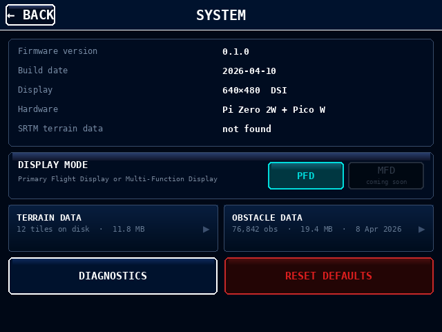

### Information panel

Shows firmware version, build date, display resolution, hardware platform, and terrain data status.

### Display mode

Switch between **PFD** (Primary Flight Display) and **MFD** (Multi-Function Display).  MFD is a planned future mode — the button is shown but not yet active.

### Terrain data / Obstacle data

Two side-by-side tiles in the data row:

| Tile | Status | Action |
|------|--------|--------|
| **TERRAIN DATA** | Tile count and disk usage | Tap to open the terrain downloader (Section 14) |
| **OBSTACLE DATA** | Obstacle count and disk usage | Tap to open the obstacle downloader (Section 15) |

### Buttons

| Button | Action |
|--------|--------|
| DIAGNOSTICS | Reserved for future use |
| RESET DEFAULTS | Resets all V-speeds, display, and AHRS settings to factory defaults |

---

## 14. Terrain Data Download


SRTM elevation tiles provide the ground texture behind the attitude indicator.  Without tiles the AI shows a plain blue/brown split.

Tiles are stored in `pi_display/data/srtm/` as `.hgt` files (1° × 1° grid, ~1 MB each).

### Downloading a preset region

Six preset regions are offered:

| Region | Coverage |
|--------|----------|
| US Southwest | AZ · NM · NV · UT · CO |
| US Pacific | CA · OR · WA |
| US Southeast | FL · GA · AL · NC · SC |
| US Northeast | NY · PA · New England |
| Alaska | Southern AK corridor |
| Canada | AB · BC · SK · ON |

Tap the region button to start the download.  The download runs in the background while the progress bar updates.

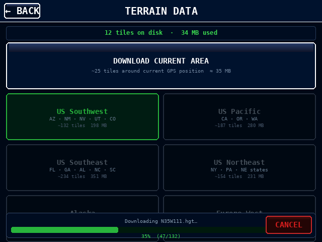

The display shows:
- Region name and tile currently being fetched
- Progress bar and tile count (`47 / 132`)
- Elapsed time

Tap **CANCEL** to abort.  Already-downloaded tiles are kept; the download can be restarted later and will skip tiles already on disk.

### Current area

**CURRENT AREA** downloads the ±2° square around the aircraft's current GPS position (approximately 240 × 220 nm in the US).  Requires a valid GPS fix.

### WiFi requirement

The Pi must be connected to an internet-reachable network (not the Pico W AP) to download terrain.  Use the Connectivity screen to switch to your home WiFi, then come back here to download, then switch back to the Pico W AP for flight.

---

## 15. Obstacle Data Download

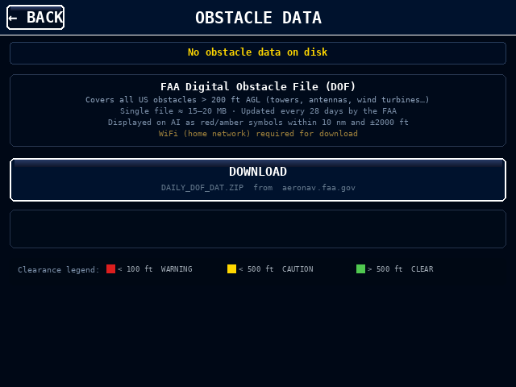

The FAA Digital Obstacle File (DOF) adds tower, antenna, and wind-turbine symbols to the synthetic vision display.  Obstacles within **10 nm** of the aircraft and within **±2000 ft** of current altitude are shown.

Data is stored in `pi_display/data/obstacles/` as `DAILY_DOF_DAT.DAT` (~15–20 MB) plus a parsed binary cache.

### Downloading

Tap **OBSTACLE DATA** on the System screen to open this screen.  The information panel summarises coverage, file size, and update frequency.

Tap **DOWNLOAD** (or **UPDATE** if data is already present) to fetch `DAILY_DOF_DAT.ZIP` from `aeronav.faa.gov`.

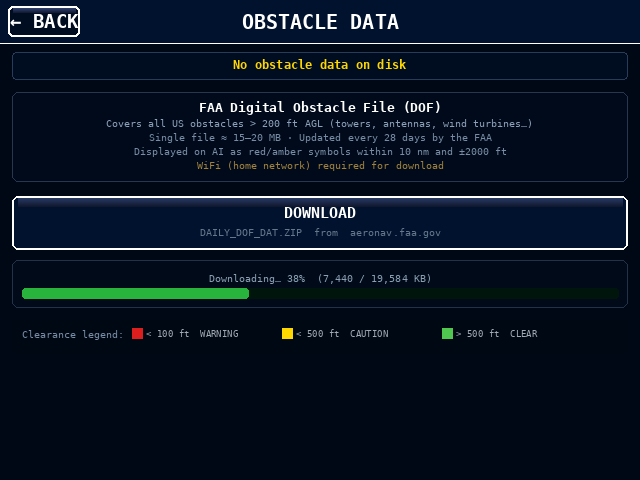

The progress bar updates as the file downloads.  After the download completes the file is extracted and parsed automatically — this takes a few seconds and is shown as a "Parsing…" status.

Tap **CANCEL** to abort the download.  No partial data is written to disk.

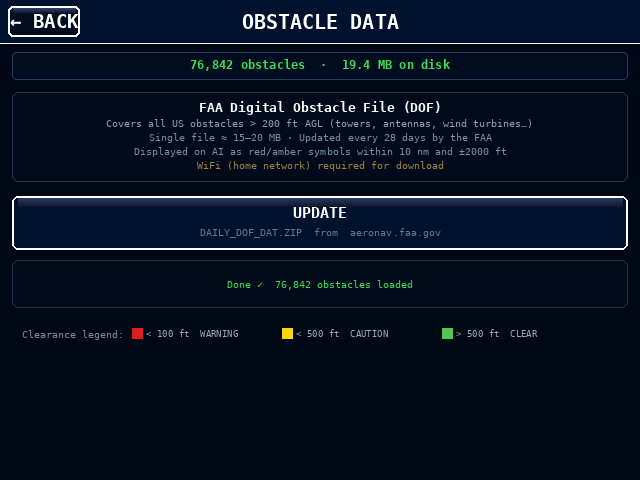

When complete the status strip shows the record count and disk usage.

### On the AI display

Once data is loaded, obstacles appear as coloured tower symbols on the attitude indicator:

| Symbol colour | Meaning |
|--------------|---------|
| Red | MSL height within **100 ft** below aircraft altitude |
| Amber / yellow | MSL height within **500 ft** below aircraft altitude |
| Green | Cleared by more than 500 ft |

A small red dot above the symbol indicates the obstacle is **lit** (has aviation lighting).  The MSL height is shown in hundreds of feet for obstacles above 500 ft AGL or within 3 nm.

### WiFi requirement

The Pi must be on an internet-reachable network to download.  Use the Connectivity screen to switch to home WiFi, download here, then switch back to the Pico W AP for flight.

### Update schedule

The FAA publishes a new DOF every 28 days.  Tap **UPDATE** on this screen to refresh.

---

## 16. Demo Mode

Demo mode animates a scripted flight over **Sedona, Arizona (KSEZ)** without any Pico W hardware.  It is useful for screen testing and getting familiar with the display.

### Starting demo mode

```bash
python3 pi_display/pfd.py --demo
```

Or with the windowed (desktop) flag for development:

```bash
python3 pi_display/pfd.py --demo --sim
```

### Scripted scenarios

The demo cycles through:

1. **Level cruise** at 8500 ft / 115 kt heading 133°
2. **Climbing left turn** — 18° bank, 500 fpm climb
3. **Level cruise** with slight drift
4. **Descending right turn** — 12° bank, 700 fpm descent toward final

Terrain rendering activates automatically if Sedona tiles are present (run `bash fetch_sedona_tiles.sh` first).

### Toggling demo mode in-flight

Press **D** on a connected keyboard to toggle demo mode while the PFD is running.  This is intended for bench testing only — do not use in flight.

---

## Quick-Reference Card

| Action | How |
|--------|-----|
| Open setup menu | Two-finger hold 0.8 s |
| Close setup menu | Tap EXIT |
| Set altitude bug | Tap top of alt tape → numpad |
| Set heading bug | Tap bottom-left of heading strip → numpad |
| Set GS bug | Tap top of speed tape → numpad |
| Tap altitude tape | Jumps alt bug to tapped altitude |
| Tap heading tape | Jumps HDG bug to tapped heading |
| Adjust baro | Tap bottom-right of heading strip → numpad |
| Adjust brightness | Setup → Display → − / + |

---

*This document covers software version 0.1. Features marked "future" or "coming soon" are not yet active.*
