# AHRS PFD — iPhone / Browser Pilot's User Manual

**Software version 0.2 · Hardware: Raspberry Pi Pico W AHRS unit · Display: any iPhone / Android / tablet browser**

*No dedicated display — any smartphone, tablet, or laptop on the Pico W AP becomes the PFD. HTML5 Canvas rendering, SSE-driven at ~20 Hz.*

> This manual covers the iPhone / browser version. For the dedicated Pi Zero 2W display see `USER_MANUAL_ZERO.md`; for the Pi 4 SVT display see `USER_MANUAL_PI4.md`.

---

## Contents

1. [What It Is](#1-what-it-is)
2. [Connecting](#2-connecting)
3. [Screen Overview](#3-screen-overview)
4. [Attitude Indicator](#4-attitude-indicator)
5. [Airspeed Tape](#5-airspeed-tape)
6. [Altitude Tape and VSI](#6-altitude-tape-and-vsi)
7. [Heading Tape](#7-heading-tape)
8. [Slip / Skid Ball](#8-slip--skid-ball)
9. [Badges and Status](#9-badges-and-status)
10. [Baro Setting (QNH)](#10-baro-setting-qnh)
11. [AHRS Trim](#11-ahrs-trim)
12. [Terrain Download](#12-terrain-download)
13. [TAWS Proximity Alerts](#13-taws-proximity-alerts)
14. [Phone Sensor Fallback](#14-phone-sensor-fallback)
15. [Demo Mode](#15-demo-mode)
16. [Feature Differences vs Pi 4 / Pi Zero](#16-feature-differences-vs-pi-4--pi-zero)

---

## 1. What It Is

The iPhone display is the **original** PFD for this project and still the simplest way to get flying: with only a Pico W AHRS unit you can use any phone, tablet, or laptop as the display. No dedicated hardware, no dedicated display, no install — just join the `AHRS-Link` Wi-Fi and open a browser.

Everything you see is rendered by the phone's browser from a single HTML file (`iphone_display/index.html`) served by the Pico W itself. The Pico streams live AHRS / GPS / baro state over Server-Sent Events (SSE) at ~20 Hz; the browser redraws the PFD at up to 60 fps with smoothing in between.

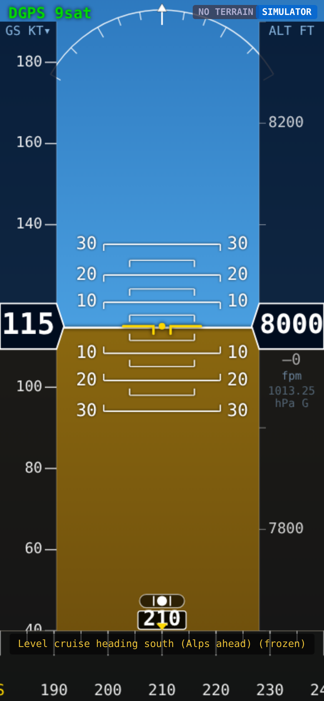

## 2. Connecting

1. Power the Pico W AHRS unit.
2. After ~5 s, a Wi-Fi AP named **`AHRS-Link`** appears. Join it with your phone. DHCP assigns you an address on `192.168.4.x`.
3. Open `http://192.168.4.1` in Safari / Chrome / Firefox. The PFD fills the screen.
4. **Add to Home Screen** (Safari → Share → Add to Home Screen) so it launches fullscreen without the address bar. The `apple-mobile-web-app-capable` and safe-area-inset metadata are already in place — the PFD runs edge-to-edge on iPhones with a notch or Dynamic Island.

Lock your phone into portrait orientation, dim the screen for night flying, and you have a three-axis PFD with no extra hardware.

## 3. Screen Overview

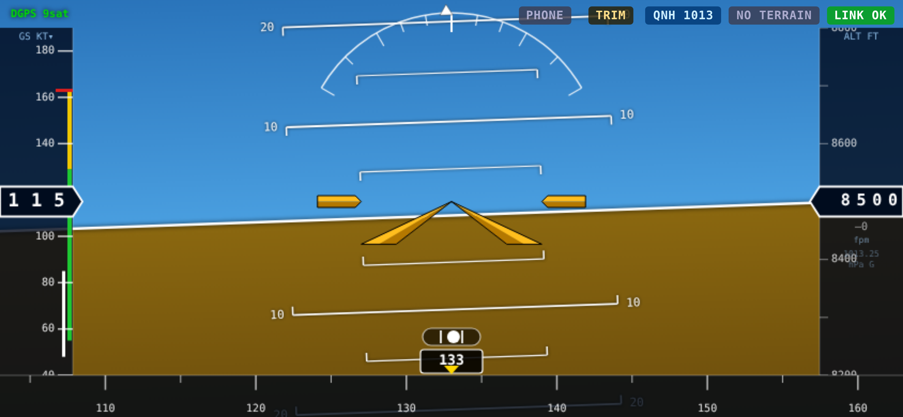

The PFD renders full-bleed in **portrait** (landscape is not yet optimised). The layout is:

| Zone | Content |
|------|---------|
| Top strip | Status badges (GPS, TRIM, QNH, TERRAIN, LINK) |
| Centre | Attitude Indicator — horizon, pitch ladder, roll arc, aircraft symbol |
| Left tape | Airspeed |
| Right tape | Altitude + VSI (green triangle with number + "fpm") |
| Bottom strip | Heading tape + heading readout box |

Tapping any top-strip badge opens the corresponding control panel (QNH, TRIM, TERRAIN). Tapping the speed readout toggles KT ↔ MPH; the QNH readout inside the baro panel toggles hPa ↔ inHg. These unit preferences persist in `localStorage`, so your phone remembers them between flights.

## 4. Attitude Indicator

Sky-blue above, brown ground below, split by a white horizon line. The aircraft symbol (two yellow chevrons + centre dot) is fixed at screen centre; the horizon tilts and translates with roll and pitch.

### Aircraft reference symbol

The fixed aircraft reference is the **amber swept-delta symbol** ported from the Pi 4 PFD (same geometry, same inner/outer colour split, same engine nacelles). It sits at the centre of the AI and stays fixed while the horizon, terrain, and pitch ladder move around it.

### Pitch ladder

Short white bars at ±10°, ±20°, ±30°, scale matches the horizon projection so pitch bars, horizon, and zero-pitch line all line up at any attitude.

### Roll arc

Arc across the top of the AI with ticks at 10°, 20°, 30°, 45°, 60° each side of level. A small doghouse at the arc's apex is the fixed sky pointer — when you bank, the arc rotates with the sky, and the doghouse still indicates "up". Read bank angle by checking where the fixed aircraft reference (at the very top) lines up with the rotating ticks.

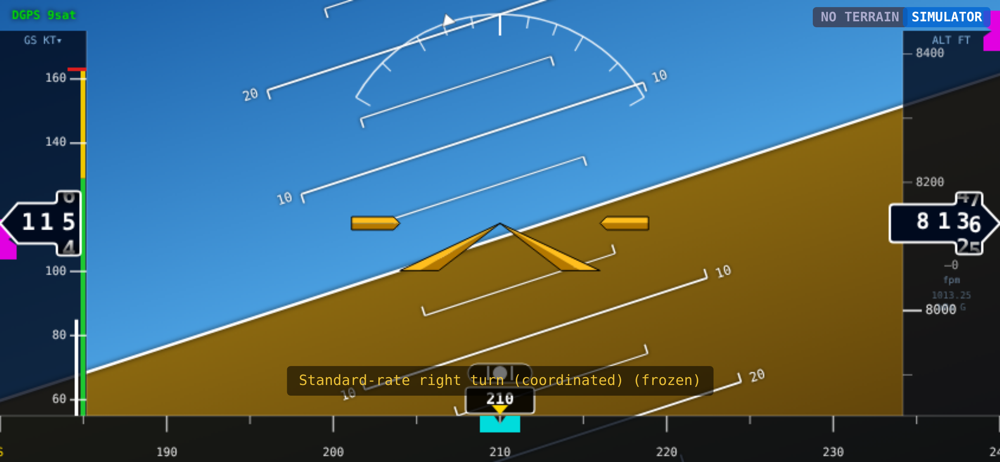

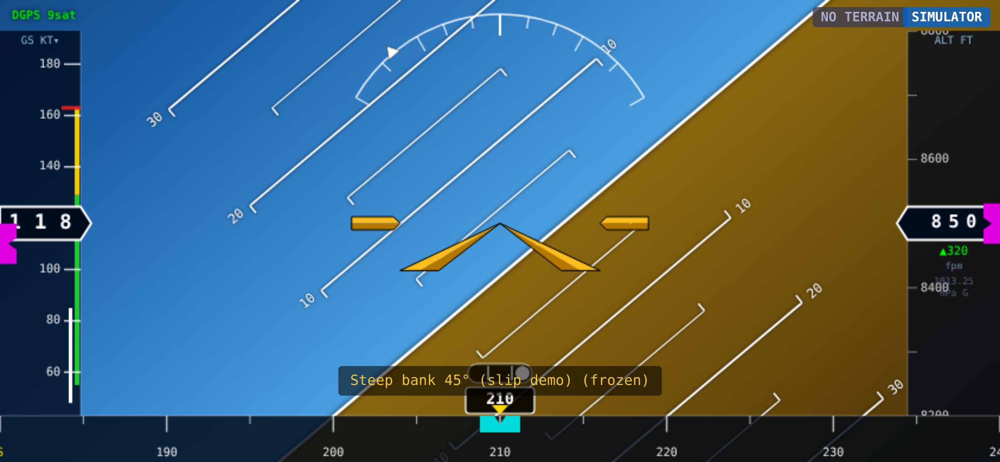

### Terrain awareness (no mesh — colour only)

When SRTM tiles are loaded, the ground colour bands by aircraft-to-terrain clearance:

| Clearance | Ground colour |
|-----------|---------------|
| Aircraft below terrain | Red |
| 0–500 ft clear | Amber |
| 500–1 000 ft clear | Yellow |
| > 1 000 ft clear | Normal brown |

There is **no 3D terrain mesh** on the iPhone — it renders terrain as a colour-graded ground plane only. For the full synthetic-vision 3D terrain, use the Pi 4 display.

## 5. Airspeed Tape

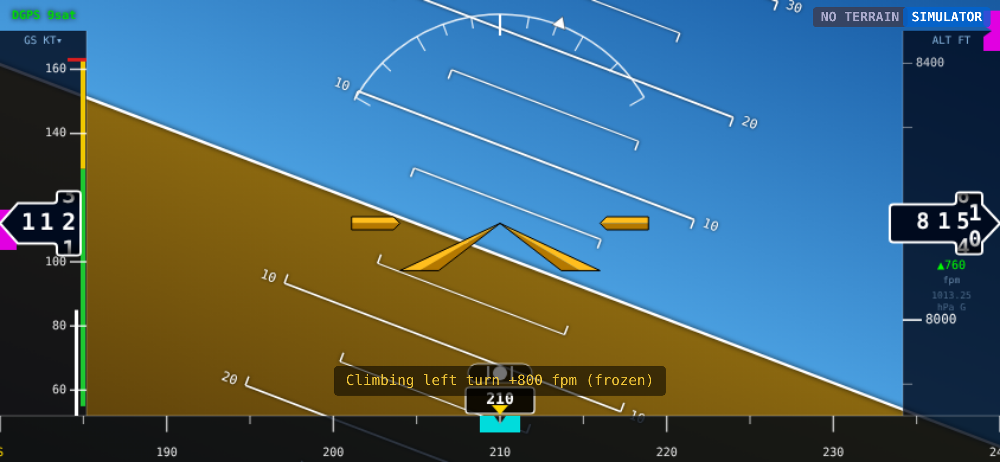

The tape scrolls past a centre **Veeder-Root drum** showing current groundspeed. The drum is a faithful port of the Pi 4 rendering: each digit column rolls independently and cascades — when the ones pass 9→0 the tens column slides to its next value over the last 10% of the cycle, so crossings through 100 kt look continuous instead of snapping.

Digit colour reflects over-speed state:

| Condition | Colour |
|-----------|--------|
| Speed ≤ VNO | White |
| VNO < speed ≤ VNE | Amber |
| Speed > VNE | Red |

The `GS KT▼` label in the top-left corner is tappable — tap to toggle the display unit:

| Display | Internal | Label |
|---------|----------|-------|
| Knots | kt | `GS KT▼` |
| Miles per hour | mph | `GS MPH▼` |

The unit choice persists in `localStorage` so the app remembers it next launch.

### V-speed colour arcs

The right edge of the tape shows four V-speed bands (ported from pi4):

| Band | Speeds | Meaning |
|------|--------|---------|
| White | VS0 – VFE | Flap operating range |
| Green | VS1 – VNO | Normal operating range |
| Yellow | VNO – VNE | Caution / structural range |
| Red line | VNE | Never-exceed |

Defaults are Cessna 172S (VS0=48, VS1=55, VFE=85, VNO=129, VNE=163 kt). Override via `localStorage['vspeeds']` as a JSON blob — a future settings screen will expose this as a UI.

### Speed bug

A **magenta chevron** on the inner edge of the tape tracks the speed bug (GPS groundspeed is the only iPhone source today, hence magenta — matches the pi4 data-source convention). The bug value is stored in `localStorage['bugs'].spd_bug`.

## 6. Altitude Tape and VSI

Altitude scrolls in 50 ft steps with labels every 100 ft. Current value is shown in a **Veeder-Root drum** matching the airspeed drum — five digits with leading-zero suppression, each column cascading smoothly so crossings through 1000 ft and 10000 ft look continuous.

Under the altitude box, the VSI readout shows vertical speed in feet per minute with a green up / red down triangle. Below it the current QNH setting is displayed in the active unit (hPa or inHg).

### Altitude bug

An **altitude bug chevron** sits on the inner edge of the altitude tape and tracks the stored bug value (in feet, canonical). Colour reflects the altitude source:

| Colour | Source |
|--------|--------|
| Cyan | Barometric altimeter (BME280 active) |
| Magenta | GPS altitude (no baro sensor or baro failed) |

Bug value stored in `localStorage['bugs'].alt_bug`.

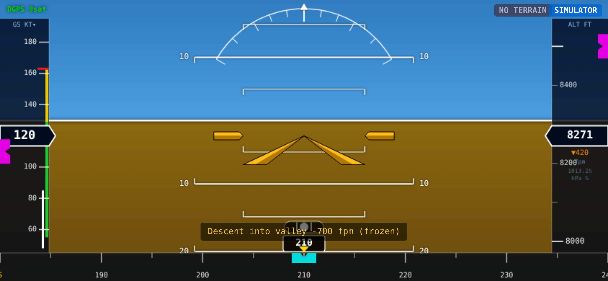

## 7. Heading Tape

Bottom of the screen — compass scale scrolling past a centre triangle that marks current magnetic heading. The heading readout box displays the integer heading in degrees. Long-press not required: heading source is whatever the Pico W's fused AHRS provides (magnetometer + gyro).

### Heading bug

A **cyan chevron** on the top edge of the heading tape marks the stored heading bug (MAG source, matches the pi4 convention). The chevron is clamped to the visible portion of the tape — if the bug is more than 30° off current heading it hides until you turn toward it.

Bug value stored in `localStorage['bugs'].hdg_bug`.

## 8. Slip / Skid Ball

A small ball slides left / right below the roll arc. Centred = coordinated flight. Deflected = uncoordinated — step on the rudder toward the ball to re-centre it.

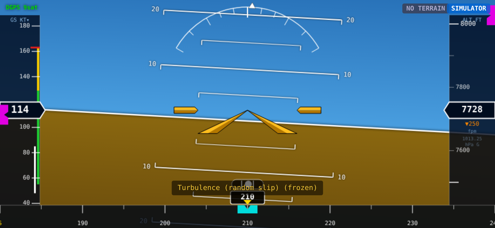

The ball reacts to lateral acceleration (`ay`) from the IMU, not to the AHRS-computed bank angle, so it catches slips and skids independently of your attitude.

## 9. Badges and Status

Top strip, left to right:

| Badge | Colours | Meaning |
|-------|---------|---------|
| `GPS nSAT` / `DGPS nSAT` / `NO FIX` | green → amber → red | GPS fix status + satellite count |
| `TRIM` | gold | Tap to adjust pitch / roll / heading mounting trim |
| `QNH 29.92` / `QNH 1013` | cyan | Current baro setting; tap to adjust |
| `NO TERRAIN` / `TERRAIN OK` / `TERRAIN…` | grey / green / amber | SRTM tile load state; tap to open download panel |
| `LINK OK` / `LINK WARN` / `NO LINK` | green → amber → red | Health of the SSE stream from the Pico W (based on last-message age) |

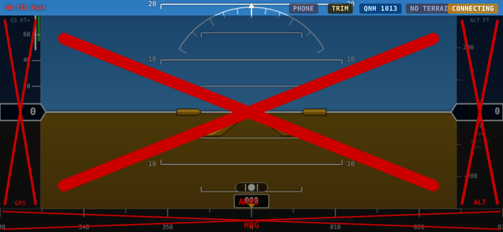

When the SSE stream stops, the entire PFD goes to **NO LINK** state: red X across the AI, tapes, heading, and the `LINK` badge turns red. Tapes freeze at their last values. This is the correct in-flight failure mode for the phone display — every instrument is clearly invalid, the pilot knows to revert to steam gauges or the aircraft's primary PFD.

## 10. Baro Setting (QNH)

Tap the `QNH` badge at the top to open the altimeter panel.

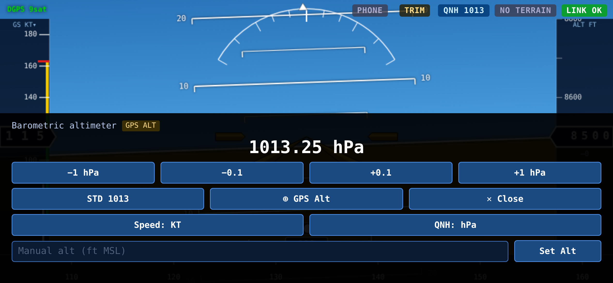

| Control | Effect |
|---------|--------|
| **−1 hPa** / **+1 hPa** | Coarse step (useful when you know the current altimeter setting) |
| **−0.1** / **+0.1** | Fine step |
| **STD 1013** | One-tap reset to standard pressure (1013 hPa / 29.92 inHg) |
| **⊕ GPS Alt** | Solves QNH from GPS altitude — useful on the ground to set QNH without an ATIS |
| **Manual alt** | Type a known field elevation and tap **Set Alt** — the Pico back-solves QNH via `/baro?cal_ft=`  |
| **Speed: KT / MPH** | Toggle airspeed unit |
| **QNH: hPa / inHg** | Toggle pressure unit |
| **✕ Close** | Close panel |

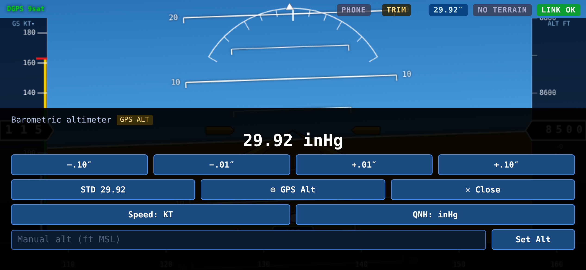

Each ± button sends an HTTP `GET /baro?qnh=X` to the Pico W. The firmware updates its internal QNH and broadcasts the new value via SSE, so the PFD reflects the change within ~50 ms. All adjustments survive Pico reboots (the firmware stores QNH in its settings).

## 11. AHRS Trim

If the horizon isn't level on the ground with the aircraft wings level, open the TRIM panel to add a mounting-correction offset.

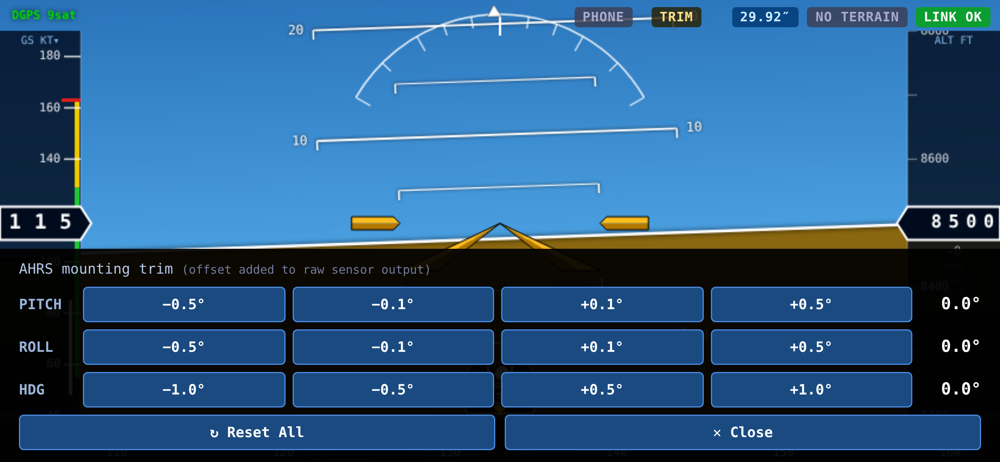

Pitch, roll, and heading each have **−0.5°**, **−0.1°**, **+0.1°**, **+0.5°** buttons. Values are pushed to the Pico W and applied to the raw sensor output before the PFD sees them, so the same trim persists across all displays (iPhone, Pi Zero, Pi 4) connected to the same Pico.

**Reset All** zeroes all three axes. The panel also provides a current-value readout on the right of each row.

## 12. Terrain Download

Tap the `TERRAIN` badge to open the tile-download panel.

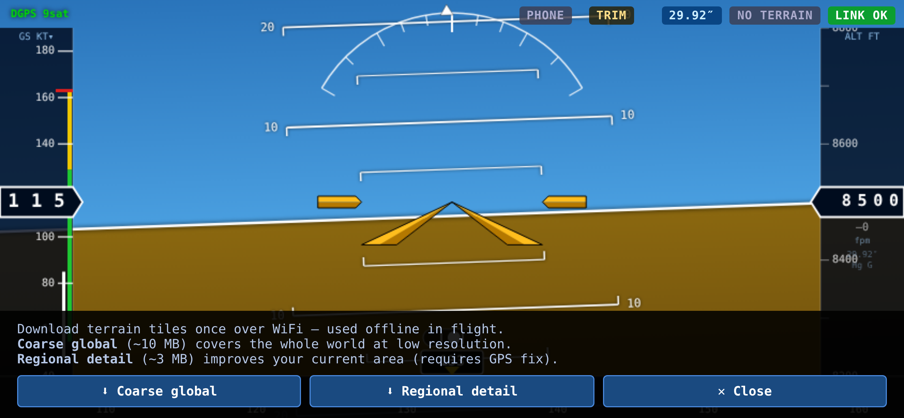

The iPhone version has a simplified two-button interface:

| Button | Effect |
|--------|--------|
| **⬇ Coarse global** (~10 MB) | Low-resolution global SRTM coverage — enough for the ground-clearance colour bands anywhere in the world |
| **⬇ Regional detail** (~3 MB) | Higher-resolution tiles around your current GPS position |
| **✕ Close** | Close the panel |

Progress bar and tile count appear during download. Tiles persist in the Pico W's flash so you don't re-download on every boot.

> **For more granular region selection** (US Southwest, US Pacific, All CONUS, All Europe, etc.) use the Pi 4 display — it has a 9-region grid with per-region size estimates.

## 13. TAWS Proximity Alerts

With terrain tiles loaded, the PFD computes clearance between the aircraft's GPS altitude and the terrain elevation at the current position. Two escalation thresholds match the Pi displays exactly:

| Clearance | Banner | Colour |
|-----------|--------|--------|
| < 500 ft | **TERRAIN CAUTION** | Amber, steady |
| < 100 ft | **PULL UP TERRAIN** | Red, 1 Hz flash |

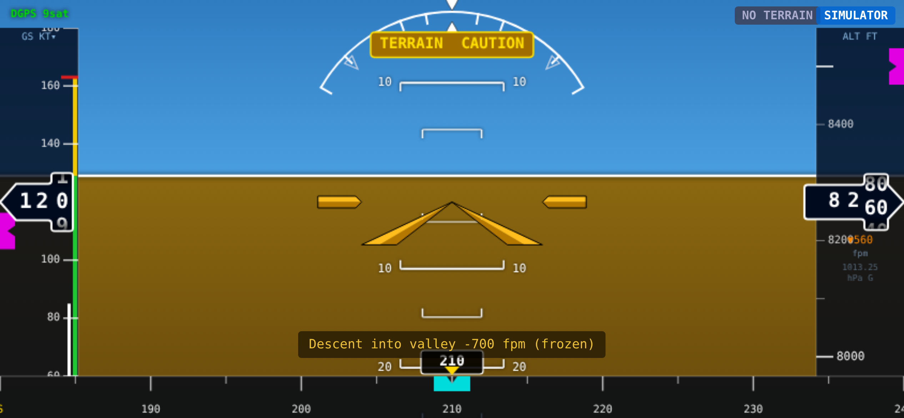

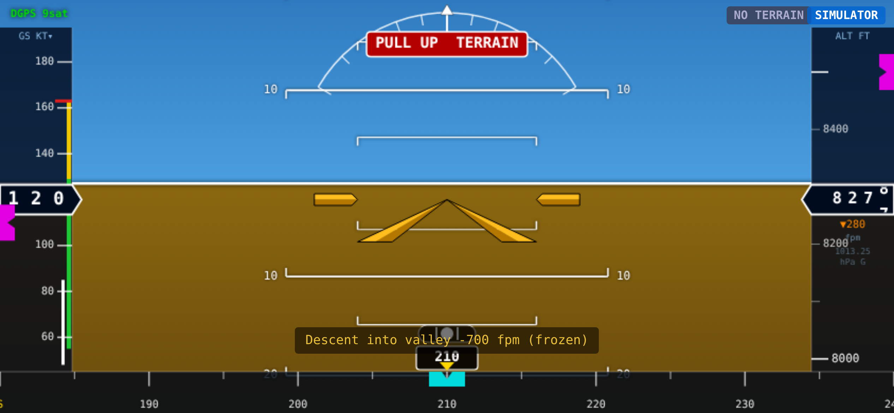

Alerts require a GPS fix; without one the banner stays off regardless of terrain data availability. The banner is positioned at the top of the AI so it's visible above the horizon and overlaps neither the tapes nor the aircraft reference.

---

## 14. Phone Sensor Fallback

If the SSE link to the Pico W AHRS drops (weak signal, firmware reset, Pico reboot), the phone can take over as a **degraded AHRS** using its own sensors. Tap the **PHONE** badge at the top of the screen to enable.

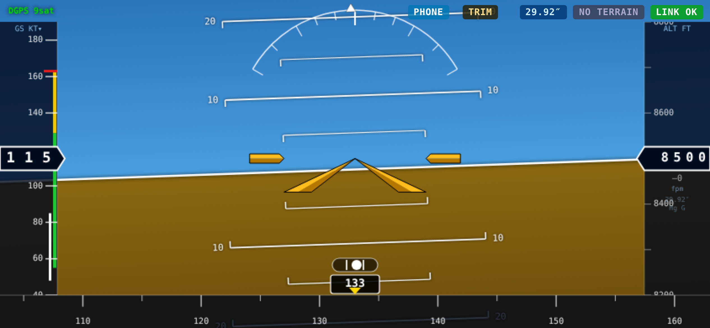

### What the phone provides

| Value | Sensor | Notes |
|-------|--------|-------|
| Roll | DeviceOrientation `gamma` | Left-right tilt of the long edge |
| Pitch | DeviceOrientation `beta` | Forward-back tilt of the long edge |
| Yaw | DeviceOrientation `alpha` | Magnetic compass (true-north on iOS with `deviceorientationabsolute`) |
| Latitude, longitude | Geolocation | High-accuracy mode; 1 Hz update nominal |
| Altitude | Geolocation | WGS84 altitude, approximate — not barometric |
| Ground speed | Geolocation | Knots, derived by the OS from successive fixes |
| Ground track | Geolocation | Degrees from true north |

### Limitations

1. **Barometric altitude unavailable** — mobile Safari doesn't expose the iPhone's internal pressure sensor, so the altimeter always falls back to GPS altitude when running on phone sensors.
2. **iOS 13+ permission gate** — the browser will prompt once for "motion & orientation" access the first time you tap PHONE. Grant it to continue; denials leave the badge in the OFF state with a `DENIED` flash.
3. **Mount orientation** — the phone must be held in **landscape with the top edge pointing right**. Other mount positions would need a mount-selector which isn't implemented yet.
4. **Yaw reference** — the `PHONE*` suffix means the phone's absolute-yaw API isn't available (some Android builds); heading will still work but may drift relative to true north.

### How it activates

1. Tap the **PHONE** badge — it turns blue (`PHONE` / `PHONE*`).
2. The PFD continues using SSE data as long as the link is up.
3. If the SSE link goes dead for > 5 s, the badge turns teal (`PHONE` green-ish) and the PFD takes attitude + GPS from the phone.
4. When the SSE stream recovers, the phone values are overwritten by the live stream automatically — no manual toggle needed.

### When to use

This is a **last-resort** mode. The phone's IMU drifts over time and lacks sensor fusion tuning for flight attitudes; use it only to maintain reasonable situational awareness while you recover the AHRS link. For real instrument flight in IMC, always rely on the certified AHRS (or a backup gauge) rather than the phone alone.

---

## 15. Demo Mode

Open `http://192.168.4.1/preview.html` (or copy `iphone_display/preview.html` to the Pico W and navigate there) to run a self-contained simulator. It cycles through six scenarios on a 5-6 s loop:

1. Level cruise heading south (Alps ahead)
2. Standard-rate right turn
3. Climbing left turn +800 fpm
4. Steep bank 45° (slip demo)
5. Descent into valley -700 fpm
6. Turbulence with random slip

The simulator uses the exact same rendering code as the live display, so it's a faithful preview / training tool. No AHRS, no GPS, no baro sensor needed. Position drifts slowly along track so the terrain-awareness colour bands update as if you were flying.

## 16. Feature Differences vs Pi 4 / Pi Zero

The iPhone display was the original product and is now close to feature parity with the Pi displays for the core PFD instrument cluster. A few items remain on the port list.

| Feature | iPhone | Pi Zero | Pi 4 |
|---------|:------:|:-------:|:----:|
| Horizon + pitch ladder + roll arc + slip ball | ✓ | ✓ | ✓ |
| Reference airplane (amber swept-delta) | ✓ | ✓ | ✓ |
| Veeder-Root rolling drums (airspeed + altitude) | ✓ | ✓ | ✓ |
| V-speed colour arcs (white / green / yellow / VNE line) | ✓ | ✓ | ✓ |
| Speed / altitude / heading bug chevrons | ✓ | ✓ | ✓ |
| TAWS CAUTION / PULL-UP banners | ✓ | ✓ | ✓ |
| QNH adjust with Pico push | ✓ | ✓ | ✓ |
| AHRS trim adjust with Pico push | ✓ | ✓ | ✓ |
| Terrain-aware ground colour bands | ✓ | ✓ | ✓ |
| SRTM tile download (in-app) | ✓ (2 presets) | ✓ (9 regions) | ✓ (9 regions) |
| Settings persistence | localStorage | `data/settings.json` | `data/settings.json` |
| Unit toggles (KT↔MPH, hPa↔inHg) | ✓ | ✓ | ✓ |
| **Phone-sensor AHRS fallback** (DeviceOrientation + GPS) | ✓ | ✗ | ✗ |
| Demo mode | ✓ (preview.html) | ✓ | ✓ |
| Numpad / keyboard for bug + field entry | ✗ | ✓ | ✓ |
| Setup menus (Flight Profile / Display / AHRS / Connectivity / System) | ✗ | ✓ | ✓ |
| Airport / runway / obstacle overlays | ✗ | ✓ | ✓ |
| Full flight simulator with scenario selection | ✗ (preview.html only) | ✓ | ✓ |
| 3D SVT terrain mesh | ✗ | ✗ | ✓ |

Remaining port list: on-screen numpad for bug editing (bug values already render, just not settable yet from the phone UI), and the settings menu tree (flight profile, display, AHRS, connectivity). The phone-sensor fallback is unique to the iPhone — the Pi displays don't have equivalent built-in sensors to fall back on.

---

*This document covers the iPhone / browser PFD. For the dedicated Pi displays see USER_MANUAL_ZERO.md or USER_MANUAL_PI4.md.*
