# AHRS PFD — Pi 4 Pilot's User Manual

**Software version 0.2 · Hardware: Raspberry Pi Pico W + Pi 4 (2 GB) · Display: ROADOM 7" HDMI 1024×600 (or Waveshare 3.5" DPI 640×480)**

*Full SVT version — OpenGL vector graphics with 3D terrain rendering*

> This manual covers the Pi 4 version with full SVT. For the Pi Zero 2W version (no SVT), see USER_MANUAL_ZERO.md.

---

## Contents

1. [Screen Overview](#1-screen-overview)
2. [Airspeed Tape](#2-airspeed-tape)
3. [Altitude Tape and VSI](#3-altitude-tape-and-vsi)
4. [Attitude Indicator](#4-attitude-indicator)
5. [Heading Tape](#5-heading-tape)
6. [Status Badges](#6-status-badges)
7. [Setting Bugs](#7-setting-bugs)
8. [Setup Menu](#8-setup-menu)
9. [Flight Profile — V-Speeds and Callsign](#9-flight-profile--v-speeds-and-callsign)
10. [Display Settings](#10-display-settings)
11. [AHRS / Sensors](#11-ahrs--sensors)
12. [Connectivity](#12-connectivity)
13. [System](#13-system)
14. [Terrain Data Download](#14-terrain-data-download)
15. [Obstacle Data Download](#15-obstacle-data-download)
16. [Airport Data Download](#16-airport-data-download)
17. [Demo Mode](#17-demo-mode)
18. [Flight Simulator](#18-flight-simulator)

---

## 1. Screen Overview

The Pi 4 version supports two display options:

| Display | Resolution | Interface | Size |
|---------|-----------|-----------|------|
| ROADOM 7" HDMI (default) | 1024×600 | HDMI + USB touch | 7" IPS, 178° viewing |
| ROADOM 10" HDMI | 1024×600 | HDMI + USB touch | 10" IPS, 178° viewing |
| Waveshare 3.5" DPI | 640×480 | DPI GPIO + I2C touch | 3.5" IPS, panel mount |

All layout elements scale automatically to the display resolution. To switch displays, edit `DISPLAY_PROFILE` in `pi4/config.py`.

The display is divided into five fixed zones (sizes shown for 1024×600 default):

| Zone | Width / Height | Content |
|------|---------------|---------|
| Left tape | 118 px wide | Airspeed |
| Right tape | 131 px wide | Altitude + VSI |
| Centre AI | remainder (~775 px) | Attitude + synthetic vision terrain |
| Bottom strip | 55 px tall | Heading tape |
| Top strip | 28 px tall | Bug readouts |

Everything is rendered at 30 fps using OpenGL ES vector graphics directly on the framebuffer.

---

## 2. Airspeed Tape

### Reading the tape

The tape scrolls so that current airspeed is always at the centred **Veeder-Root drum** readout. The drum shows two-digit resolution (e.g. `115`, `099`, `008`): the **ones** digit rolls smoothly on a small inner drum to the right, and the **tens** digit cascades one slot up whenever the ones drum passes 9 → 0. Above the current tens digit a faint preview of the next digit (and the one two above) peeks in from the top of the box so you can see what you're approaching — e.g. at 99 kt the "1" of 100 is already visible above the "0" and "9". This matches the altimeter drum behaviour and makes crossings through 10 / 100 / 1000 obvious at a glance.

The readout box is scaled with the display font so the digits remain crisp at 1024×600.

### Colour arcs (right edge of tape)

| Arc | Colour | Meaning |
|-----|--------|---------|
| White | White | VS0 – VFE — flap operating range |
| Green | Green | VS1 – VNO — normal operating range |
| Yellow | Yellow | VNO – VNE — caution / structural |
| Red line | Red | VNE — never-exceed |

The drum numerals turn **yellow** above VNO and **red** above VNE.

### Speed bug

A chevron marker tracks the speed bug. Tap the readout button at the **top** of the tape to set a value.

| Colour | Source |
|--------|--------|
| Magenta | GPS groundspeed (GS) — current default |
| Cyan | IAS sensor — when pitot/static is fitted |

---

## 3. Altitude Tape and VSI

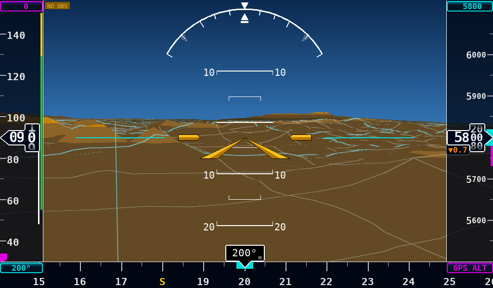

### Altitude tape

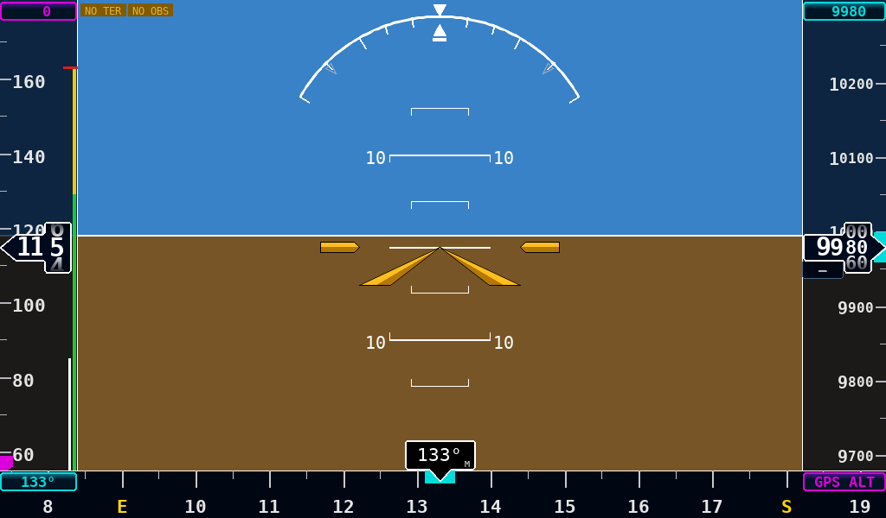

Veeder-Root drum on the right side. Scrolls in 50 ft increments. The right-hand inner drum shows the ten-foot digit; the centre cell shows the hundreds/tens pair in 20-ft steps; the leading thousands column reveals the next column one slot above so transitions through 1000 / 10000 ft stay readable. The drum renders as two/three independent cells that roll at the correct rates — the altitude value is always the number vertically centred in the large outer cell.

**Altitude bug** settable via numpad (entry in hundreds of feet) or by tapping the tape.

| Colour | Source |
|--------|--------|
| Cyan | Barometric altitude (BME280 active) |
| Magenta | GPS altitude (baro failed or absent) |

### Baro setting

| Display | Colour | Meaning |
|---------|--------|---------|
| `29.92 IN` | Cyan | BME280 active; inHg |
| `1013 hPa` | Cyan | BME280 active; hPa |
| `GPS ALT` | Magenta | No baro sensor |

### VSI

Green/amber bar along the inner edge of the alt tape. ±2000 fpm scale. Amber above ±1500 fpm.

---

## 4. Attitude Indicator

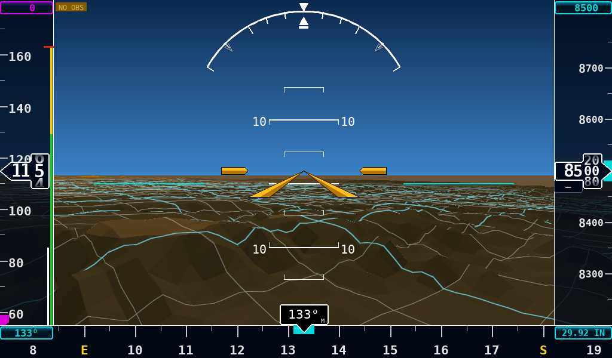

### Synthetic vision background

The Pi 4 renders a **full 3D Synthetic Vision Terrain (SVT)** background behind the attitude indicator using OpenGL ES. A terrain mesh is built from SRTM elevation data within a 20 nm radius of the aircraft and rendered through a true perspective projection from the aircraft's position.

**Key capability:** Unlike 2D scanline renderers, the OpenGL SVT shows terrain features that are **above the aircraft's altitude** — mountain peaks and ridges rise **above the horizon line** in correct geometric perspective. This gives the pilot a natural, out-the-window view of the terrain environment.

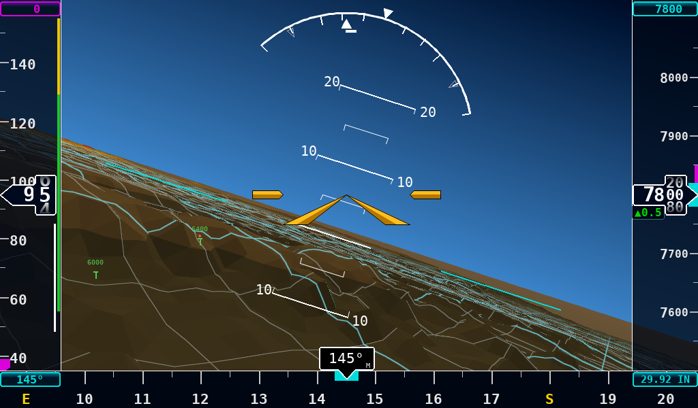

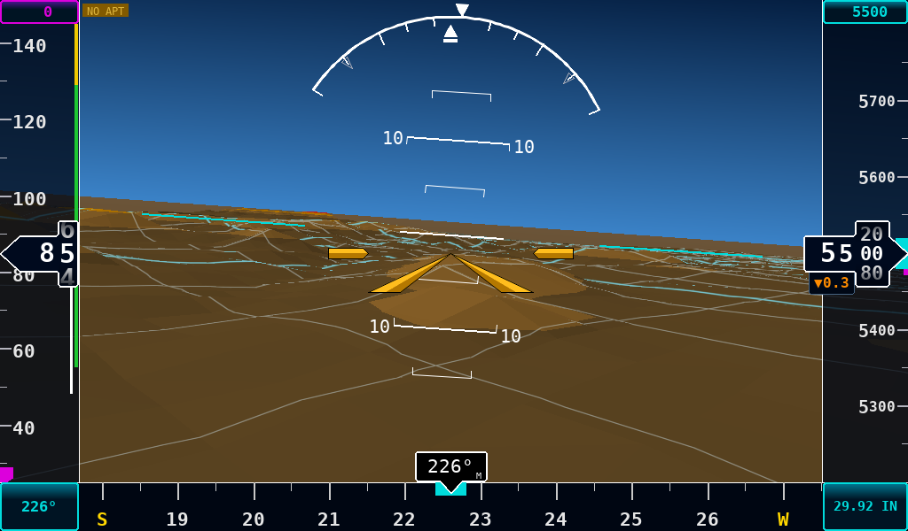

#### Clearance colouring

Terrain is coloured by clearance below the aircraft:

| Clearance | Colour | Meaning |
|-----------|--------|---------|
| Above aircraft altitude | Red | Terrain is higher than you — obstacle |
| 0–100 ft below | Deep orange | Immediate proximity |
| 100–500 ft below | Amber | Caution |
| 500–1000 ft below | Brown | Safe clearance |
| 1000–2000 ft below | Dark brown | Well clear |
| More than 2000 ft below | Very dark | Far below |

Beyond the 20 nm mesh edge the rendering fades to a dusty atmospheric-haze gradient that blends with distant terrain so there is no visible seam.

#### Sun-angle lighting

Terrain is shaded by a directional sun source so that slopes facing the sun appear brighter and slopes in shadow darken toward the ambient level. Ridge-lines, valleys, canyons, and mesa edges become immediately recognisable. Default sun position is 45° elevation, SE azimuth (mid-morning). This is configurable in `pi4/svt_renderer_gl.py`.

#### Distance grid

A cyan grid aligned with cardinal directions is overlaid on the terrain to help judge distance and orientation.

- Minor lines every **0.5 nm** (counts squares to estimate distance)
- Major lines every **2 nm** (slightly brighter for longer-range reference)
- Lines fade toward the mesh edge to avoid clutter at the visible horizon
- Grid colours switch automatically: light cyan-white on brown terrain, dark blue on red/orange "above aircraft" terrain for contrast

The grid doubles as a heading reference — the N/S grid line is always parallel to true north, so a glance at the grid orientation relative to the aircraft symbol gives a crude no-compass heading check.

#### Zero-pitch reference line

A pair of short cyan hash marks across the AI mark the aircraft's **0° pitch reference** in the sky frame. With 3D SVT the visible horizon may be higher or lower than the actual 0° pitch position depending on terrain (for example, mountains above your altitude push the apparent horizon up). The zero-pitch line is independent of terrain — it always shows where level flight would put the nose.

- Drops below AI centre in climbs
- Rises above AI centre in descents
- Tilts with the horizon during banks
- Aligned exactly with the pitch ladder's 0° bar

When terrain is at or below your altitude, the zero-pitch line and the visible SVT horizon coincide.

#### No terrain data

When no SRTM tiles are loaded the SVT falls back to a traditional blue-sky-over-brown-ground split. The `NO TER` badge appears in the status strip.

### Pitch ladder

Grey pitch bars at ±5°, ±10°, ±15°, ±20°, ±30°. GI-275 style. Horizon bar is white. Scale is 10 px/° (matches the SVT horizon projection exactly so the 0° bar and the terrain horizon align at all pitches).

### Roll arc and pointer

Graduated arc at the top of the AI implementing the **sky-pointer** convention. The arc and tick marks (10°, 20°, 30°, 45°, 60°) rotate with the sky so that the fixed aircraft reference at the very top of the screen reads the current bank angle on the arc. A moving doghouse outside the arc marks the sky's "up" direction; a fixed reference inside the arc at the top marks the aircraft's current bank position.

### Aircraft symbol

Amber swept-delta wing symbol fixed at AI centre.

### Slip/skid indicator

A short white horizontal bar (16×4 px) sits below the roll pointer's doghouse base and slides laterally with uncoordinated flight. Centred under the zero-bank triangle = ball-centered, coordinated flight. The bar moves in the same direction as the imaginary ball of a conventional inclinometer — step on the rudder toward the bar to re-centre it.

### Terrain / obstacle proximity alert

**TERRAIN CAUTION** (amber, steady) — terrain or obstacle within **500 ft** below.

**PULL UP TERRAIN** (red, 1 Hz flash) — terrain or obstacle within **100 ft** below.

Requires GPS fix and SRTM tiles or obstacle data loaded.

---

## 5. Heading Tape

### Heading source modes


**MAG mode (default):** Magnetometer heading. Dim border, `M` subscript.

**GPS TRK mode:** Heading slewed to GPS track via complementary filter. Magenta border, `G` subscript. `GPS TRK` badge appears.

### Track pointer

In MAG mode with GPS fix, a **magenta** tick shows GPS ground track (wind/crab indication). Magenta matches the PFD's data-source convention: GPS-derived values and indicators are magenta; sensor-derived values are cyan.

### Heading bug

Chevron on the tape. CYAN (MAG) / MAGENTA (GPS TRK). Settable via numpad or tap on tape.

---

## 6. Status Badges

Blank during normal flight. Appear only when attention required.

| Badge | Colour | Meaning |
|-------|--------|---------|
| `AHRS FAIL` | Red | IMU data absent or invalid |
| `NO LINK` | Red | SSE stream not connected |
| `NO TER` | Amber | No SRTM terrain tiles loaded |
| `NO OBS` | Amber | No FAA obstacle data loaded |
| `EXP OBS` | Orange | Obstacle data > 28 days old |
| `NO APT` | Amber | No airport data loaded |
| `EXP APT` | Orange | Airport data older than expiry |
| `GPS TRK` | Magenta | GPS TRK heading mode active |
| `GPS ALT` | Amber | Altitude from GPS (baro failed) |
| `GPS` *N*`sat` | Amber | GPS acquiring — *N* satellites |
| `NO GPS` | Red | No GPS signal |

---

## 7. Setting Bugs

Three bugs — altitude, heading, ground-speed — plus the baro setting. All four use the same numpad overlay.

### Bug buttons on the PFD

Four tap targets sized for gloved / in-turbulence use. The bug buttons fill the full heading-strip height (55 px on 1024×600) so they're easy to hit without looking away from the horizon.

| Button | Location | Opens |
|--------|----------|-------|
| **Speed bug** | Top of airspeed tape | SET SPD BUG |
| **Altitude bug** | Top of altitude tape | SET ALTITUDE BUG |
| **HDG bug** | Bottom-left of heading strip | SET HDG BUG |
| **Baro** | Bottom-right of heading strip | SET BARO inHg / SET BARO hPa |

### Numpad entry

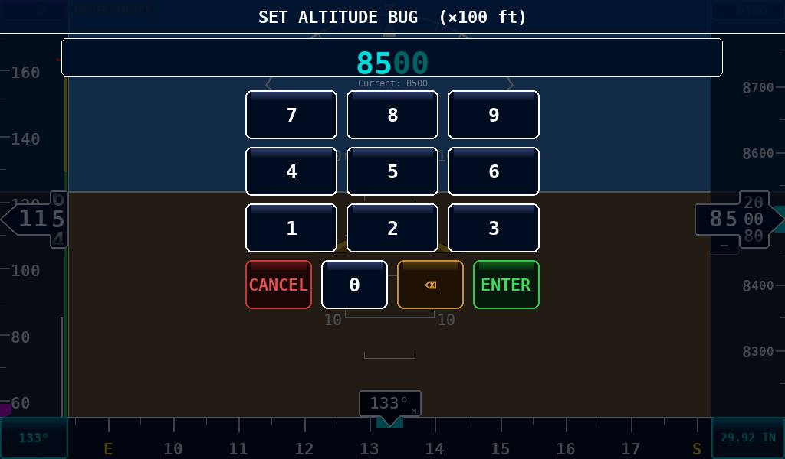

Tap the readout button. The numpad slides in over the live PFD so attitude remains visible behind the keys.

**Current value is shown as a dim placeholder** under the entry field — the input starts empty so typing ENTER without changing anything keeps the previous bug value. Typing overwrites; ⌫ backspaces the buffer.

| Target | Entry | Example |
|--------|-------|---------|
| Altitude | hundreds of feet | `85` → `8500 ft` |
| Heading | 3 digits | `270` → `270°` |
| Speed  | whole knots | `90` → `90 kt` |
| Baro (inHg) | 4 digits, decimal auto-inserted | `2992` → `29.92 in` |
| Baro (hPa) | plain integer | `1013` → `1013 hPa` |

Numpad keys: `0`–`9`, **CANCEL**, **⌫** (backspace — deletes one character from the buffer), **ENTER**. The numpad is centred under the AI so the fingers rest below the horizon while typing.

### Baro entry

The baro numpad title switches between **SET BARO inHg** and **SET BARO hPa** based on the unit selected in Display Settings. The pre-populated placeholder shows the current baro setting in whichever unit is active.

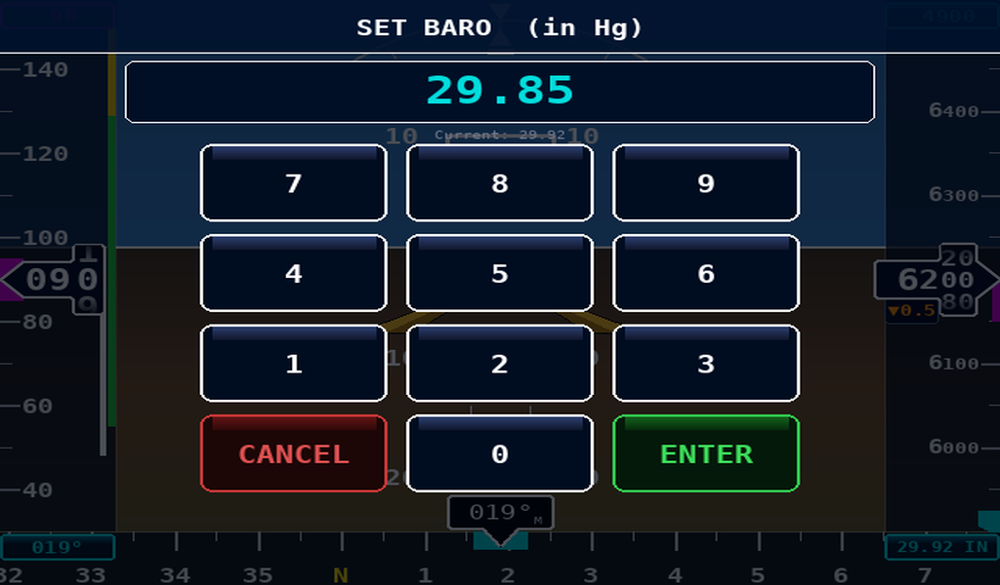
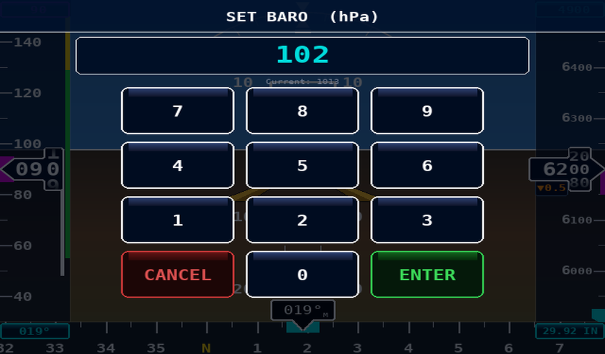

### Tape taps

Tap heading tape → jump HDG bug. Tap altitude tape → jump alt bug (nearest 100 ft). These are fine-positioning shortcuts — the buttons and numpad are for precise values.

### Clear

Enter `0` + **ENTER**. Clears the bug (alt/spd/hdg); for baro this resets to 29.92 in / 1013 hPa.

---

## 8. Setup Menu

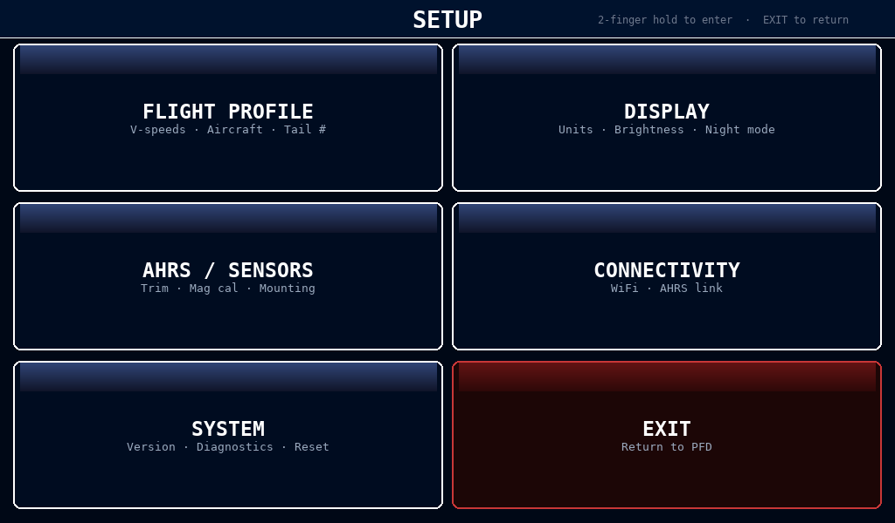

Two-finger hold 0.8 s → six tiles: FLIGHT PROFILE, DISPLAY, AHRS / SENSORS, CONNECTIVITY, SYSTEM, EXIT.

---

## 9. Flight Profile — V-Speeds and Callsign


Cessna 172S defaults: VS0=48, VS1=55, VFE=85, VNO=129, VNE=163, VA=105, VY=74, VX=62 kt.

Tap any V-speed box to change — the numpad opens with the current value shown as a dim placeholder. RESET DEFAULTS restores all.

### Keyboard — tail number and aircraft type

Tap **CALLSIGN** or **A/C TYPE** to open the on-screen keyboard.

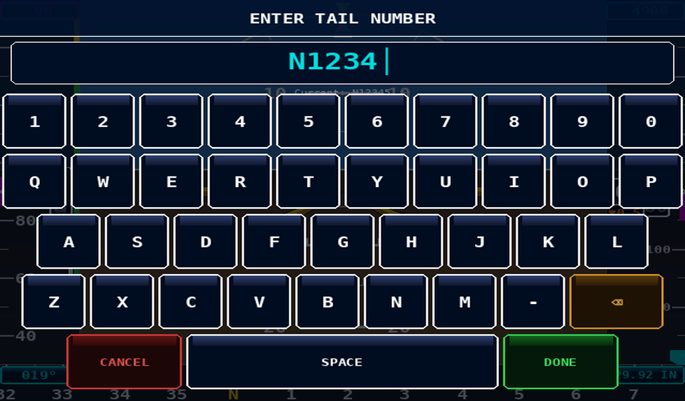

Four rows:

1. Digits `1 2 3 4 5 6 7 8 9 0`
2. `Q W E R T Y U I O P`
3. `A S D F G H J K L`
4. `Z X C V B N M` + period (`.`), colon (`:`), and **⌫** backspace

Action row across the bottom: **CANCEL** (discard), hyphen (`-`), **SPACE**, **DONE** (commit).

The period and colon keys are useful for entering URLs (e.g. `http://192.168.4.1`) on the Connectivity screen — the same keyboard is used there. The current field value appears pre-populated so you can edit in place rather than re-typing from scratch; the ⌫ backspace key deletes one character at a time from the end of the buffer.

---

## 10. Display Settings

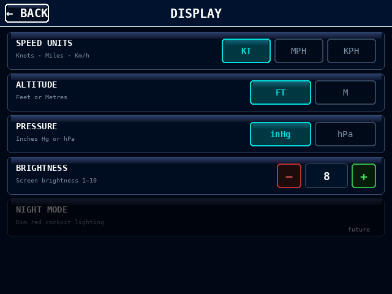

**Speed:** KT / MPH / KPH. **Altitude:** FT / M. **Pressure:** inHg / hPa. **Brightness:** 1–10 steps.

---

## 11. AHRS / Sensors

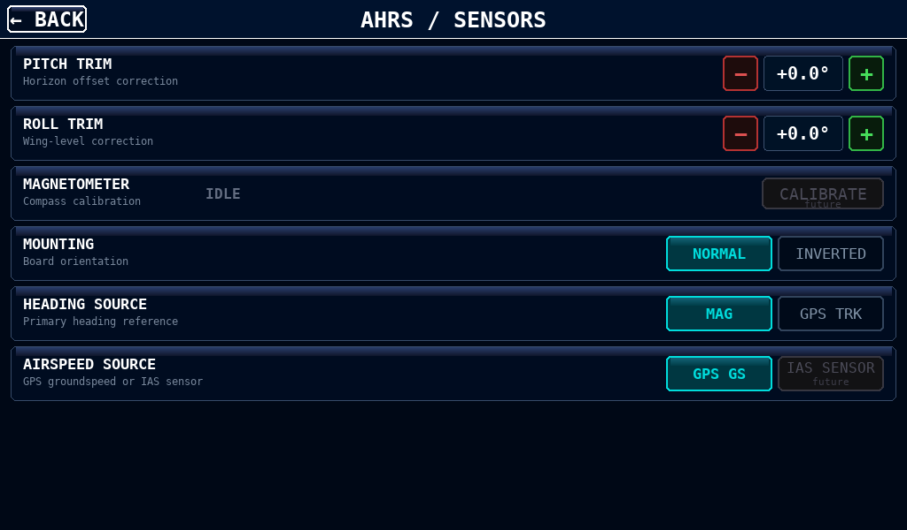

**Pitch/Roll trim:** ±0.5° steps. **Mounting:** NORMAL / INVERTED. **Heading source:** MAG / GPS TRK. **Airspeed source:** GPS GS / IAS SENSOR (future).

---

## 12. Connectivity

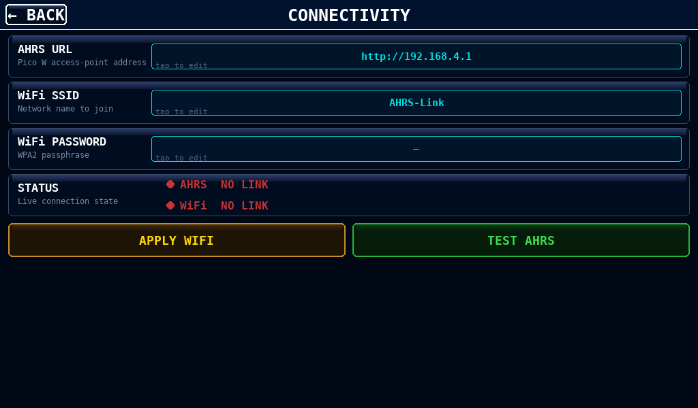

Four editable fields + two status rows + two action buttons.

### Editable fields (rows 1–3)

Tap any value box to open the keyboard and edit.

| Field | Purpose | Default |
|-------|---------|---------|
| **AHRS URL** | Pico W access-point address | `http://192.168.4.1` |
| **WiFi SSID** | Network name the Pi should join (for downloads) | `AHRS-Link` |
| **WiFi PASSWORD** | WPA2 passphrase | (blank; not persisted) |

The Wi-Fi password is intentionally **not** stored in `settings.json` and must be re-entered when you switch networks — see §13.

### STATUS row

Two coloured dot/label pairs showing the live state of the two links:

- **AHRS** — green dot + "CONNECTED" when the SSE/USB link is up and the Pico W is pushing frames; red dot + "NO LINK" otherwise.
- **WiFi** — green + `WiFi: <ssid>` when the Pi has an `iwgetid` result (the **actual** network name, truncated with `…` if longer than 18 characters); red + "NO LINK" otherwise. This is the network the Pi itself is joined to, not the AHRS URL.

### AHRS LINK diagnostics row

This row tells you why the AHRS link is or isn't working when STATUS alone isn't enough:

- **Transport + port** (subtitle on the left): `USB /dev/ttyACM0` or `WIFI http://192.168.4.1`. Shows which transport the PFD chose at startup (USB serial is tried first; SSE over Wi-Fi is the fallback).
- **RX counter** — total frames received since boot. Should tick up ~20×/s when a live link is working.
- **ERR counter** — parse failures. A few at boot are normal; continuous growth points at a baud/wiring issue.
- **Last error** — most recent parse error string, truncated at 44 chars.
- **Live R / P / Y / ALT** (right-hand side) — the most recent roll, pitch, yaw, and altitude values the PFD has received. If RX is growing but R/P/Y are stuck at `+0.0°` the firmware is alive but the WT901 isn't talking — check the TX/RX crossover at pin 2 (GP1).

### Action buttons

- **APPLY WIFI** (amber) — saves SSID + password and attempts to join. Uses `nmcli` / `wpa_supplicant` depending on distribution. A status message appears above the button on success or failure.
- **TEST AHRS** (green) — issues a one-shot HTTP GET to the AHRS URL (Wi-Fi transport) or probes the serial port (USB transport) and reports whether the peer answered. Use after APPLY WIFI to confirm the peer is reachable.

After editing WiFi SSID/password, tap **APPLY WIFI** to actually commit the change. After changing AHRS URL, tap **TEST AHRS** to confirm the peer is reachable.

---

## 13. System

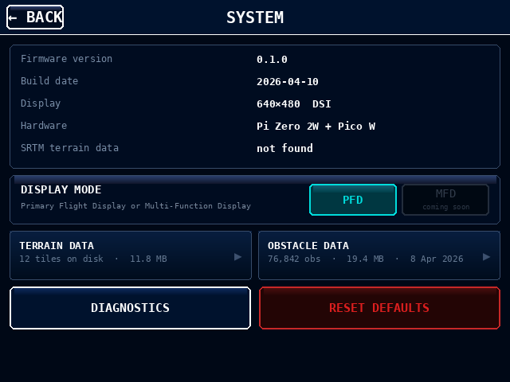

Version info, terrain/obstacle status, DIAGNOSTICS (future), RESET DEFAULTS, FLIGHT SIMULATOR.

All configurable settings — V-speeds, tail number, units, backlight brightness, colour scheme, heading-source mode, Wi-Fi SSID, airport display filters, and the runway/centerline overlay toggles — persist across power cycles in `pi4/data/settings.json`. The file is written atomically on a background thread with a 1.5 s debounce, so rapid successive taps produce a single write with no UI stutter. The Wi-Fi password is intentionally *not* stored — it must be re-entered when joining a new network.

---

## 14. Terrain Data Download

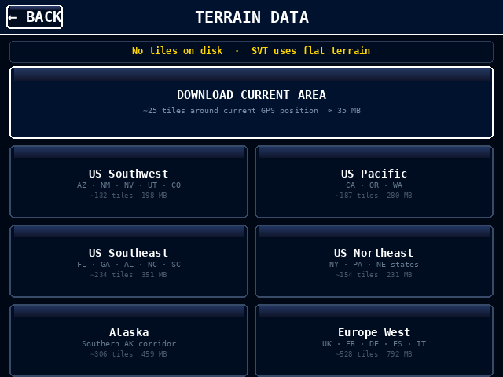

SRTM elevation tiles provide the ground texture for the SVT background and power the TAWS proximity alerting. Without tiles the AI shows a plain blue/brown split and the `NO TER` badge appears.

Tiles are stored in `pi4/data/srtm/` as `.hgt` files (~1 MB each, 1°×1° patches).

### DOWNLOAD CURRENT AREA

Top tile — downloads a 5°×5° box (≈ 25 tiles, ~35 MB) centred on the current GPS position. Requires a GPS fix. This is the fastest way to get flying in an unfamiliar area: one tap and the tiles you actually need are on disk a minute later.

### Preset regions

Nine preset regions below **DOWNLOAD CURRENT AREA**. Each tile shows the states/countries it covers, approximate tile count, and estimated size. Tap a tile to start the download; a progress bar replaces the status strip at the top of the screen.

| Region | Coverage | ~Tiles | ~Size |
|--------|----------|-------:|------:|
| **US Southwest** | AZ · NM · NV · UT · CO | 132 | 198 MB |
| **US Pacific** | CA · OR · WA | 187 | 280 MB |
| **US Southeast** | FL · GA · AL · NC · SC | 234 | 351 MB |
| **US Northeast** | NY · PA · NE states | 154 | 231 MB |
| **US Midwest** | OH · MI · IL · MN · WI | 276 | 414 MB |
| **All CONUS** | Lower 48 — single-tap full coverage | ~1,475 | ~2 GB |
| **Alaska** | Southern AK corridor | 306 | 459 MB |
| **Europe West** | UK · FR · DE · ES · IT | 528 | 792 MB |
| **All Europe** | UK to Turkey | ~1,050 | ~3 GB |

Downloads are resumable: already-present tiles are skipped, so re-tapping a region after a partial download finishes the remainder. **CANCEL** stops in flight; tiles already on disk are kept.


### WiFi requirement

The Pi 4 must be on an internet-reachable network to download. Use the Connectivity screen (§12) to switch to your home Wi-Fi, download here, then switch back to the Pico W AP for flight. If you tap DOWNLOAD while still on the Pico W AP the screen will show a "WiFi (home network) required" guard message instead of starting.

---

## 15. Obstacle Data Download

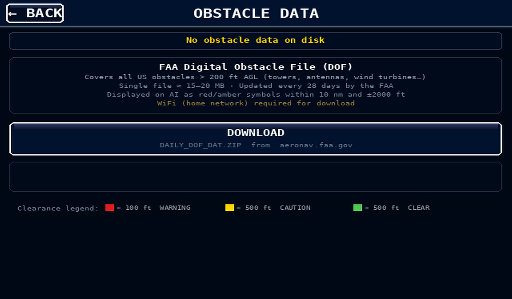

FAA DOF adds tower/antenna/wind-turbine symbols. Within 10 nm and ±2000 ft.

Tap DOWNLOAD to fetch. Symbols colour-coded:

| Colour | Meaning |
|--------|---------|
| Red | Within 100 ft below |
| Amber | Within 500 ft below |
| White | Cleared > 500 ft |

Red dot = lit obstacle. 28-day update cycle.

---

## 16. Airport Data Download

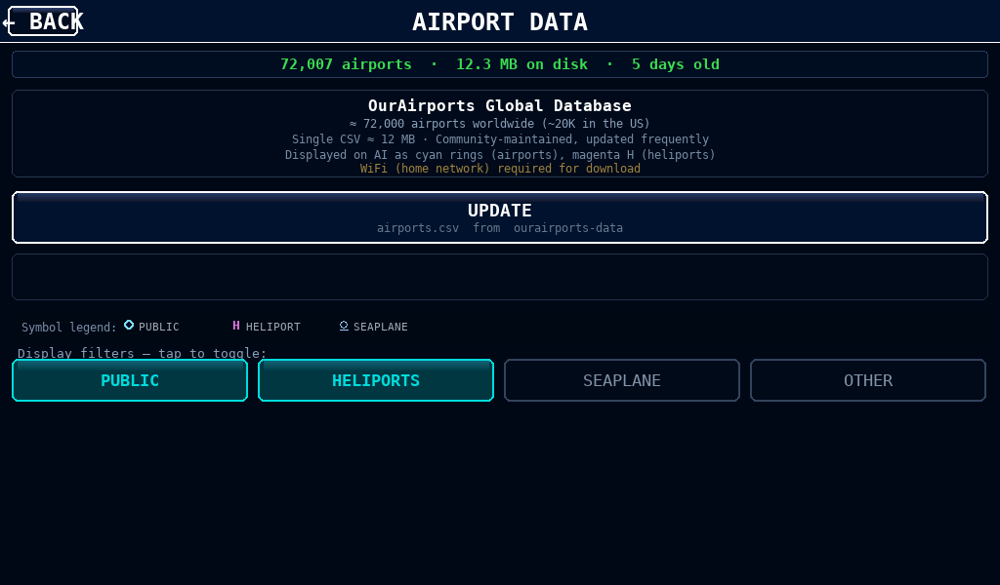

The OurAirports.com global database adds airport and heliport symbols to the attitude indicator within 20 nm of the aircraft. The database covers approximately 72,000 airports worldwide including ~20,000 in the US.

### Symbols on the AI

| Symbol | Meaning |
|--------|---------|
| Cyan ring (filled centre) | Public airport (small / medium / large) |
| Cyan ring with outer ring | Medium or large public airport |
| Magenta "H" | Heliport |
| Cyan circle with wavy underscore | Seaplane base |
| Grey triangle | Balloonport |

The airport identifier (e.g. "KSEZ") is rendered within 15 nm as a small "road sign" — a coloured text box mounted on a thin vertical post that lifts the label clear of the symbol and any nearby terrain features. The sign border matches the symbol colour (cyan for public airports, magenta for heliports). Beyond 15 nm only the symbol is drawn to reduce clutter at distance.

### Display filters

The AIRPORT DATA screen has four type filters and two overlay toggles at the bottom. Tap any tile to toggle its state.

| Filter | Controls | Default |
|--------|----------|---------|
| **PUBLIC** | Small / medium / large public-use airports | On |
| **HELIPORTS** | Hospital helipads, rooftop pads, private helis | On |
| **SEAPLANE** | Seaplane bases (water operations) | Off |
| **OTHER** | Balloonports and uncategorised types | Off |
| **RUNWAYS** | Paved/unpaved runway polygons (within 8 nm) | On |
| **EXT CENTERLINES** | Dashed extended centerlines off each threshold (within 15 nm) | On |

This lets you declutter the AI to show only the types relevant to your flight — for example, turn off HELIPORTS when operating in dense urban airspace where helipads would swamp the display, or turn off EXT CENTERLINES en-route and only re-enable during terminal-area operations.

All filter and toggle states persist across power cycles — you don't need to re-configure on every startup.

### Runways and extended centerlines

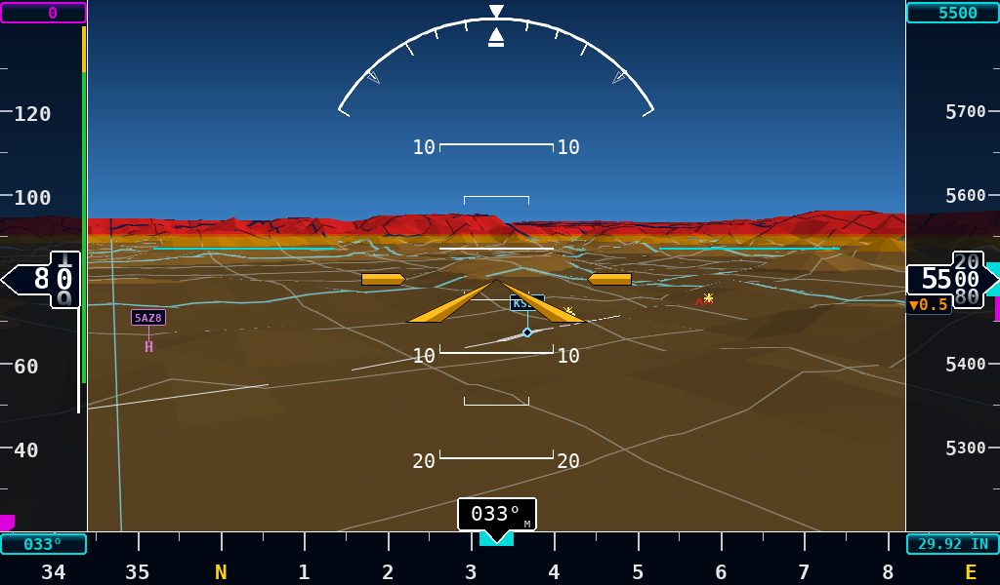

Within 8 nm of an airport, the PFD overlays a scaled polygon for each runway threshold-to-threshold, projected in the same perspective as the rest of the attitude indicator so runways translate, rotate, and scale naturally with the aircraft's position, bank and pitch. Width is taken from the OurAirports database.

Extended centerlines (dashed yellow) extend 10 nm outward from each runway threshold along its exact bearing, visible within 15 nm of the airport. This provides an at-a-glance final-approach reference for non-precision and visual approaches — the same kind of cue you get from a flight director's course bar, but derived purely from the runway geometry rather than a flight-plan waypoint.

Runway data comes from OurAirports `runways.csv` (approximately 14,700 runways worldwide) and is downloaded alongside the airport CSV in a single UPDATE action.

### Downloading

Tap **AIRPORTS** on the System screen to open the airport data screen.

Tap **DOWNLOAD** (or **UPDATE** if data is already present) to fetch `airports.csv` (~12 MB) plus `runways.csv` (~3 MB) from the OurAirports GitHub mirror.

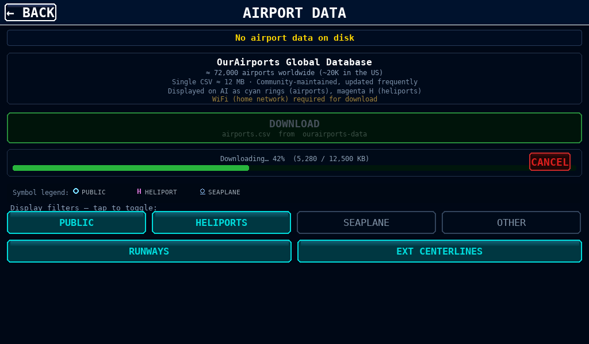

A progress bar updates as the download runs. After completion the CSV is parsed into a NumPy cache for fast future loads. Tap **CANCEL** to abort at any time — no partial data is kept.

### Update schedule

The OurAirports database is community-maintained and updated frequently. A 60-day local expiry is enforced; after that the `EXP APT` badge appears in the status strip to remind the pilot to refresh. The data is usable past expiry — the badge is an advisory only.

### WiFi requirement

The Pi 4 must be on an internet-reachable network to download. Use the Connectivity screen to switch to home Wi-Fi, download here, then switch back to the Pico W AP for flight.

---

## 17. Demo Mode

Scripted Sedona, AZ flight. No hardware needed.

```bash
python3 pi4/pfd.py --demo
python3 pi4/pfd.py --demo --sim   # windowed
```

Cycles: level cruise → climbing left turn → level → descending right turn. SVT terrain renders if Sedona tiles are present.

---

## 18. Flight Simulator

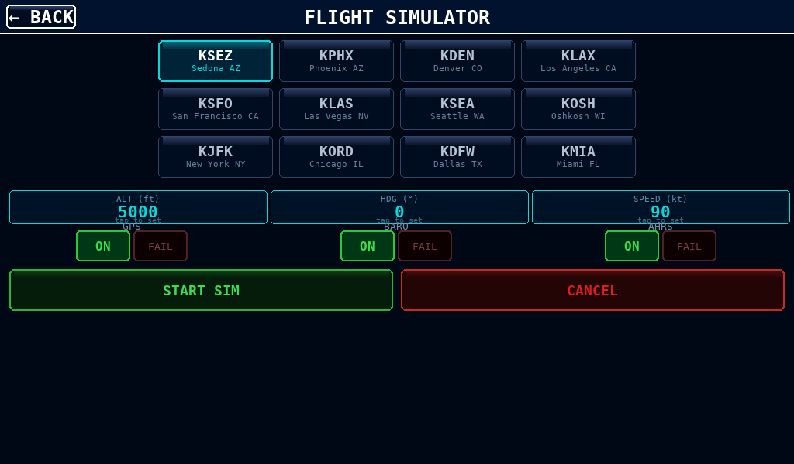

A full-PFD flight simulator is built in. It drives every instrument on the display through an internal autopilot model — so every tape, badge, bug, the SVT background, airport symbols, runway polygons, and TAWS alerting all behave exactly as they would with a live AHRS link. No external aircraft, no Pico W, and no network are needed.

### Starting

Setup → System → **FLIGHT SIMULATOR**. The setup screen lets you pick:

| Control | Purpose |
|---------|---------|
| Airport preset grid | 12 US airports covering mountain, coastal, plains, and desert terrain. Tap to highlight (cyan border). Starts the simulator parked on the field at the runway elevation. |
| **ALT / HDG / SPEED** tiles | Tap a tile to open the numpad and set the initial cruise altitude, heading, and indicated airspeed that the autopilot will fly to once airborne. |
| **GPS / BARO / AHRS** ON / FAIL pairs | Inject a sensor failure before the sim starts. FAIL makes the corresponding badge appear (`NO GPS`, `GPS ALT`, `AHRS FAIL`) and disables that sensor's contribution to the flight model so you can practice partial-panel scenarios. |
| **START SIM** / **CANCEL** | Start drops you at the selected airport and immediately commands a takeoff; the autopilot holds the initial ALT/HDG/SPD. |

### 12 airport presets

KSEZ, KPHX, KDEN, KLAX, KSFO, KLAS, KSEA, KOSH, KJFK, KORD, KDFW, KMIA — chosen for geographic variety so you can watch SVT, TAWS caution/warning thresholds, and obstacle proximity alerting behave naturally in different environments. Sedona (KSEZ) is the default because the surrounding red-rock mesas exercise the clearance-colour banding dramatically.

### While the simulator is running

- A small `SIM` watermark appears at the centre of the AI.
- Tap the watermark to open **SIM CONTROLS** (overlay on top of the live PFD) — from here you can toggle GPS/BARO/AHRS failures mid-flight and exit back to the setup screen.
- All three bug controls (ALT / HDG / SPD) remain active — set a new bug and the autopilot will fly to it. This is how you explore heading changes, climbs, descents, and arrivals at other airports.
- Baro setting, display units, filters, and every other adjustment all take effect in real time just as they would in the aircraft.

### Failure injection

Inject a sensor failure either before start (SIM SETUP) or mid-flight (SIM CONTROLS).

| Failure | Effect |
|---------|--------|
| **GPS** | `NO GPS` badge, magenta ground-track tick hidden, GPS-TRK mode forced off, airport and runway overlays dim. |
| **BARO** | `GPS ALT` badge; altitude tape falls back to GPS altitude; baro setting shows `GPS ALT` in magenta. |
| **AHRS** | `AHRS FAIL` badge; attitude freezes (classic AI fail). Tapes still work from GPS. |

All failures revert the moment you toggle back to ON — use them for quick what-if drills and recovery procedures.

### Exit

SIM CONTROLS → **EXIT SIM** returns you to the live PFD. If no AHRS unit is connected the display simply shows stale indications (`NO LINK`). If you're connected to the real Pico W AHRS, live data resumes immediately.

---

## Quick-Reference Card

| Action | How |
|--------|-----|
| Open setup | Two-finger hold 0.8 s |
| Close setup | Tap EXIT or `← BACK` |
| Set alt bug | Tap top of alt tape → numpad |
| Set HDG bug | Tap bottom-left of heading strip → numpad |
| Set GS bug | Tap top of speed tape → numpad |
| Set baro | Tap bottom-right of heading strip → numpad |
| Clear a bug | `0` + ENTER on its numpad |
| Tap alt tape | Jumps alt bug to nearest 100 ft |
| Tap heading tape | Jumps HDG bug to tapped heading |
| Check live AHRS values | Setup → CONNECTIVITY (R/P/Y/ALT on diag row) |
| Check WiFi the Pi is on | Setup → CONNECTIVITY (STATUS row shows SSID) |
| Download nearest terrain | Setup → SYSTEM → TERRAIN → DOWNLOAD CURRENT AREA |
| Brightness | Setup → Display → − / + |
| Start sim | Setup → System → FLIGHT SIMULATOR → START |
| SIM controls | Tap SIM watermark |
| Exit sim | SIM controls → EXIT SIM |

---

*This document covers the Pi 4 version with full SVT. For the Pi Zero 2W version (no SVT), see USER_MANUAL_ZERO.md.*
