# AHRS PFD — Pi 4 / Pi 5 Pilot's User Manual

**Software version 0.5 · Hardware: AHRS PCB rev A (Pico W + WT901 + NEO-6M + BME280 + SDP33-1500Pa) · Display: ROADOM 7" or 10" HDMI 1024×600 (or Waveshare 3.5" DPI 640×480)**

*Full SVT version — OpenGL vector graphics with 3D terrain rendering*

> This manual covers the **full-SVT build**, which runs on both the **Raspberry Pi 4** and the **Raspberry Pi 5** (same `pi4/` software — the Pi 5's extra headroom just gives more frame-rate margin). For the Pi Zero 2W version (no SVT), see USER_MANUAL_ZERO.md. Display hardware and resolution are set by a **display profile** — see §1.

---

## Contents

1. [Screen Overview](#1-screen-overview)
2. [Airspeed Tape](#2-airspeed-tape)
3. [Altitude Tape and VSI](#3-altitude-tape-and-vsi)
4. [Attitude Indicator](#4-attitude-indicator)
5. [Heading Tape](#5-heading-tape)
6. [Status Badges](#6-status-badges)
6A. [PFD Top Ribbon](#6a-pfd-top-ribbon)
7. [Setting Bugs](#7-setting-bugs)
8. [Setup Menu](#8-setup-menu)
9. [Flight Profile — V-Speeds and Callsign](#9-flight-profile--v-speeds-and-callsign)
10. [Display Settings](#10-display-settings)
11. [AHRS / Sensors](#11-ahrs--sensors)
12. [Connectivity](#12-connectivity)
12A. [Screen Sync (multi-display panels)](#12a-screen-sync-multi-display-panels)
13. [System](#13-system)
14. [Data Downloads](#14-data-downloads)
    - [Terrain data](#terrain-data)
    - [Airspace data](#airspace-data)
    - [Obstacle data](#obstacle-data)
    - [Airport data](#airport-data)
15. [Full-Screen MFD](#15-full-screen-mfd)
16. [Navigation & Approach](#16-navigation--approach)
    - [Direct-to Navigation](#direct-to-navigation)
    - [AGL Readout](#agl-readout)
    - [Synthetic Approach (HITS + VDI)](#synthetic-approach-hits--vdi)
17. [Moving Map & Overlays](#17-moving-map--overlays)
    - [Moving-Map Inset](#moving-map-inset)
    - [Winds Aloft (WND)](#winds-aloft-wnd)
    - [Weather — Sources and Overlays](#weather--sources-and-overlays)
    - [Traffic — ADS-B / FIS-B IN](#traffic--ads-b--fis-b-in)
18. [Demo Mode](#18-demo-mode)
19. [Flight Simulator](#19-flight-simulator)
20. [Audio Alerts](#20-audio-alerts)
21. [Unusual-Attitude Recovery Cues](#21-unusual-attitude-recovery-cues)
22. [AHRS PCB and Air-Data Hardware](#22-ahrs-pcb-and-air-data-hardware)

---

## 1. Screen Overview

This build runs on a **Raspberry Pi 4 or Pi 5** (identical software; the Pi 5 just renders with more headroom) and supports three display profiles:

| Profile (`DISPLAY_PROFILE`) | Display | Resolution | Interface | Backlight |
|---|---|---|---|---|
| `roadom_7` (default) | ROADOM 7" HDMI | 1024×600 | HDMI + USB touch | DDC/CI (BRIGHTNESS slider) |
| `roadom_10` | ROADOM 10" HDMI | 1024×600 | HDMI + USB touch | DDC/CI (BRIGHTNESS slider) |
| `waveshare_35` | Waveshare 3.5" DPI | 640×480 | DPI GPIO + I2C touch | PWM on GPIO 18 |

All layout elements scale automatically to the resolution. Pick your panel by setting **`DISPLAY_PROFILE`** in `pi4/config.py` (or override `DISPLAY_W`/`DISPLAY_H` in `config_local.py` for a custom panel). Both ROADOM panels are 1024×600 — the 7" and 10" differ only physically — so the layout is identical; the 10" just shows it bigger. **All three panels respond to the BRIGHTNESS slider** (§10): the ROADOM HDMI panels over **DDC/CI** (the Pi 4 setup script installs `ddcutil`; the panel's own hardware button still works too), the Waveshare over **GPIO-18 PWM**.

The display is divided into five fixed zones (sizes shown for 1024×600 default):

| Zone | Width / Height | Content |
|------|---------------|---------|
| Left tape | 118 px wide | Airspeed |
| Right tape | 131 px wide | Altitude + VSI |
| Centre AI | remainder (~775 px) | Attitude + synthetic vision terrain |
| Bottom strip | 55 px tall | Heading tape |
| Top ribbon | 28 px tall | Bug readouts + a configurable 5-slot data ribbon (§6A) |

Everything is rendered at 30 fps using OpenGL ES vector graphics directly on the framebuffer.

---

## 2. Airspeed Tape

### Reading the tape

The tape scrolls so that current airspeed is always at the centred **Veeder-Root drum** readout. The drum shows two-digit resolution (e.g. `115`, `099`, `008`): the **ones** digit rolls smoothly on a small inner drum to the right, and the **tens** digit cascades one slot up whenever the ones drum passes 9 → 0. Above the current tens digit a faint preview of the next digit (and the one two above) peeks in from the top of the box so you can see what you're approaching — e.g. at 99 kt the "1" of 100 is already visible above the "0" and "9". This matches the altimeter drum behaviour and makes crossings through 10 / 100 / 1000 obvious at a glance.

The readout box is scaled with the display font so the digits remain crisp at 1024×600.

### Colour arcs (right edge of tape)

| Arc | Colour | Meaning |
|-----|--------|---------|
| White | White | VS0 – VFE — flap operating range |
| Green | Green | VS1 – VNO — normal operating range |
| Yellow | Yellow | VNO – VNE — caution / structural |
| Red line | Red | VNE — never-exceed |

The drum numerals turn **yellow** above VNO and **red** above VNE.

### Speed bug

A chevron marker tracks the speed bug. Tap the readout button at the **top** of the tape to set a value.

| Colour | Source |
|--------|--------|
| Cyan | IAS — SDP33-1500Pa differential-pressure sensor with BME280 density correction. Default when the air-data path reports `airdata_ok = True`. |
| Magenta | GPS groundspeed (GS) — fallback when SDP33 is absent, has failed, or AIRSPEED SOURCE is forced to GPS GS in AHRS / Sensors. |

The active source is also surfaced in the AIRSPEED SOURCE row of the AHRS / Sensors menu (§11) and on the speed tape itself as the bug colour. When pulling the IAS feed offline (cap on pitot, low altitude, sensor failure) the tape silently switches to GS — the bug + drum recolour from cyan to magenta so the change is unambiguous.

---

## 3. Altitude Tape and VSI

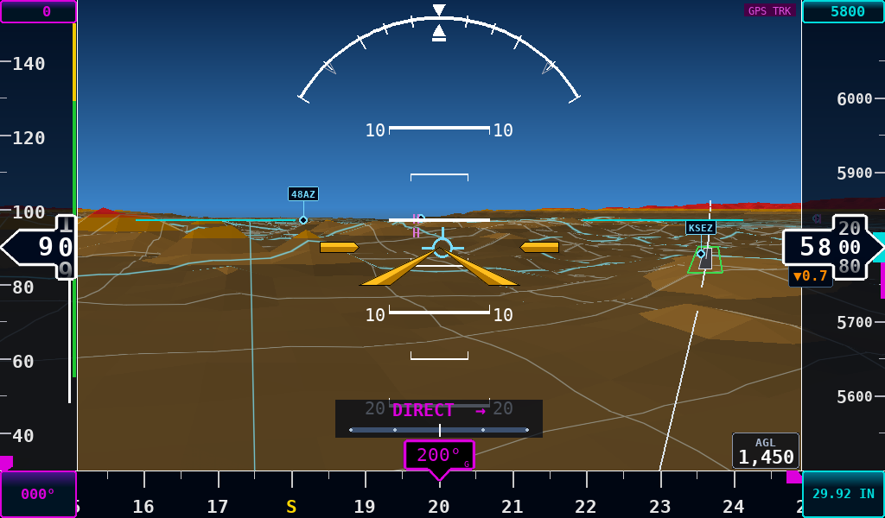

### Altitude tape

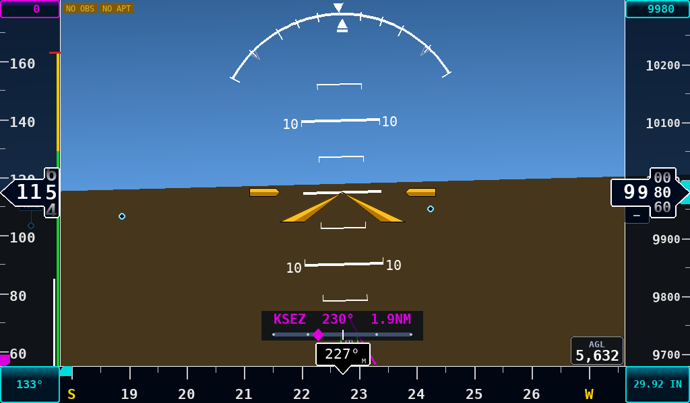

Veeder-Root drum on the right side. Scrolls in 50 ft increments. The right-hand inner drum shows the ten-foot digit; the centre cell shows the hundreds/tens pair in 20-ft steps; the leading thousands column reveals the next column one slot above so transitions through 1000 / 10000 ft stay readable. The drum renders as two/three independent cells that roll at the correct rates — the altitude value is always the number vertically centred in the large outer cell.

**Altitude bug** settable via numpad (entry in hundreds of feet) or by tapping the tape.

| Colour | Source |
|--------|--------|
| Cyan | Barometric altitude (BME280 active) |
| Magenta | GPS altitude (baro failed or absent) |

### Baro setting

| Display | Colour | Meaning |
|---------|--------|---------|
| `29.92 IN` | Cyan | BME280 active; inHg |
| `1013 hPa` | Cyan | BME280 active; hPa |
| `GPS ALT` | Magenta | No baro sensor |

### VSI

Green/amber bar along the inner edge of the alt tape. ±2000 fpm scale. Amber above ±1500 fpm.

---

## 4. Attitude Indicator

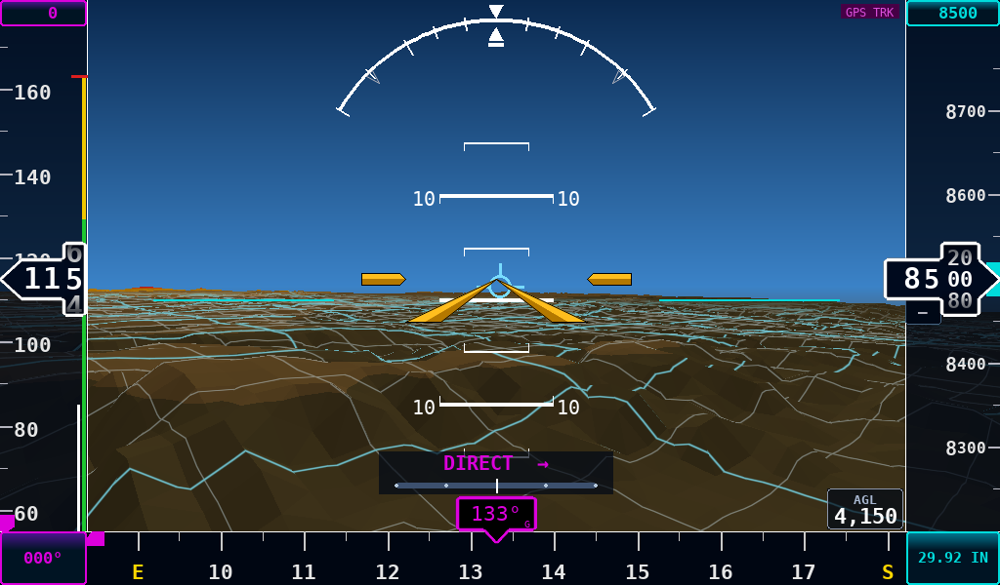

### Synthetic vision background

The Pi 4 renders a **full 3D Synthetic Vision Terrain (SVT)** background behind the attitude indicator using OpenGL ES. A terrain mesh is built from SRTM elevation data within a 20 nm radius of the aircraft and rendered through a true perspective projection from the aircraft's position.

**Key capability:** Unlike 2D scanline renderers, the OpenGL SVT shows terrain features that are **above the aircraft's altitude** — mountain peaks and ridges rise **above the horizon line** in correct geometric perspective. This gives the pilot a natural, out-the-window view of the terrain environment.

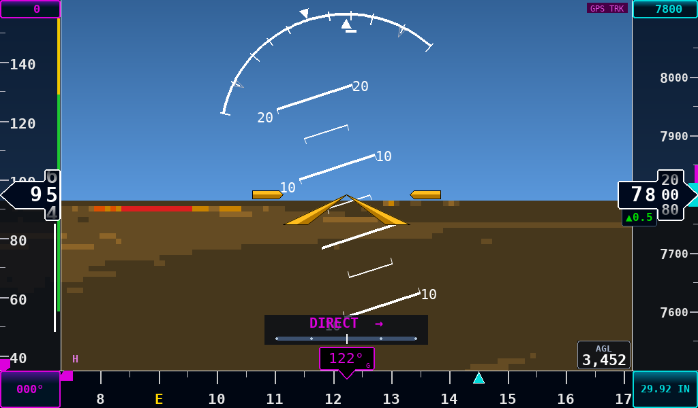

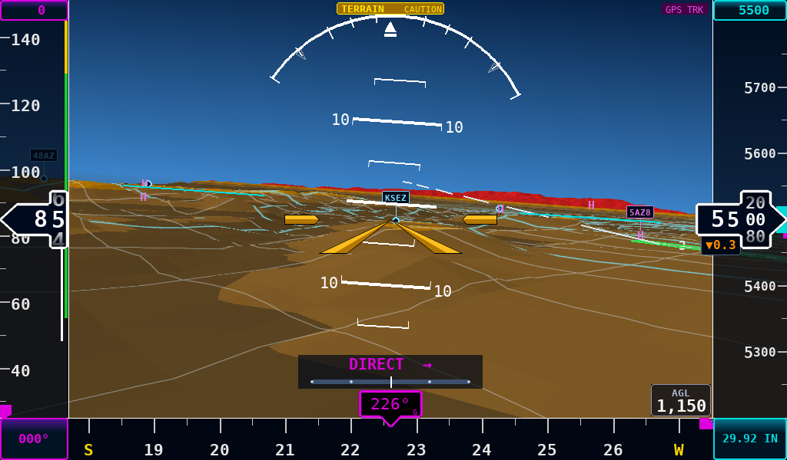

#### Clearance colouring

Terrain is coloured by clearance below the aircraft:

| Clearance | Colour | Meaning |
|-----------|--------|---------|
| Above aircraft altitude | Red | Terrain is higher than you — obstacle |
| 0–100 ft below | Deep orange | Immediate proximity |
| 100–500 ft below | Amber | Caution |
| 500–1000 ft below | Brown | Safe clearance |
| 1000–2000 ft below | Dark brown | Well clear |
| More than 2000 ft below | Very dark | Far below |

Beyond the 20 nm mesh edge the rendering fades to a dusty atmospheric-haze gradient that blends with distant terrain so there is no visible seam.

#### Sun-angle lighting

Terrain is shaded by a directional sun source so that slopes facing the sun appear brighter and slopes in shadow darken toward the ambient level. Ridge-lines, valleys, canyons, and mesa edges become immediately recognisable. Default sun position is 45° elevation, SE azimuth (mid-morning). This is configurable in `pi4/svt_renderer_gl.py`.

#### Distance grid

A cyan grid aligned with cardinal directions is overlaid on the terrain to help judge distance and orientation.

- Minor lines every **0.5 nm** (counts squares to estimate distance)
- Major lines every **2 nm** (slightly brighter for longer-range reference)
- Lines fade toward the mesh edge to avoid clutter at the visible horizon
- Grid colours switch automatically: light cyan-white on brown terrain, dark blue on red/orange "above aircraft" terrain for contrast

The grid doubles as a heading reference — the N/S grid line is always parallel to true north, so a glance at the grid orientation relative to the aircraft symbol gives a crude no-compass heading check.

#### Zero-pitch reference line

A pair of short cyan hash marks across the AI mark the aircraft's **0° pitch reference** in the sky frame. With 3D SVT the visible horizon may be higher or lower than the actual 0° pitch position depending on terrain (for example, mountains above your altitude push the apparent horizon up). The zero-pitch line is independent of terrain — it always shows where level flight would put the nose.

- Drops below AI centre in climbs
- Rises above AI centre in descents
- Tilts with the horizon during banks
- Aligned exactly with the pitch ladder's 0° bar

When terrain is at or below your altitude, the zero-pitch line and the visible SVT horizon coincide.

#### No terrain data

When no SRTM tiles are loaded the SVT falls back to a traditional blue-sky-over-brown-ground split. The `NO TER` badge appears in the status strip.

### Pitch ladder

White pitch bars run from ±5° out to ±80° (every 5° to ±20°, every 10° beyond). The horizon bar is white; line length narrows progressively at extreme attitudes so the ladder reads clean during unusual-attitude recoveries. Scale is 10 px/° and matches the SVT horizon projection exactly so the 0° bar and the terrain horizon align at every pitch.

### Roll arc and pointer

Graduated arc at the top of the AI implementing the **sky-pointer** convention. The arc and tick marks (10°, 20°, 30°, 45°, 60°) rotate with the sky so that the fixed aircraft reference at the very top of the screen reads the current bank angle on the arc. A moving doghouse outside the arc marks the sky's "up" direction; a fixed reference inside the arc at the top marks the aircraft's current bank position.

### Aircraft symbol

Amber swept-delta wing symbol fixed at AI centre.

### Flight-path vector (velocity vector)

A cyan open circle with two short horizontal wings and a vertical stub marks the **flight-path vector (FPV)** — where the airplane is actually going through space, not where the nose is pointed. It's computed from GPS: azimuth = ground **track**, elevation = flight-path angle (`atan2(vertical speed, groundspeed)`).

- **Horizontal offset** from the aircraft symbol = drift/crab (track vs. heading). In a left crosswind the FPV sits right of the nose, and vice-versa.
- **Vertical offset** = the difference between pitch and flight-path angle. In a steady climb the FPV sits **below the nose by the angle of attack** — fly the FPV onto the runway numbers on approach and that's where you'll touch down, whatever the crab and AOA are doing.
- **Hidden below 5 kt** groundspeed (parked / taxi has no meaningful track).
- In an extreme attitude (or large crab) where the vector would fall outside the AI, it's **clamped to the edge as a small arrow** pointing toward the true off-screen vector, so the cue never just vanishes.

Toggle it on the DISPLAY setup screen — **FLIGHT PATH** (default **ON**). It draws over the synthetic-vision background and airport symbols, under the pitch ladder.

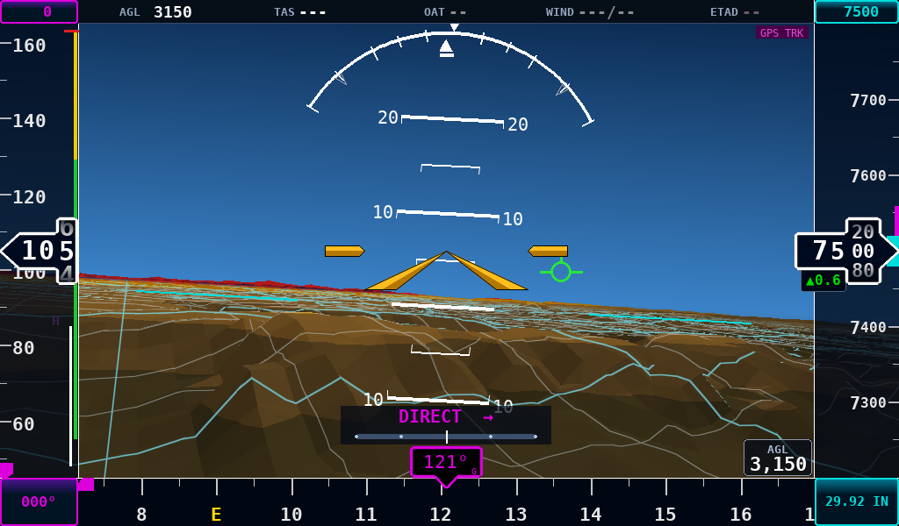

### Slip/skid indicator

A short white horizontal bar (16×4 px) sits below the roll pointer's doghouse base and slides laterally with uncoordinated flight. Centred under the zero-bank triangle = ball-centered, coordinated flight. The bar moves in the same direction as the imaginary ball of a conventional inclinometer — step on the rudder toward the bar to re-centre it.

### Terrain / obstacle proximity alert

**TERRAIN CAUTION** (amber, steady) — terrain clearance below **500 ft** along the 45-second look-ahead, or an obstacle within the forward wedge below **500 ft** of the aircraft.

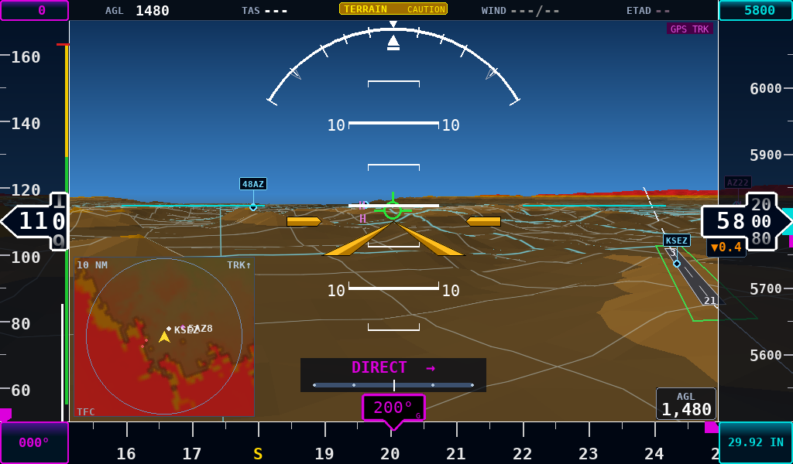

**PULL UP TERRAIN** (red, 1 Hz flash) — terrain clearance below **100 ft** along the look-ahead, or an obstacle within the forward wedge below **100 ft**.

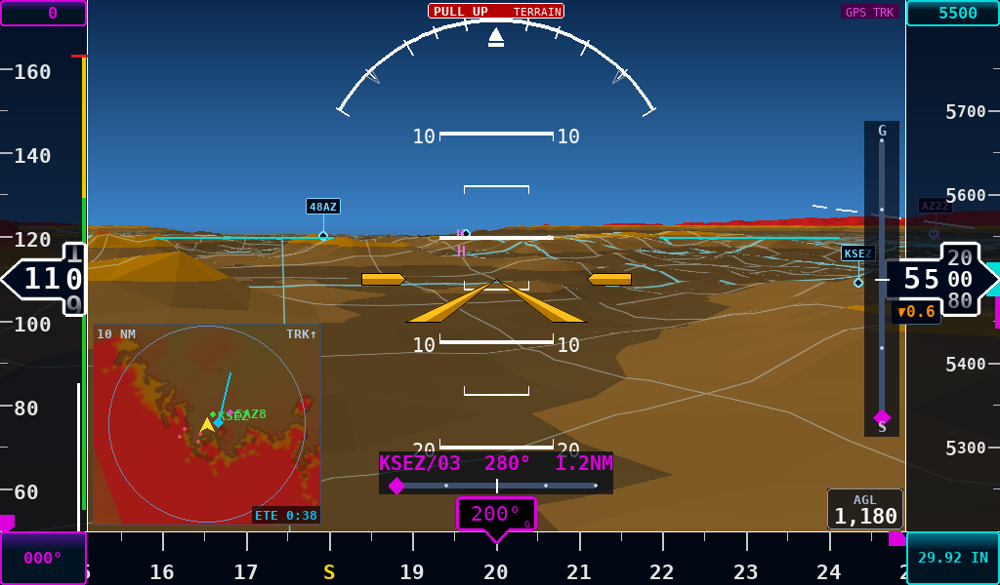

**TERRAIN look-ahead**: the alert isn't fired off your current ground point alone. Each render frame the PFD walks twelve samples along your current GPS ground track for 45 s of flight (≈ 1.2 NM at 100 kt), projects altitude forward at the current VSI, and trips the alert on the worst clearance encountered — same convention EGPWS / TAWS-B uses. The benefit is that you get the banner (and the voice callout) while there's still room to climb, not when you're already in the wall.

**Forward wedge**: obstacle proximity is filtered to a **±25° wedge** around the GPS ground track. A 1500 ft tower abeam or behind the wing won't fire the alert — only obstacles you're actually flying toward. The wedge is wider than the AI's angular FOV so a sloppy bank doesn't unhide a tower you were about to overfly.

**Low-speed inhibit**: alerts (terrain and obstacle, both banners *and* the voice callouts) are silenced below **VS0** (default 48 kt). This kills the nuisance fire during taxi, takeoff roll, and landing rollout where the aircraft is in continuous "ground-impact territory" by design. Sink-rate / bank-angle callouts share the same inhibit.

**Approach-corridor auto-inhibit**: when a synthetic approach is loaded (§16) and the aircraft is inside the published-approach corridor, TAWS callouts auto-suppress — same Mode 7 convention Honeywell MK V/VII and Garmin G3X use. The corridor is defined as:

- Within **5 NM** of the threshold along the approach course
- Cross-track within **±0.3 NM** of the published centreline (matches the CDI full-scale on approach)
- Altitude between threshold-elevation and threshold + **2 500 ft**

While the aircraft is in the corridor the look-ahead terrain / obstacle / pull-up alerts go quiet — you don't get nagged during a normal descent into a known runway environment. **Sink-rate stays armed** because "you're going down too fast at the runway" is the one cue that's still relevant on a stabilised approach. The moment the aircraft drifts outside the corridor (high deviation, way off centreline, missed approach, sidestep manoeuvre) every alert comes back automatically.

A `TER INH APR` amber badge appears in the status strip whenever the auto-corridor is gating callouts, so you can see at a glance that the TAWS safety net is currently off and that it's the approach that turned it off (not a stuck manual inhibit). The badge clears the instant the aircraft leaves the corridor or the approach is cancelled.

**Manual TERRAIN INHIBIT**: a pilot-controlled mute on the AHRS / Sensors screen (§11). Tap **INHIBIT** to silence terrain + obstacle + pull-up callouts for **120 seconds**, after which the safety net comes back on automatically. Use it at known false-positive locations (low passes, off-airport landings, charted approaches into airports surrounded by terrain where the auto-corridor doesn't catch it). The status badge `TER INH Xs` appears in the badge strip with the remaining countdown so you can never forget the inhibit is on. A second tap clears the inhibit immediately. Sink-rate also stays armed under manual inhibit.

Requires GPS fix and SRTM tiles (terrain) or FAA obstacle data (obstacles) loaded.

Voice callouts for the same conditions live in §20. The full alert pipeline (banner + voice + on-AI red recovery cues at extreme attitudes) is designed so the pilot gets the same information whether their eyes are on the instruments or on the windscreen.

### Past 60° bank — sky/ground and pitch ladder agreement

At extreme bank the simple sky/ground polygon (used when there is no SRTM tile or when the unusual-attitude declutter has stripped the SVT mesh, see §21) is drawn from a roll-aware horizon **direction vector** rather than a fixed-up horizontal line. Past ±60° this prevents the brown half from sliding across the wrong side of the AI — the sky/ground split now agrees with the pitch ladder all the way to inverted, and the AI no longer flips to "all brown" when rolled past vertical.

### Roll-aware horizon point

The horizon point the SVT camera projects through is rotated with bank so that inverted flight no longer puts the entire SVT inside the brown half of the screen. Combined with the pitch-ladder Euler-chart fix (pitch >90° re-expressed as 180°−pitch with a 180° roll offset; see `normalize_attitude` in `pi4/pfd.py`) the AI stays drawable through over-the-top loops and split-S manoeuvres.

---

## 5. Heading Tape

### Heading source modes


**MAG mode (default):** Magnetometer heading. Dim border, `M` subscript.

**GPS TRK mode:** Heading slewed to GPS track via complementary filter. Magenta border, `G` subscript. `GPS TRK` badge appears.

### Track pointer

In MAG mode with GPS fix, a **magenta** tick shows GPS ground track (wind/crab indication). Magenta matches the PFD's data-source convention: GPS-derived values and indicators are magenta; sensor-derived values are cyan.

### Heading bug

Chevron on the tape. CYAN (MAG) / MAGENTA (GPS TRK). Settable via numpad or tap on tape.

### Magnetic vs True reference

A small **`MAG`** / **`TRU`** tag sits at the top-left of the heading box telling you which reference *all* headings and courses are shown in:

- **`MAG` (default, grey):** Magnetic — matches charts, plates, runway numbers and ATC clearances. The system computes everything internally in **true** and subtracts the local magnetic variation from the **WMM2025** world magnetic model at your GPS position. In Arizona that's about 10–11° east, so a runway labelled "03" reads ~030°, not the ~041° true it actually points.
- **`TRU` (amber):** True — every heading/course shown exactly as computed, no variation applied. The amber tag flags that you're off the charted (magnetic) convention.

The toggle is **Setup → Display → UNITS → HDG / CRS REF**. It is one global setting: the heading tape, the data-strip `TRK` / `HDG` / `BTW` / `DTK` / `WIND` fields, the CDI/direct-to bearing, and the flight-plan leg courses all follow it. The choice persists across power cycles and is per-display (each screen can differ). Without a GPS fix the system can't look up variation, so MAG mode shows true until a fix is acquired.

> The magnetometer is still calibrated against *true* cardinals (the compass-cal wizard is unchanged); MAG mode is purely a display conversion, so the internal navigation math is unaffected.

---

## 6. Status Badges

Blank during normal flight. Appear only when attention required.

| Badge | Colour | Meaning |
|-------|--------|---------|
| `AHRS FAIL` | Red | IMU data absent or invalid |
| `NO LINK` | Red | SSE stream not connected |
| `NO TER` | Amber | No SRTM terrain tiles loaded |
| `NO OBS` | Amber | No FAA obstacle data loaded |
| `EXP OBS` | Orange | Obstacle data > 28 days old |
| `NO APT` | Amber | No airport data loaded |
| `EXP APT` | Orange | Airport data older than expiry |
| `TER INH` *N*`s` | Amber | TAWS callouts muted by the pilot, *N* seconds remain on the 120 s inhibit |
| `TER INH APR` | Amber | TAWS callouts auto-inhibited because the aircraft is inside the approach corridor of an active synthetic approach (§16). Clears automatically when you leave the corridor or cancel the approach. |
| `GPS TRK` | Magenta | GPS TRK heading mode active |
| `GPS ALT` | Amber | Altitude from GPS (baro failed) |
| `NO FIX` | Amber | GPS hardware responding (NMEA flowing) but no satellite lock yet — acquiring. A shadow/peer display mirrors the source's GPS, so it too shows **NO FIX** (not NO SIGNAL) while the source is still acquiring. |
| `NO SIGNAL` | Red | GPS hardware not responding (no NMEA at all). If GPS is the only position source, airspeed/altitude also show a red ✕. |

---

## 6A. PFD Top Ribbon

The band across the top of the attitude indicator — between the **groundspeed** bug box (top-left) and the **altitude** bug box (top-right) — is a **configurable 5-slot readout ribbon**. It gives you a row of glanceable numbers on the PFD itself, separate from the MFD's bottom data strip (§15).


**Default fields:** **AGL · TAS · OAT · WIND · ETAD** — height above terrain, true airspeed, outside air temperature, wind direction/speed, and estimated arrival at the final destination.

**Configuring it.** **Tap the ribbon** to open its field picker: the five current slots show as pills across the top (the selected one ringed cyan); tap a field in the grid to assign it, and the selection auto-advances to the next slot so you can fill the row with successive taps. It draws from the **same field set as the MFD data strip** — groundspeed, airspeed, TAS, track, heading, altitude, AGL, VS, WIND, UTC, baro, satellites, and the nav-derived WPT · BTW · DTK · DIST · DISTD · XTE · ETE · ETED · ETA · ETAD. See **§15** for the full field table and the **ARRIVAL TIME (LOCAL / ZULU)** toggle that governs the ETA/ETAD readouts.

**Independent of the MFD strip.** The PFD ribbon keeps its **own** 5-slot selection — changing it doesn't touch the MFD's 8-slot strip, and vice-versa. Both persist in `data/settings.json` across power cycles.

**Values fill when their source is live.** A field reads `--` (or `---/--` for WIND) until its data is available: AGL needs terrain data, TAS/OAT/WIND need air-data (WIND is computed from the TAS + GPS-track triangle when there's no OAT sensor), and ETAD needs an active flight plan or Direct-To.

**Alerts win.** When an annunciation fires (terrain, traffic, etc.) it paints over the ribbon, so a warning is never hidden behind a readout.

---

## 7. Setting Bugs

Three bugs — altitude, heading, ground-speed — plus the baro setting. All four use the same numpad overlay.

### Bug buttons on the PFD

Four tap targets sized for gloved / in-turbulence use. The bug buttons fill the full heading-strip height (55 px on 1024×600) so they're easy to hit without looking away from the horizon.

| Button | Location | Opens |
|--------|----------|-------|
| **Speed bug** | Top of airspeed tape | SET SPD BUG |
| **Altitude bug** | Top of altitude tape | SET ALTITUDE BUG |
| **HDG bug** | Bottom-left of heading strip | SET HDG BUG |
| **Baro** | Bottom-right of heading strip | SET BARO inHg / SET BARO hPa |

### Numpad entry

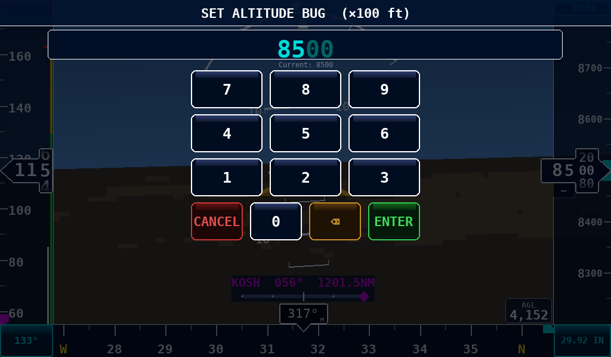

Tap the readout button. The numpad slides in over the live PFD so attitude remains visible behind the keys.

**Current value is shown as a dim placeholder** under the entry field — the input starts empty so typing ENTER without changing anything keeps the previous bug value. Typing overwrites; ⌫ backspaces the buffer.

| Target | Entry | Example |
|--------|-------|---------|
| Altitude | hundreds of feet | `85` → `8500 ft` |
| Heading | 3 digits | `270` → `270°` |
| Speed  | whole knots | `90` → `90 kt` |
| Baro (inHg) | 4 digits, decimal auto-inserted | `2992` → `29.92 in` |
| Baro (hPa) | plain integer | `1013` → `1013 hPa` |

Numpad keys: `0`–`9`, **CANCEL**, **⌫** (backspace — deletes one character from the buffer), **ENTER**. The numpad is centred under the AI so the fingers rest below the horizon while typing.

### Baro entry

The baro numpad title switches between **SET BARO inHg** and **SET BARO hPa** based on the unit selected in Display Settings. The pre-populated placeholder shows the current baro setting in whichever unit is active.

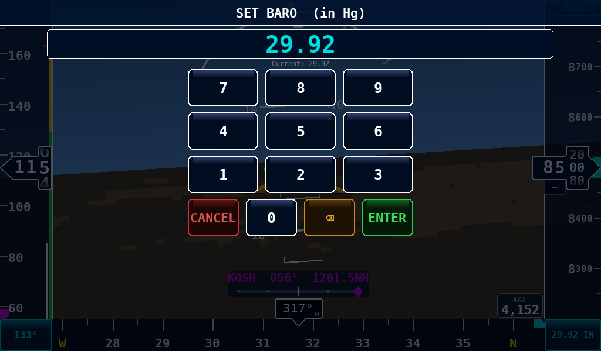
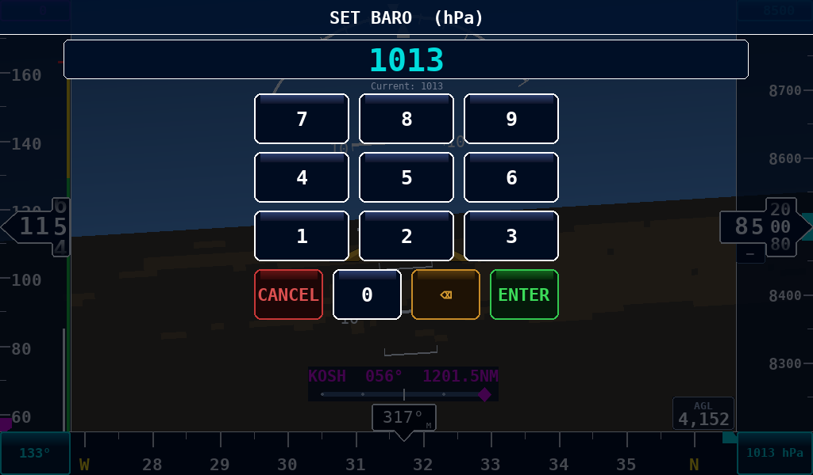

### Tape taps

Tap heading tape → jump HDG bug. Tap altitude tape → jump alt bug (nearest 100 ft). These are fine-positioning shortcuts — the buttons and numpad are for precise values.

### Clear

Enter `0` + **ENTER**. Clears the bug (alt/spd/hdg); for baro this resets to 29.92 in / 1013 hPa.

---

## 8. Setup Menu

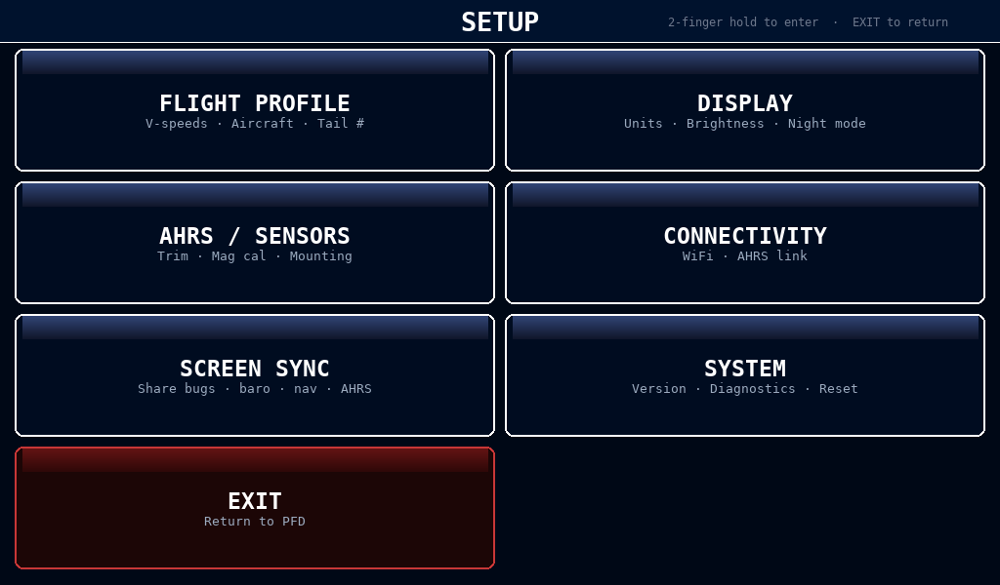

Two-finger hold 0.8 s → six tiles: FLIGHT PROFILE, DISPLAY, AHRS / SENSORS, CONNECTIVITY, SYSTEM, EXIT.

---

## 9. Flight Profile — V-Speeds and Callsign

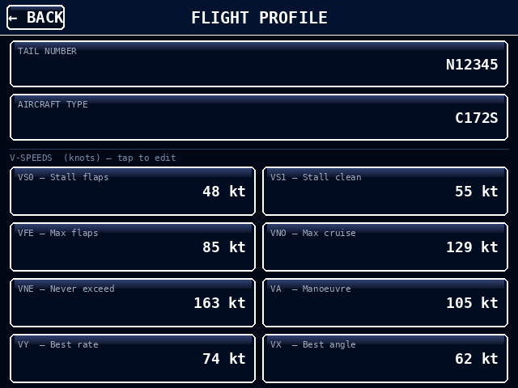

Cessna 172S defaults: VS0=48, VS1=55, VFE=85, VNO=129, VNE=163, VA=105, VY=74, VX=62 kt.

Tap any V-speed box to change — the numpad opens with the current value shown as a dim placeholder. RESET DEFAULTS restores all.

### Keyboard — tail number and aircraft type

Tap **CALLSIGN** or **A/C TYPE** to open the on-screen keyboard.

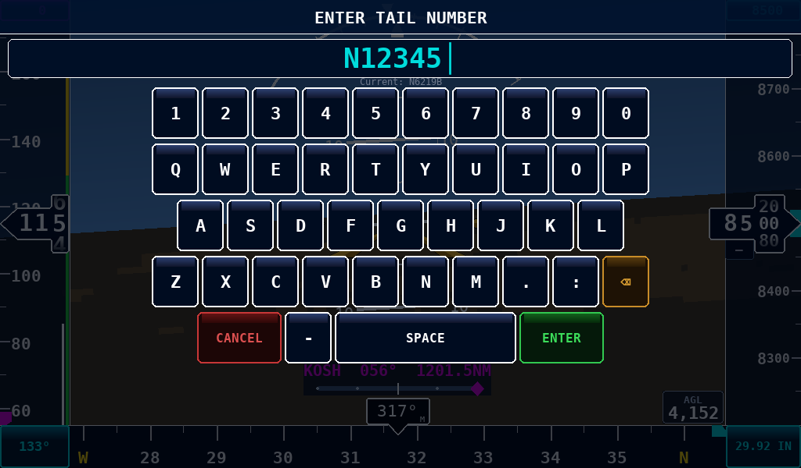

Four rows:

1. Digits `1 2 3 4 5 6 7 8 9 0`
2. `Q W E R T Y U I O P`
3. `A S D F G H J K L`
4. `Z X C V B N M` + period (`.`), colon (`:`), and **⌫** backspace

Action row across the bottom: **CANCEL** (discard), hyphen (`-`), **SPACE**, **DONE** (commit).

The period and colon keys are useful for entering URLs (e.g. `http://192.168.4.1`) on the Connectivity screen — the same keyboard is used there. The current field value appears pre-populated so you can edit in place rather than re-typing from scratch; the ⌫ backspace key deletes one character at a time from the end of the buffer.

---

## 10. Display Settings

The screen is split into three tabbed sub-pages — **UNITS**, **DISPLAY**, and **MAP** — selected from the tab bar under the header. Tapping a tab swaps the visible rows; each page fits without scrolling. The screen opens on **UNITS**. The current tab is not persisted — the screen always reopens on UNITS.

**UNITS** — speed / altitude / pressure:

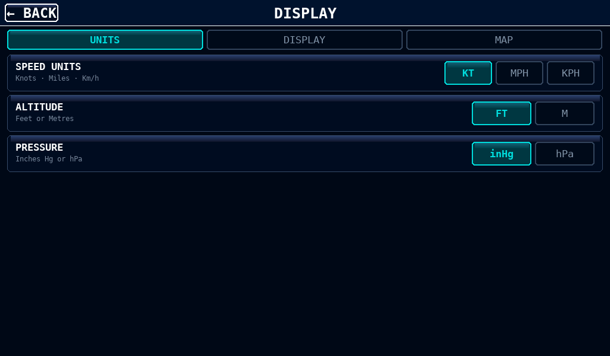

**DISPLAY** — brightness, alert audio/volume, sun position, flight path:

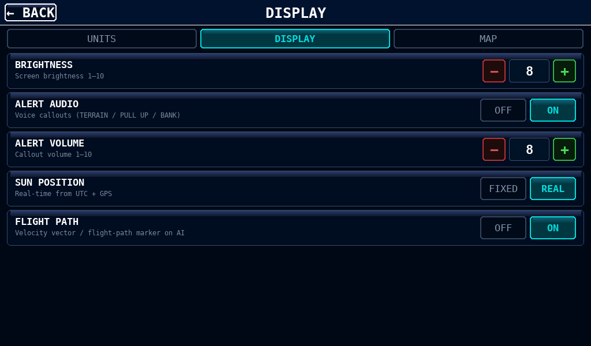

**MAP** — inset enable/orient, range, winds level, traffic filters, MAP LAYERS:

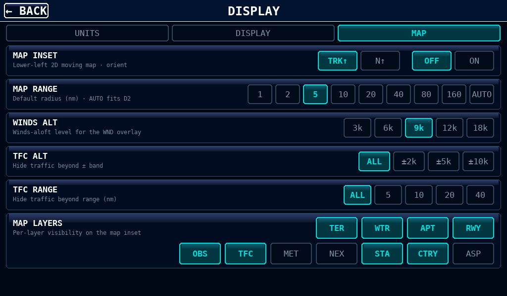

| Tab | Row | Options | Default | Notes |
|-----|-----|---------|---------|-------|
| UNITS | **SPEED UNITS** | KT / MPH / KPH | KT | Speed tape + bug numpad units. |
| UNITS | **ALTITUDE** | FT / M | FT | Altitude tape, bug, AGL readout. |
| UNITS | **PRESSURE** | inHg / hPa | inHg | Baro setting; numpad title and entry mode follow this. |
| UNITS | **HDG / CRS REF** | MAG / TRUE | MAG | Reference for *all* displayed headings and courses (heading tape, TRK/HDG/BTW/DTK/WIND strip fields, CDI bearing, FPL leg courses). MAG applies WMM2025 magnetic variation at GPS position so the numbers match charts/plates/ATC; TRUE shows the raw computed values. The heading box carries a `MAG` / `TRU` tag. See §5. |
| DISPLAY | **BRIGHTNESS** | 1 – 10 | 8 | Backlight level. Routed to the active backlight transport (see below). |
| DISPLAY | **ALERT AUDIO** | OFF / ON | ON | Master mute for the voice-callout pipeline. When OFF, terrain / obstacle / sink-rate / bank-angle callouts are suppressed and any in-flight clip is cut. The visual banners stay on regardless. |
| DISPLAY | **ALERT VOLUME** | 1 – 10 | 8 | Callout volume scale. 0 is effectively muted; 10 is unity. Applied live to the pygame mixer; takes effect on the next callout. |
| DISPLAY | **SUN POSITION** | FIXED / REAL | REAL | SVT terrain lighting: FIXED uses a SE mid-morning sun; REAL pulls UTC + GPS lat/lon through the NOAA solar formulas. |
| DISPLAY | **FLIGHT PATH** | OFF / ON | ON | Flight-path vector (velocity-vector) marker on the AI. See §4. |
| DISPLAY | **HITS BOXES** | OFF / ON | ON | Highway-in-the-sky approach corridor — the cyan 3D boxes drawn on the AI during an active synthetic approach (§16). Turn off to declutter the AI on approach; the VDI / CDI still work. |
| MAP | **MAP INSET** | OFF / ON + TRK↑ / N↑ | OFF · TRK↑ | Lower-left 2D moving-map inset and its rotation mode. See §17. |
| MAP | **MAP RANGE** | 1/2/5/10/20/40/80/160 NM · AUTO | 5 NM | Default inset radius; AUTO fits to the active direct-to. |
| MAP | **WINDS ALT** | 3k / 6k / 9k / 12k / 18k ft | 9k | Winds-aloft level shown on the WND overlay. See §16. |
| MAP | **TFC ALT** | ALL / ±2k / ±5k / ±10k ft | ALL | Hide traffic outside this relative-altitude band. See §16G. |
| MAP | **TFC RANGE** | ALL / 5 / 10 / 20 / 40 NM | ALL | Hide traffic beyond this range. |
| MAP | **MAP LAYERS** | TER · WTR · APT · RWY · OBS · TFC · MET · NEX · STA · CTRY · ASP (independent pills) | all ON | Per-layer visibility for the moving-map inset. **TER** terrain tint; **WTR** ocean/lake water mask; **APT** airport / heliport / seaplane symbols; **RWY** runway outlines; **OBS** FAA DOF obstacles; **TFC** traffic; **MET** METAR station dots (idents labelled when zoomed in below 160 NM range); **NEX** NEXRAD; **STA** state / province boundary lines (Natural Earth admin_1, slate-blue, fades in at ≥ 20 NM); **CTRY** country boundary lines (Natural Earth admin_0, tan, also ≥ 20 NM); **ASP** airspace. Toggles are independent and persist in `data/settings.json`. |

### Backlight transports

`BRIGHTNESS` writes to whichever backlight control is wired:

1. **sysfs** — `/sys/class/backlight/rpi_backlight/brightness` (Waveshare 3.5" DPI; some HDMI panels with backlight pads on the DSI bus expose the same node).
2. **DDC/CI** — `ddcutil` on the i2c-N bus matching a panel that speaks VESA MCCS. The ROADOM 7" / 10" HDMI panels fall into this bucket. Writes are background-threaded and serialised so a brightness drag never blocks the render loop.
3. **None** — neither found; the slider still works in the UI but won't change panel output. Diagnostic logs print `[BL] No backlight control available` at startup.

The Pi 4 setup script installs `ddcutil` and pre-loads the `i2c-dev` module. If brightness control silently does nothing on an HDMI panel, run `sudo ddcutil detect` to confirm the panel responds and that `Brightness (10)` is in its VCP feature list.

### Alert volume / mute persistence

`ALERT AUDIO` and `ALERT VOLUME` persist with the rest of the display settings in `data/settings.json` and reload at boot, so the speaker level you set on the bench is what powers up in the cockpit. The startup self-test fires a one-shot `"terrain"` callout at boot (unless ALERT AUDIO is OFF) so you can confirm the speaker is alive without waiting for a real alert.

---

## 11. AHRS / Sensors

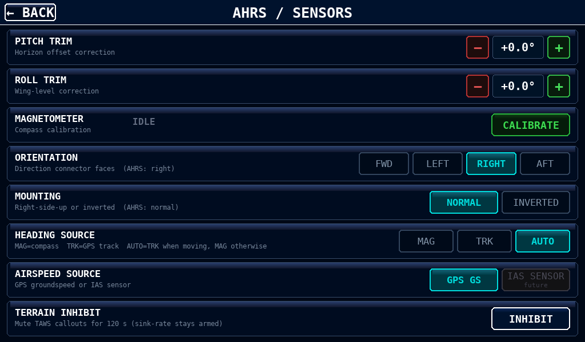

Seven rows on this screen, each independent:

| Row | Control | Default | Notes |
|-----|---------|---------|-------|
| **PITCH TRIM** | ± steppers + **LEVEL** button | 0.0° | 0.1° per tap. Display-side fine-trim for a horizon that sits above/below level on the ground. **LEVEL** (green, this row) is a one-tap *AHRS flight zero* — see below. |
| **ROLL TRIM** | ± steppers | 0.0° | 0.1° per tap. Display-side fine-trim for a wing that reads low on the ground. |

**LEVEL (AHRS flight zero).** The green **LEVEL** button on the PITCH TRIM row re-zeros the **AHRS itself** to the current attitude — the "Level" cage a Sentry gives ForeFlight. Fly straight-and-level, tap it once, and the AHRS treats your present orientation as its new level.

This is a true **sensor** zero, not a display trim: it folds the captured attitude into the AHRS **input-side axis alignment** (`PITCH ALIGN` / `ROLL ALIGN`), which rotates the raw gyro/accelerometer/magnetometer *before* the attitude filter runs. The new alignment is pushed to the AHRS (over USB `$ALIGN`, or HTTP `/align` on a WiFi link), **persisted in the AHRS flash**, and seen identically by every display. Because it corrects the mounting tilt at the sensor input, it also removes the yaw-into-pitch/roll coupling that makes a small static error *compound in turns* — the failure mode that makes an un-levelled AHRS unusable. Use it whenever you couldn't do a full ground level.

Notes: the correction is clamped to the AHRS's ±10° alignment range (a residual larger than that is a wrong ORIENTATION/MOUNTING, not a trim job — fix those first). Tapping it also clears any leftover display-side PITCH/ROLL TRIM so the zero isn't double-counted. It's reversible from the PITCH ALIGN / ROLL ALIGN steppers, and you can re-tap any time. On a display connected to the AHRS over WiFi only, the push uses the HTTP `/align` endpoint.
| **MAGNETOMETER** | CALIBRATE button | (idle) | Opens the 8-point compass-cal wizard (N / NE / E / SE / S / SW / W / NW). Cal is stored *on the AHRS* in flash, so both Pi 4 and Pi Zero displays read the same calibrated heading off the SSE / USB broadcast. Status row shows `max \|Δ\| X.X°` once a cal is committed. |
| **ORIENTATION** | FWD / LEFT / RIGHT / AFT | RIGHT | Which side of the AHRS the connector points toward, viewed from the pilot's seat. |
| **MOUNTING** | NORMAL / INVERTED | NORMAL | Whether the AHRS is right-side-up or upside-down. Independent of orientation. |
| **HEADING SOURCE** | MAG / TRK / AUTO | AUTO | Magnetometer, GPS ground track (via complementary filter), or auto-select (TRK in motion, MAG when stationary). |
| **AIRSPEED SOURCE** | GPS GS / IAS SENSOR | IAS SENSOR | IAS from the SDP33-1500Pa differential-pressure sensor (default when `airdata_ok`). Forced fallback to GPS groundspeed when the sensor is unhealthy or the pilot pins it manually. |
| **SDP ZERO** | CAPTURE button | (idle) | Capture the current differential-pressure reading as the in-flight zero offset. Aircraft must be stationary with no airflow over the pitot. Status row shows `LAST ZERO h:mm ago`. |
| **TERRAIN INHIBIT** | INHIBIT button | (off) | Mute all TAWS callouts (terrain look-ahead, obstacle, pull-up) for 120 s. Sink-rate stays armed — the descent-rate alert still applies even while inhibited. Status row shows the countdown while active; an amber `TER INH Xs` badge also appears in the badge strip. Second tap clears the inhibit early. Auto-clears on timeout. |

### Mounting and orientation

The AHRS box can be installed with the connector facing any of four directions, plus right-side-up or upside-down:

- **ORIENTATION = RIGHT** (default): connector toward the right wing. No transform applied.
- **ORIENTATION = FWD**: connector toward the nose. Pitch and roll axes swap; magnetic heading shifted +90°.
- **ORIENTATION = LEFT**: connector toward the left wing. Pitch and roll both negate; heading shifted +180°.
- **ORIENTATION = AFT**: connector toward the tail. Pitch and roll axes swap (opposite of FWD); heading shifted +270°.

Combine with **MOUNTING = INVERTED** for upside-down installs — the inversion is a separate flip about the longitudinal axis applied after orientation.

The base AHRS firmware reports yaw and roll with an ENU-style sign convention; the display assumes NED. The PFD negates roll and yaw at the base before any orientation transform layers on, so once you've picked the right ORIENTATION + MOUNTING the AI banks the same direction as the airplane and the heading number rises when you turn right. Pitch is unchanged between the two conventions.

**Sim and Demo modes bypass every AHRS-mounting compensation** (orientation, mounting, base correction, trim, compass cal) so a calibrated trim doesn't show up as wing-down on a level sim flight.

### Compass calibration (8-point walk-through)

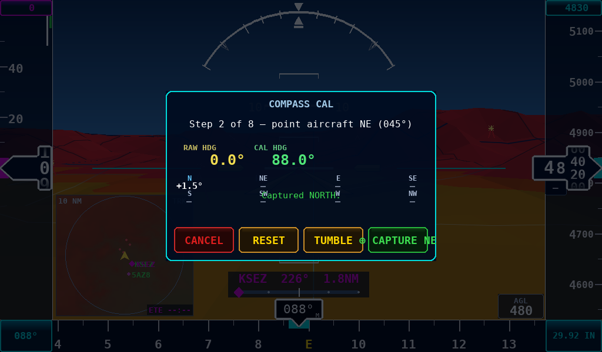

Tap CALIBRATE on the MAGNETOMETER row to open the wizard. Step through eight headings, holding each one steady before you tap CAPTURE:

1. **N** (000°) → **⊕ CAPTURE N** (or press ENTER on a keyboard).
2. **NE** (045°) → CAPTURE NE.
3. **E** (090°) → CAPTURE E.
4. **SE** (135°) → CAPTURE SE.
5. **S** (180°) → CAPTURE S.
6. **SW** (225°) → CAPTURE SW.
7. **W** (270°) → CAPTURE W.
8. **NW** (315°) → CAPTURE NW.

The modal shows live readouts for **RAW HDG** (the raw compass output before cal) and **CAL HDG** (with the cal applied), plus the captured Δ values laid out in two rows of four (N / NE / E / SE on top, S / SW / W / NW below). After the eighth capture the cal commits automatically.

| Button | Action |
|--------|--------|
| **EXIT** | Close the modal. The cal commits on the 8th capture so this is non-destructive. Reads CANCEL only mid-walk when there are partial captures still in flight to the AHRS. |
| **RESET** | Wipe the stored cal back to zero (sends `$MAGDEV,CLEAR` to the AHRS, or `/magcal?action=clear` over Wi-Fi). |
| **RESTART** | Abandon partial captures and restart the eight-capture sequence. |
| **⊕ CAPTURE *X*** | Record the current heading at the cardinal/intercardinal indicated by *X*. Available throughout. |

### Hard-iron calibration (TUMBLE)

The cal modal also has a **TUMBLE** flow — a faster hard-iron calibration that doesn't need you to find headings. Tap **TUMBLE** and then, over about **30 seconds**, slowly rotate the AHRS unit through **all** orientations (roll it, pitch it, yaw it — like polishing every face of a ball). The modal shows the **elapsed time** and the live **per-axis spread** (the min–max range the magnetometer has seen on X / Y / Z) so you can tell when you've covered enough; keep going until each axis stops growing. Tap **STOP TUMBLE** to finish.

The firmware tracks the min/max on each magnetometer axis during the tumble and, on finish, solves the **hard-iron offset** as the centre of that ellipsoid `((min+max)/2)` per axis, writes it to flash, and applies it before computing yaw. It drives the same `/magoff?action=tumble_start` / `tumble_finish` endpoints (over Wi-Fi or USB serial) and persists like the deviation table below — on the **AHRS**, so every display benefits.

Use TUMBLE when you can move the unit freely (bench, or a handheld unit before mounting); use the 8-point walk-through when it's already panel-mounted and you can only swing the airplane. *(The Pi Zero still has the 8-point flow only — its TUMBLE port is pending.)*

### Storage — AHRS-side, not display-side

Magnetometer calibration and the AHRS orientation / mounting selection both live in flash **on the Pico W**, not in the display's `settings.json`. The wizard builds a 36-point deviation table from your eight samples (linear interpolation per 10° slot) and pushes it to the AHRS over the USB serial link (`$MAGDEV,<36 floats>`) or the Wi-Fi config endpoint (`GET /magcal?action=set&t=…`). The Pico writes the table to `magdev.json` on its own filesystem and applies it before broadcasting yaw on the SSE / `$AHRS` stream. Same for orientation / mounting (`$ORIENT,connector,mounting` → `orient.json`).

Practical consequences:

- **Both displays see the same calibrated heading** — Pi 4, Pi Zero, and the iPhone PWA all consume the AHRS's pre-corrected yaw. You don't need to redo cal per display.
- **Re-flashing the display SD card doesn't lose the cal.** The cal sits on the AHRS, not on the display.
- **Re-flashing the Pico firmware does** — the deviation table lives on the Pico flash filesystem; a clean reflash wipes it. Re-run the wizard after a Pico re-flash.
- **The Pi 4 also keeps a local 36-point table** (`pi4_magdev` in `settings.json`) that it applies on top of the broadcast yaw if the push to the Pico fails (the wizard tries USB first, falls back to HTTP). This is a belt-and-braces second copy, not the source of truth.

The 36-point form on the AHRS gives finer resolution than the 8-sample input — at render time the firmware interpolates between adjacent slots so each 10° heading window has its own correction. Same convention as a real aircraft compass swing card; strictly better than a single average offset for sinusoidal hard-iron or higher-order soft-iron error.

### Heading source — MAG / TRK / AUTO

- **MAG** — magnetometer heading from the AHRS. Compass cal applies. Fastest response; subject to local magnetic deviation.
- **TRK** — GPS ground track via a complementary filter (high-frequency from AHRS yaw rate, low-frequency from GPS track). Shows the direction the aircraft is actually moving over the ground, including wind drift.
- **AUTO** — TRK while moving above ~3 kt ground speed; MAG when stationary or below the threshold (where GPS track is meaningless). Default.

Displayed heading sub-tag: `M` (cyan) for MAG, `G` (magenta) for TRK. AUTO shows whichever it's currently using.

The compass calibration only affects MAG-mode display. TRK mode is naturally drift-free because it's slaved to GPS ground track — a constant cal correction's frame-to-frame derivative blends invisibly into the complementary filter.

### AHRS firmware update

The AHRS firmware loader pushes `firmware.py` to the Pico W AHRS over the USB serial link. Tap the loader, and it transfers the firmware and reboots the Pico, showing a `Pushed firmware.py ✓` done state on success. (Re-flashing the Pico wipes the on-AHRS compass cal — re-run the wizard afterward, see Storage above.)

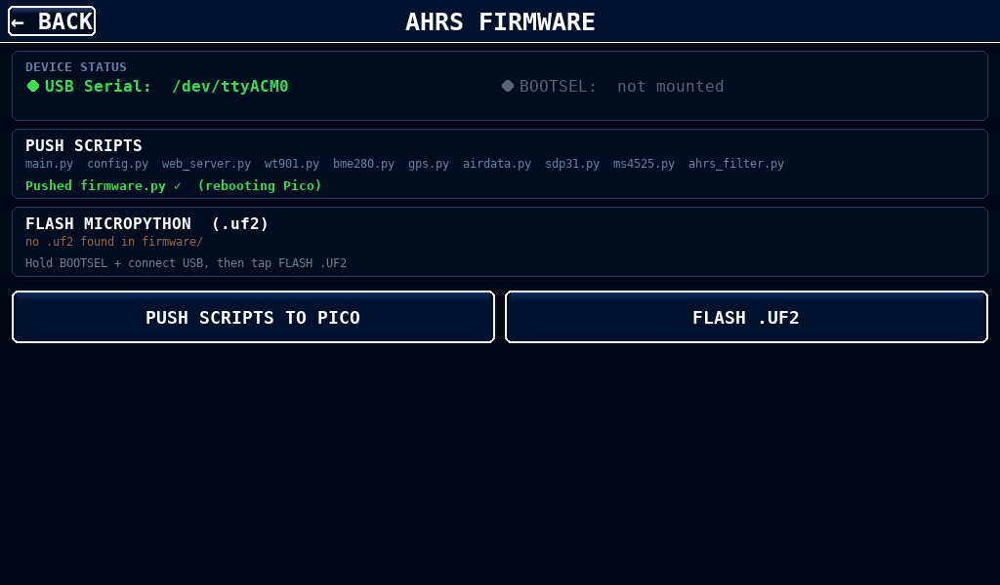

---

## 12. Connectivity

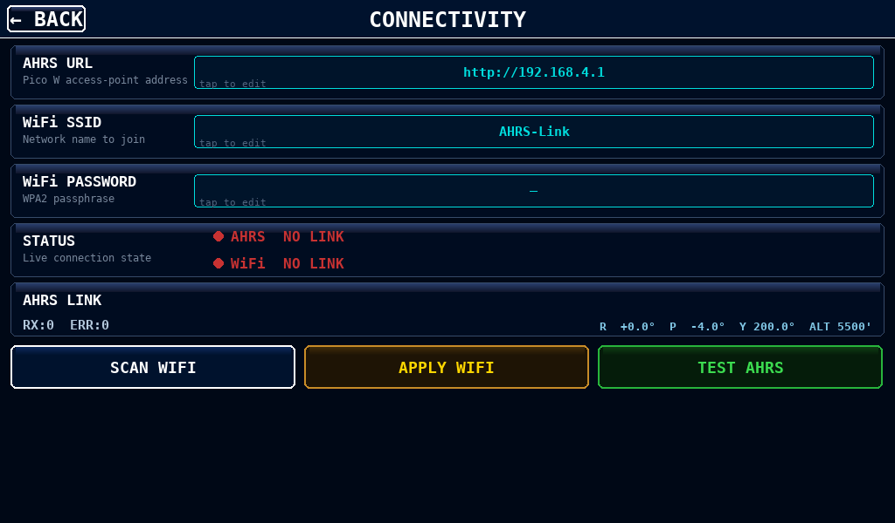

Editable fields + two status rows + two action buttons.

### Editable fields

Tap any value box to open the keyboard and edit.

| Field | Purpose | Default |
|-------|---------|---------|
| **AHRS URL** | Pico W access-point address | `http://192.168.4.1` |
| **WiFi SSID** | Network name the Pi should join (for downloads) | `AHRS-Link` |
| **WiFi PASSWORD** | WPA2 passphrase | (blank; not persisted) |
| **NOTAM KEY** | FAA NMS-API client_id | (blank) |
| **NOTAM SECRET** | FAA NMS-API client_secret (masked) | (blank) |
| **NOTAM ENV** | NMS environment: `preprod` (default) or `prod` | `preprod` |

The Wi-Fi password is intentionally **not** stored in `settings.json` and must be re-entered when you switch networks — see §13.

Rather than type the SSID by hand, tap the WiFi SSID field to open the **WIFI NETWORKS** scan list: nearby networks with signal-strength bars and a **WPA** / **OPEN** tag, plus a **RESCAN** button. Tap a network to drop it into the SSID field.

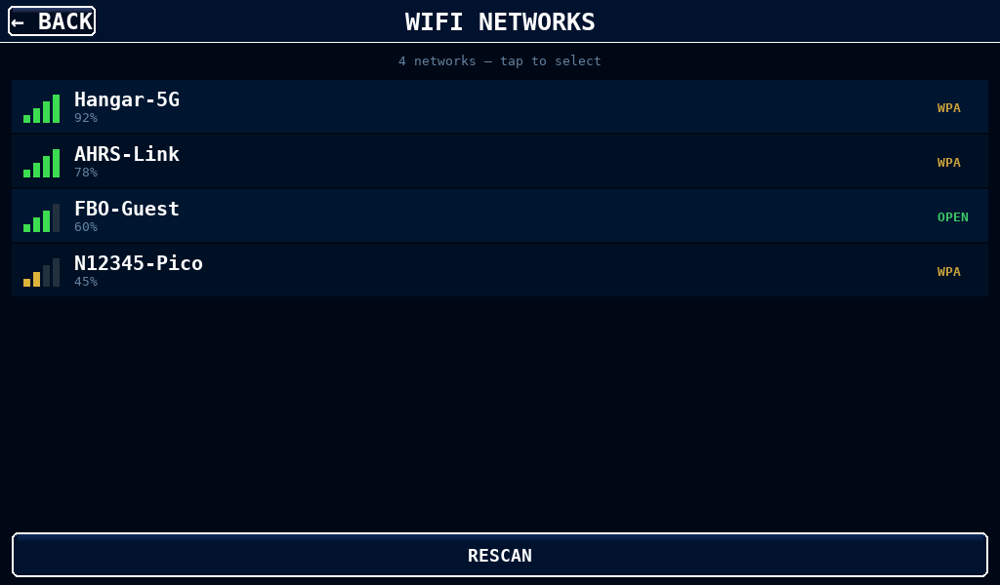

**NOTAMs** come from the **FAA NMS-API**. Paste your **client_id** into **NOTAM KEY** and your **client_secret** into **NOTAM SECRET** (masked with bullets), and leave **NOTAM ENV** at `preprod` (switch to `prod` only when you hold production credentials — it selects the NMS host). The poller reads them live, so entering a key enables NOTAMs (in the MET readout picker, §17) on the next fetch with **no reboot**; leave them blank and the rest of the weather suite is unaffected.

**One key for the whole panel.** You only need to enter the key on *one* display:

- *NOTAM data* is shared over the cabin network (screen-sync) — any display on the LAN shows NOTAMs even with **no key entered**, as long as one keyed display is feeding them.
- *The key itself* is **pushed to the other displays** the moment you finish entering it here, so each stores its own copy (persisted locally) and can fetch independently. See §12A.

NOTAMs are scoped to a tight, **zoom-following radius** (~10–40 nm), so the list stays local to what you're looking at rather than returning every NOTAM for hundreds of miles. (Entering the secret on a touchscreen is tedious — you can instead set it over SSH; see the FAQ in `Docs/BENCH_TEST_PI5_ADSB.md`.)

### STATUS row

Two coloured dot/label pairs showing the live state of the two links:

- **AHRS** — green dot + "CONNECTED" when the SSE/USB link is up and the Pico W is pushing frames; red dot + "NO LINK" otherwise.
- **WiFi** — green + `WiFi: <ssid>` when the Pi has an `iwgetid` result (the **actual** network name, truncated with `…` if longer than 18 characters); red + "NO LINK" otherwise. This is the network the Pi itself is joined to, not the AHRS URL.

### AHRS LINK diagnostics row

This row tells you why the AHRS link is or isn't working when STATUS alone isn't enough:

- **Transport + port** (subtitle on the left): `USB /dev/ttyACM0` or `WIFI http://192.168.4.1`. Shows which transport the PFD chose at startup (USB serial is tried first; SSE over Wi-Fi is the fallback).
- **RX counter** — total frames received since boot. Should tick up ~20×/s when a live link is working.
- **ERR counter** — parse failures. A few at boot are normal; continuous growth points at a baud/wiring issue.
- **Last error** — most recent parse error string, truncated at 44 chars.
- **Live R / P / Y / ALT** (right-hand side) — the most recent roll, pitch, yaw, and altitude values the PFD has received. If RX is growing but R/P/Y are stuck at `+0.0°` the firmware is alive but the WT901 isn't talking — check the TX/RX crossover at pin 2 (GP1).

### Action buttons

- **APPLY WIFI** (amber) — saves SSID + password and attempts to join. Uses `nmcli` / `wpa_supplicant` depending on distribution. A status message appears above the button on success or failure.
- **TEST AHRS** (green) — issues a one-shot HTTP GET to the AHRS URL (Wi-Fi transport) or probes the serial port (USB transport) and reports whether the peer answered. Use after APPLY WIFI to confirm the peer is reachable.

After editing WiFi SSID/password, tap **APPLY WIFI** to actually commit the change. After changing AHRS URL, tap **TEST AHRS** to confirm the peer is reachable.

---

## 12A. Screen Sync (multi-display panels)

When you run more than one display (e.g. a Pi 5 PFD + a Pi Zero MFD), they keep each other in sync over the cabin network — set a bug or a flight plan on one and it appears on the others. It's **peer-to-peer** (no master), over UDP broadcast on every available link (USB-gadget, cabin Wi-Fi, the Pico-W AP). The **SCREEN SYNC** setup screen controls it:

- **Master enable** — turn all sync on/off.
- **TRANSPORT** — `AUTO` (broadcast on every link), `USB` (force the USB-gadget link only), or `NET` (force Wi-Fi/ethernet only). Useful for proving a specific link carries packets; the listener still accepts from anywhere.
- **PEER** badge — green with the peer's short ID + "last *N*s ago" when another display is heard; red "NO PEER" when sync is on but nobody's there; grey when sync is off (peers go stale after 6 s of silence).
- **LINKS** row — per-interface diagnostics: `●`/`○` eligible, plus TX/RX packet counts and each interface's address.

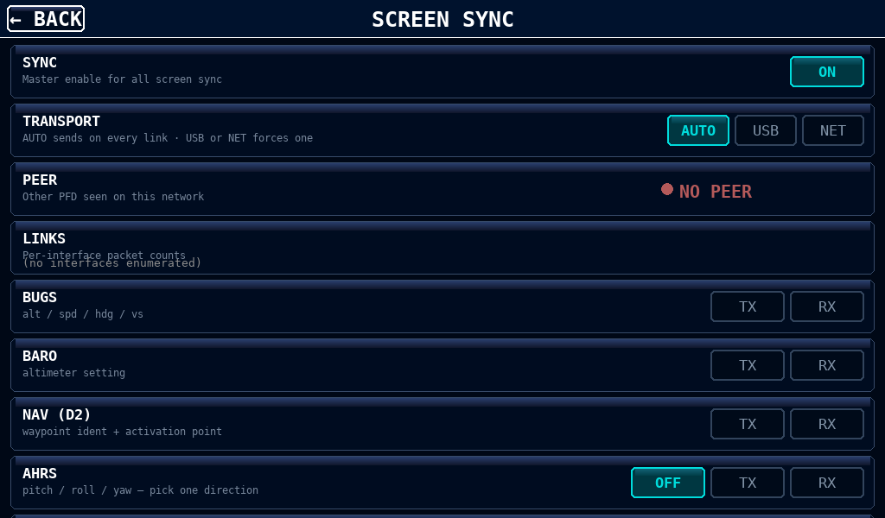

**Per-category sharing** (each its own TX / RX, so you choose direction):

| Category | What syncs |
|---|---|
| **BUGS** | altitude / speed / heading / VS bugs |
| **BARO** | altimeter setting |
| **NAV** | the active direct-to (ident, position, activation point) |
| **AHRS** | pitch / roll / yaw — **OFF / TX / RX** (mutually exclusive, to prevent an echo loop on the streaming sensor) |
| **GPS** | position / alt / speed / track — **OFF / TX / RX** (same mutex) |
| **SHARE FPL** | the active flight plan **and** the saved-plan / user-waypoint library — a single bidirectional toggle |

Bugs / baro / nav publish only when *you* edit them, so they don't echo. **Winds aloft and NOTAMs are also shared automatically** whenever sync is enabled, and don't need a toggle:

- **Winds aloft** — a display with internet feeds the winds grid to the others (see §17).
- **NOTAMs** — a display with a NOTAM key feeds its fetched NOTAMs to the others, so a display with no key still shows them (§12). Entering the NOTAM key/secret on one display also **pushes the credentials** to the others, which store their own copy so they can fetch independently. The secret travels the LAN only when you enter it, and shows masked everywhere.

All choices persist in `data/settings.json`.

---

## 13. System

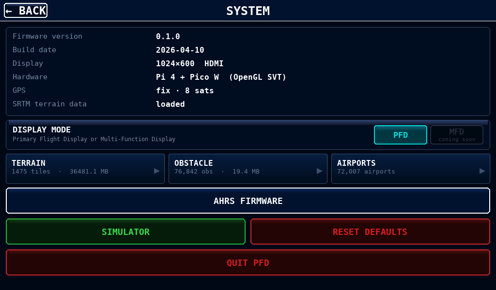

Version info, terrain/obstacle status, DIAGNOSTICS (future), RESET DEFAULTS, FLIGHT SIMULATOR.

All configurable settings — V-speeds, tail number, units, backlight brightness, colour scheme, heading-source mode, Wi-Fi SSID, airport display filters, and the runway/centerline overlay toggles — persist across power cycles in `pi4/data/settings.json`. The file is written atomically on a background thread with a 1.5 s debounce, so rapid successive taps produce a single write with no UI stutter. The Wi-Fi password is intentionally *not* stored — it must be re-entered when joining a new network.

---

## 14. Data Downloads

### Terrain data

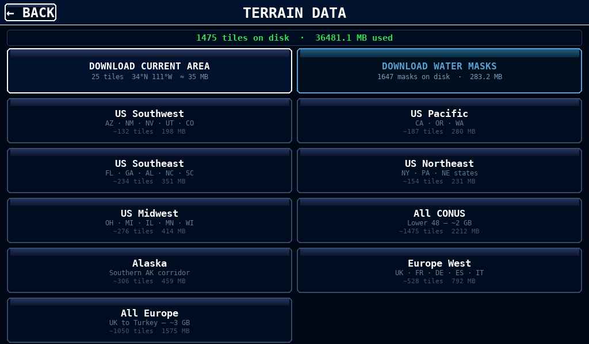

The TERRAIN DATA screen now manages three layered datasets in one place:

- **SRTM elevation tiles** (`pi4/data/srtm/*.hgt`) — ground texture for the SVT background and the TAWS proximity check. Without these the AI shows a plain blue/brown split and the `NO TER` badge appears.
- **Water masks** (`pi4/data/water/*.npy`) — rasterised Natural Earth ocean + lake polygons so the SVT mesh and the moving-map inset paint water blue rather than terrain-coloured. ~12 MB worldwide, downloaded once.
- **State / province boundary polylines** (`pi4/data/natural_earth/admin_1_*`) — used by the moving-map inset at wide zoom levels to give context (boundaries fade in around 20 NM range, slate-blue). Downloaded automatically alongside the water masks as a free side-effect.
- **Country boundary polylines** (`pi4/data/natural_earth/admin_0_*`) — same Natural Earth source, country-level (admin_0) outlines. Drawn in tan so they're distinguishable from the slate-blue state lines when both layers overlap (e.g. the US-Canada border draws once as state, once as country). Same 20 NM gate. Fetched in the same download pass as admin_1.

#### Top row — DOWNLOAD CURRENT AREA · DOWNLOAD WATER MASKS

Two side-by-side full-width tiles at the top of the screen.

- **DOWNLOAD CURRENT AREA** — downloads a 5°×5° SRTM box (≈ 25 tiles, ~35 MB) centred on the current GPS position. Requires a GPS fix. This is the fastest way to get flying in an unfamiliar area: one tap and the tiles you actually need are on disk a minute later.
- **DOWNLOAD WATER MASKS** — rasterises Natural Earth's 10 m ocean + lake vectors against every SRTM tile already on disk, then fetches the admin-1 (state / province) + admin-0 (country) line sets in the same run. ~12 MB for the global vector source, plus a small per-tile cache. Re-tap any time you've added new SRTM tiles — the rasteriser skips masks that are already on disk and only builds the new ones.

#### Preset regions

Preset regions below the two top tiles. Each tile shows the states/countries it covers, approximate tile count, and estimated size. Tap a tile to start the download; a progress bar replaces the status strip at the bottom of the screen.

| Region | Coverage | ~Tiles | ~Size |
|--------|----------|-------:|------:|
| **US Southwest** | AZ · NM · NV · UT · CO | 132 | 198 MB |
| **US Pacific** | CA · OR · WA | 187 | 280 MB |
| **US Southeast** | FL · GA · AL · NC · SC | 234 | 351 MB |
| **US Northeast** | NY · PA · NE states | 154 | 231 MB |
| **US Midwest** | OH · MI · IL · MN · WI | 276 | 414 MB |
| **All CONUS** | Lower 48 — single-tap full coverage | ~1,475 | ~2 GB |
| **Alaska** | Southern AK corridor | 306 | 459 MB |
| **Europe West** | UK · FR · DE · ES · IT | 528 | 792 MB |
| **All Europe** | UK to Turkey | ~1,050 | ~3 GB |

Downloads are resumable: already-present tiles are skipped, so re-tapping a region after a partial download finishes the remainder. **CANCEL** stops in flight; tiles already on disk are kept.

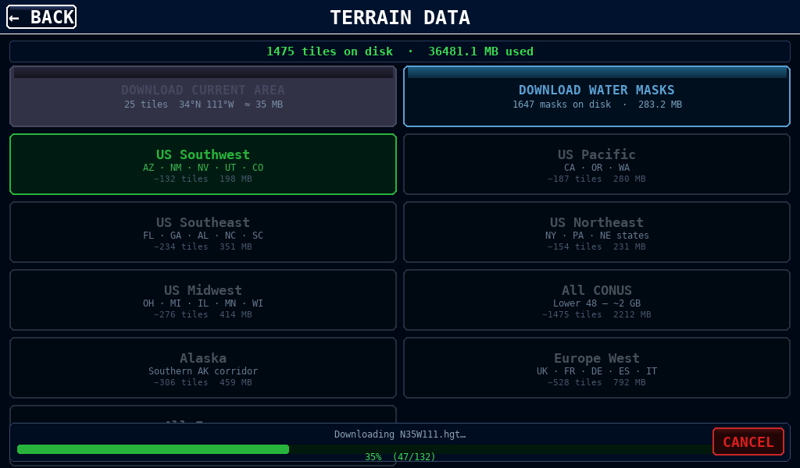

#### WiFi requirement

The Pi 4 must be on an internet-reachable network to download. Use the Connectivity screen (§12) to switch to your home Wi-Fi, download here, then switch back to the Pico W AP for flight. If you tap DOWNLOAD while still on the Pico W AP the screen will show a "WiFi (home network) required" guard message instead of starting.

#### Compacting SRTM (SRTM1 → SRTM3) and the pi4 → pi_zero hand-off

The Pi 4/5 downloads full-resolution **SRTM1** tiles (3601², ~25 MB each). The Pi Zero uses the lighter **SRTM3** (1201², ~3 MB) and can't hold the SRTM1 set, so there's a one-shot compactor, `tools/compact_srtm.py`, that decimates SRTM1 → SRTM3 (~8.7× smaller). On the Pi 4 it's a command line:

```bash
# Compact in place:
python3 tools/compact_srtm.py --srtm-dir ~/PFD-and-AHRS/pi4/data/srtm
# Or write SRTM3 copies elsewhere (leaves the SRTM1 originals untouched) —
# the hand-off path for seeding a Pi Zero:
python3 tools/compact_srtm.py --srtm-dir ~/PFD-and-AHRS/pi4/data/srtm \
    --output-dir ~/srtm3_for_zero        #  then rsync that to the Zero
```

(The Pi Zero also has an on-screen **COMPACT** button that does this in place — see the Pi Zero manual. See also the multi-display deploy recipe in the README.)

---

### Airspace data

The AIRSPACE DATA screen downloads the airspace boundary file that feeds the **ASP** overlay (§17). It mirrors the terrain / obstacle / airport download screens: tap **DOWNLOAD**, watch the progress bar, and the status line reads e.g. `Done ✓ 9,183 airspaces loaded` when the file is parsed and cached.

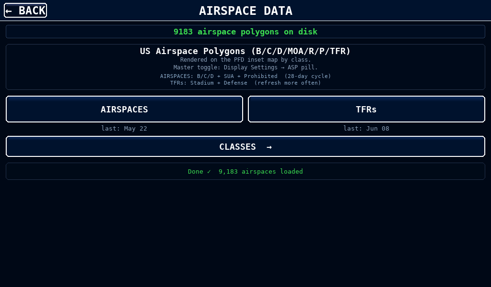

#### Airspace classes

Per-class toggles hide individual airspace classes on the map without turning off the whole overlay (the master switch is the **ASP** stop in the OVLY cycle). Each colour-coded badge — **Class B / C / D / MOA / R / P / TFR** — has its own **ON / OFF**.

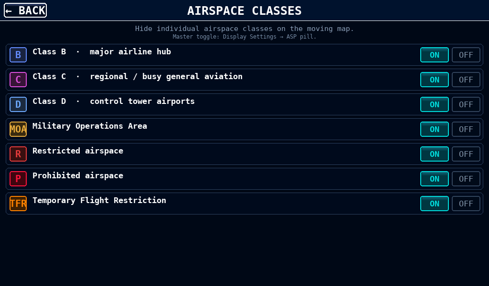

---

### Obstacle data

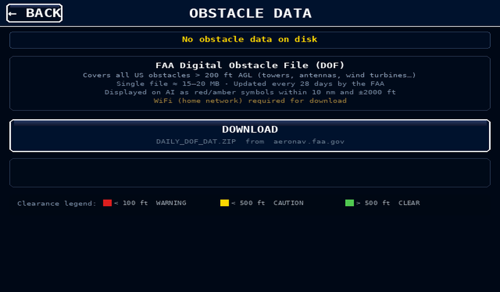

FAA DOF adds tower/antenna/wind-turbine symbols. Within 10 nm and ±2000 ft.

Tap DOWNLOAD to fetch. Symbols colour-coded:

| Colour | Meaning |
|--------|---------|
| Red | Within 100 ft below |
| Amber | Within 500 ft below |
| White | Cleared > 500 ft |

Red dot = lit obstacle. 28-day update cycle.

---

### Airport data

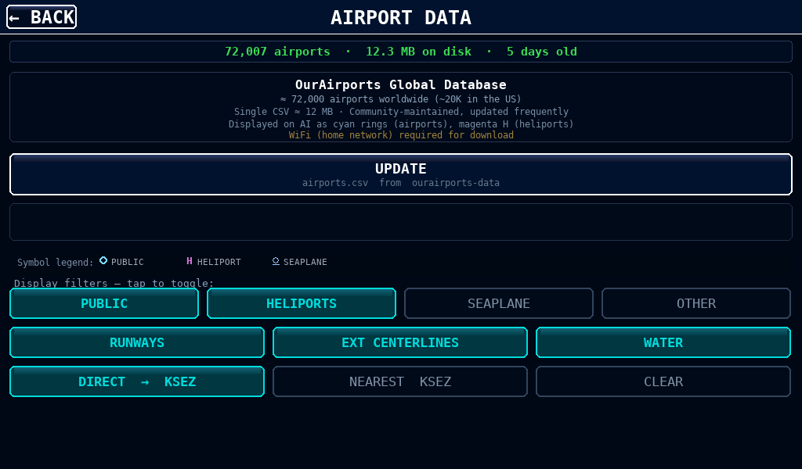

The OurAirports.com global database adds airport and heliport symbols to the attitude indicator within 20 nm of the aircraft. The database covers approximately 72,000 airports worldwide including ~20,000 in the US.

#### Symbols on the AI

| Symbol | Meaning |
|--------|---------|
| Cyan ring (filled centre) | Public airport (small / medium / large) |
| Cyan ring with outer ring | Medium or large public airport |
| Magenta "H" | Heliport |
| Cyan circle with wavy underscore | Seaplane base |
| Grey triangle | Balloonport |

The airport identifier (e.g. "KSEZ") is rendered within 15 nm as a small "road sign" — a coloured text box mounted on a thin vertical post that lifts the label clear of the symbol and any nearby terrain features. The sign border matches the symbol colour (cyan for public airports, magenta for heliports). Beyond 15 nm only the symbol is drawn to reduce clutter at distance.

#### Display filters

The AIRPORT DATA screen has four type filters and two overlay toggles at the bottom. Tap any tile to toggle its state.

| Filter | Controls | Default |
|--------|----------|---------|
| **PUBLIC** | Small / medium / large public-use airports | On |
| **HELIPORTS** | Hospital helipads, rooftop pads, private helis | On |
| **SEAPLANE** | Seaplane bases (water operations) | Off |
| **OTHER** | Balloonports and uncategorised types | Off |
| **RUNWAYS** | Paved/unpaved runway polygons (within 8 nm) | On |
| **EXT CENTERLINES** | Dashed extended centerlines off each threshold (within 15 nm) | On |

This lets you declutter the AI to show only the types relevant to your flight — for example, turn off HELIPORTS when operating in dense urban airspace where helipads would swamp the display, or turn off EXT CENTERLINES en-route and only re-enable during terminal-area operations.

All filter and toggle states persist across power cycles — you don't need to re-configure on every startup.

#### Runways and extended centerlines

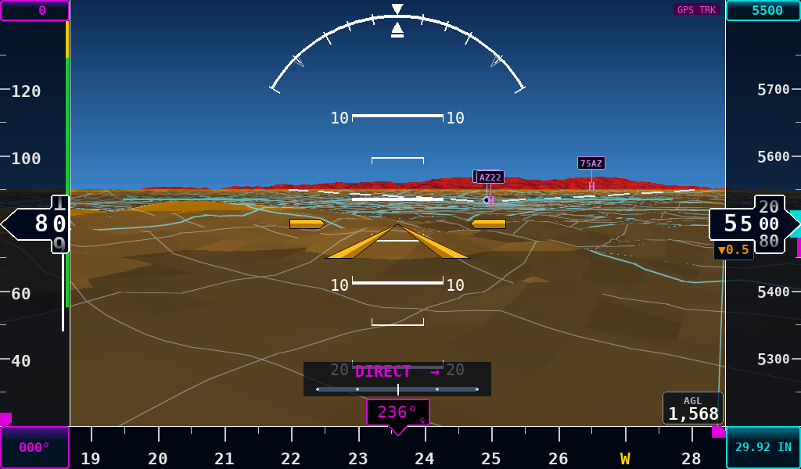

Within 8 nm of an airport, the PFD overlays a scaled polygon for each runway threshold-to-threshold, projected in the same perspective as the rest of the attitude indicator so runways translate, rotate, and scale naturally with the aircraft's position, bank and pitch. Width is taken from the OurAirports database.

Extended centerlines (dashed yellow) extend 10 nm outward from each runway threshold along its exact bearing, visible within 15 nm of the airport. This provides an at-a-glance final-approach reference for non-precision and visual approaches — the same kind of cue you get from a flight director's course bar, but derived purely from the runway geometry rather than a flight-plan waypoint.

Runway data comes from OurAirports `runways.csv` (approximately 14,700 runways worldwide) and is downloaded alongside the airport CSV in a single UPDATE action.

#### Downloading

Tap **AIRPORTS** on the System screen to open the airport data screen.

Tap **DOWNLOAD** (or **UPDATE** if data is already present) to fetch `airports.csv` (~12 MB) plus `runways.csv` (~3 MB) from the OurAirports GitHub mirror.

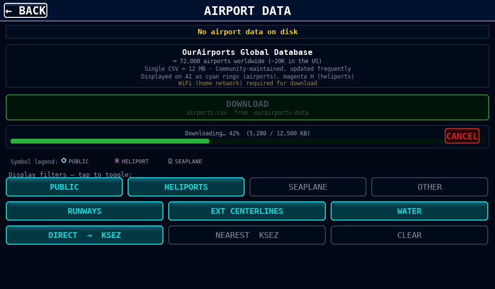

A progress bar updates as the download runs. After completion the CSV is parsed into a NumPy cache for fast future loads. Tap **CANCEL** to abort at any time — no partial data is kept.

#### Update schedule

The OurAirports database is community-maintained and updated frequently. A 60-day local expiry is enforced; after that the `EXP APT` badge appears in the status strip to remind the pilot to refresh. The data is usable past expiry — the badge is an advisory only.

#### WiFi requirement

The Pi 4 must be on an internet-reachable network to download. Use the Connectivity screen to switch to home Wi-Fi, download here, then switch back to the Pico W AP for flight.

---

## 15. Full-Screen MFD

The map overlays above (weather, traffic, winds, airspace) also live on a **full-screen multi-function display**. The lower-left **moving-map inset** (§17) is always available on the PFD; the full-screen MFD trades the PFD instruments for a large map when you want the whole picture.

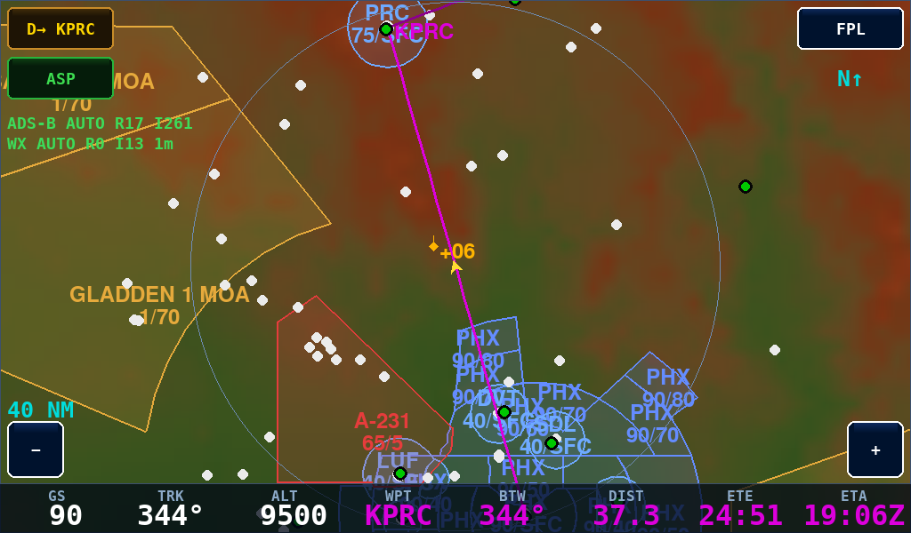

### Switching PFD ↔ MFD

A **3-finger hold (~2 s)** anywhere on the screen swaps between the PFD and the full-screen MFD. (A **2-finger hold (~0.8 s)** opens the setup menu — different finger count.) The swap is gated by **ENABLE MFD** in DISPLAY setup (default **ON** on the larger HDMI panels); turn it off to lock the display to the PFD and prevent accidental swaps. The unit always boots to the PFD.

### Chrome (buttons and labels)

| Control | Where | Action |
|---------|-------|--------|
| **D→** | top-left | Direct-to. Reads `D→` idle, `D→ KSEZ` (magenta) when active. Tap to enter/clear a waypoint (§16). |
| **FPL** | top-right | Open the flight-plan editor. |
| **TRK↑ / N↑** | top-right, under FPL | Cyan label — tap to toggle track-up vs. north-up. |
| **OVLY** | lower-left | Cycle the weather/airspace overlay (§17). |
| **RNG** (e.g. `10 NM` / `AUTO`) | lower-left, above the zoom buttons | Current range; `AUTO` fits the active direct-to leg. |
| **− / +** | bottom corners | Zoom out / in through the range ladder. |
| **CTR** | right side | Appears only when the map is **panned**; tap to recenter on the aircraft. |

The **TRK↑ / N↑** label toggles the map orientation between track-up (own-ship heading at the top) and north-up.

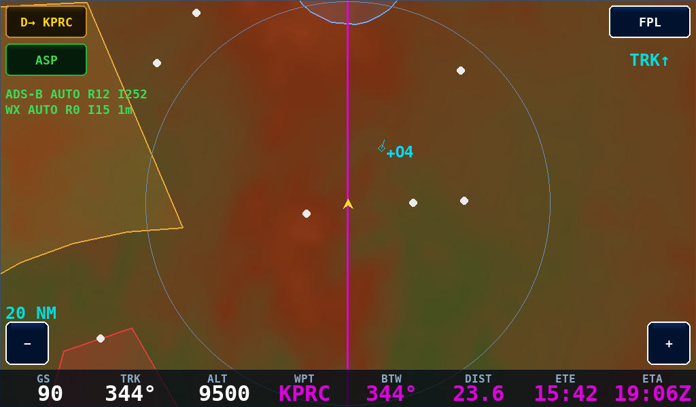

The **− / +** buttons step the **RNG** through the range ladder out to 160 NM for a cross-country overview.

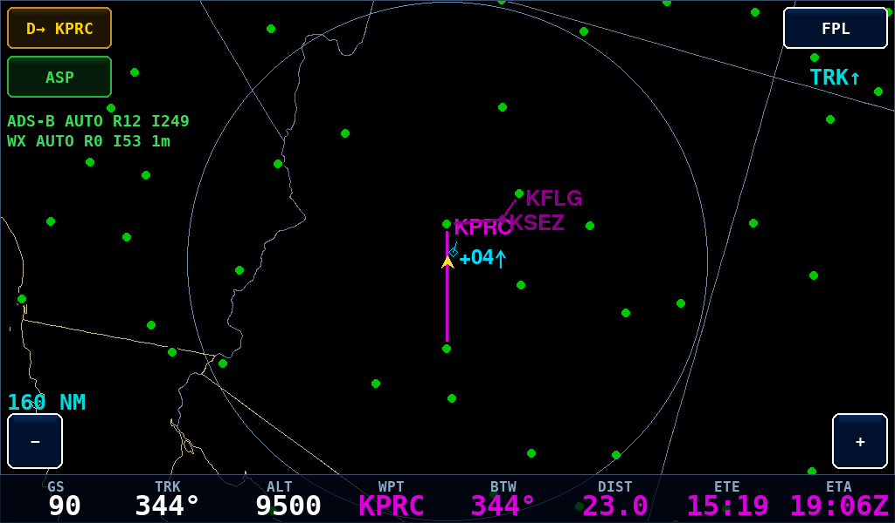

### Pan and recenter

Drag anywhere on the map (outside a button) to **pan**; heavy layers (terrain tint, water, airspace, NEXRAD, METAR) are skipped while dragging so it tracks your finger, and repaint on release. When panned, the **CTR** button appears — tap it (or the own-ship chevron) to snap back to the aircraft.

### Bottom data strip

A full-width strip along the bottom carries **8 readout slots**, each a cyan caption over a coloured value. **Tap any slot** to open the picker, then tap a field to assign it; the selection advances to the next slot so you can fill the row left-to-right with successive taps. The default layout is **GS · TRK · ALT · WPT · BTW · DIST · ETE · ETA**, and your choices persist in `data/settings.json`.

The full set of assignable fields:

| Field | Caption | Shows |
| --- | --- | --- |
| Groundspeed | **GS** | GPS groundspeed, kt |
| Airspeed | **AS** | Indicated airspeed, kt |
| True airspeed | **TAS** | True airspeed, kt |
| Track | **TRK** | GPS ground track, ° (dashes below ~3 kt) |
| Heading | **HDG** | Magnetic/true heading, ° |
| Altitude | **ALT** | Baro altitude, ft |
| Above-ground | **AGL** | Height above terrain, ft (needs terrain data) |
| Vertical speed | **VS** | Climb/descent, ft/min |
| Wind | **WIND** | Wind direction/speed, `DDD/SS` — from the AHRS/sim wind solution, else computed on the display from TAS + GPS track (assumes ISA temperature until an OAT sensor is fitted); `---/--` on the ground or with no IAS / GPS track |
| Time | **UTC** | Zulu clock, HH:MMZ |
| Baro setting | **BARO** | Altimeter setting (inHg or hPa per units) |
| Satellites | **SAT** | GPS satellites in solution |
| Active waypoint | **WPT** | Ident of the active leg's destination |
| Bearing-to | **BTW** | Bearing to the active waypoint, ° |
| Desired track | **DTK** | Course of the active leg, ° |
| Distance | **DIST** | Distance to the active waypoint, NM |
| Distance (dest.) | **DISTD** | Distance to the final destination through all remaining legs, NM |
| Cross-track | **XTE** | Cross-track error off the active leg, NM |
| Time en route | **ETE** | Time to the active waypoint, MM:SS / H:MM |
| ETE (dest.) | **ETED** | Time enroute to the final destination |
| Arrival | **ETA** | Arrival clock at the active waypoint — **local time by default** (`HH:MM`), or Zulu (`HH:MMZ`) per the ARRIVAL TIME toggle |
| Arrival (dest.) | **ETAD** | Arrival clock at the final destination — local by default, Zulu per the ARRIVAL TIME toggle |

The nav-derived fields (**WPT, BTW, DTK, DIST, DISTD, XTE, ETE, ETED, ETA, ETAD**) render magenta and show `--` when there's no active Direct-To or flight-plan leg; once a waypoint is active they fill in live. The `…D` fields (DISTD / ETED / ETAD) are to the **final destination** (the whole route), versus the plain fields to the **active waypoint**.

**Tap any slot** to open the field picker. The eight current slots show as pills across the top (the selected one ringed cyan); tap a field in the grid below to assign it to the selected slot — the selection then auto-advances to the next slot so you can fill the whole row with successive taps. Nav-derived fields are tagged **needs D2** and render magenta. The picker also carries an **ARRIVAL TIME** toggle (**LOCAL / ZULU**, default **LOCAL**) that flips every ETA / ETAD readout between the destination's local time and Zulu.

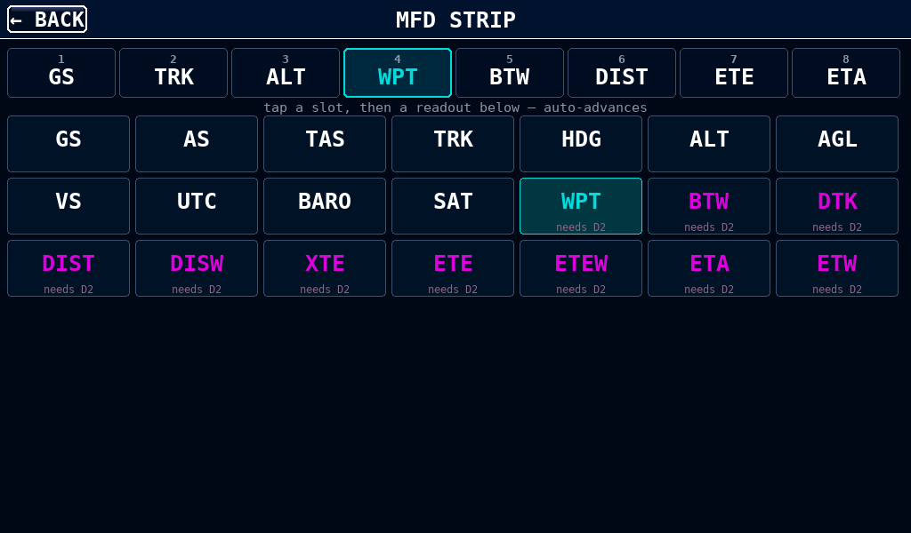

---

## 16. Navigation & Approach

### Direct-to Navigation

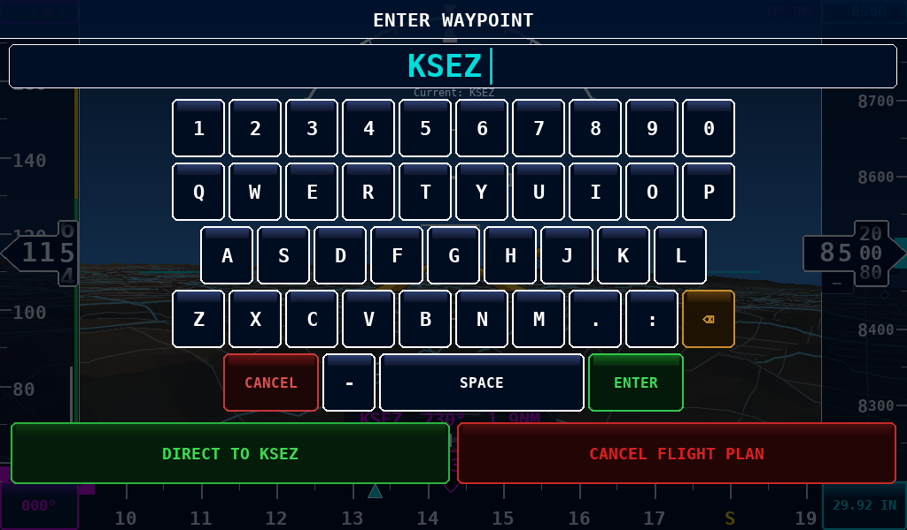

The PFD has built-in direct-to navigation: pick an airport ident, the pilot is asked to confirm, and a magenta course line draws from the activation point to the waypoint, draped over the SRTM terrain.

### Opening the keyboard

| From | How |
|------|-----|
| **PFD (live flight)** | Tap the **CDI strip** above the heading box. The keyboard opens with the existing ident as a dim placeholder; the buffer starts empty so first-keystroke replaces. |
| **AIRPORT DATA screen** | Tap the **DIRECT TO** tile in the action row. |

### Three keyboard outcomes

| You do | What happens |
|--------|--------------|
| Type a known ident → ENTER | Modal pops up: **"Activate Direct to *XXXX*?"** with **CANCEL** / **ACTIVATE** buttons. Tap ACTIVATE (or hit physical ENTER) to commit. Two-tap commit prevents accidental flight-plan edits. |
| Hit ENTER on **empty** buffer (with an active waypoint already loaded) | Same confirmation modal opens with the **existing** ident — confirms re-activation, which refreshes the magenta course line from your **current** position. Use this when you want a new course line drawn from where you are now. |
| Type an **unknown** ident → ENTER | Keyboard stays open with a red **"UNKNOWN WAYPOINT *XXXX*"** hint under the entry field. Backspace or any keystroke clears the error so you can correct the ident in place. |

### NEAREST quick-button

If the keyboard is opened from PFD and the display is tall enough (1024×600 fits it), an extra row appears below the keys:

- **DIRECT TO *XXXX*** — green. *XXXX* is the resolved nearest public airport (small / medium / large) within 100 NM of your current position. Tap to route through the same Activate? confirmation modal. The ident on the button refreshes every ~2 s so it's accurate even while you're typing.
- **CANCEL FLIGHT PLAN** — red. Wipes the active direct-to immediately (no confirmation; the impact is recoverable by re-typing the ident).

### Confirmation modal

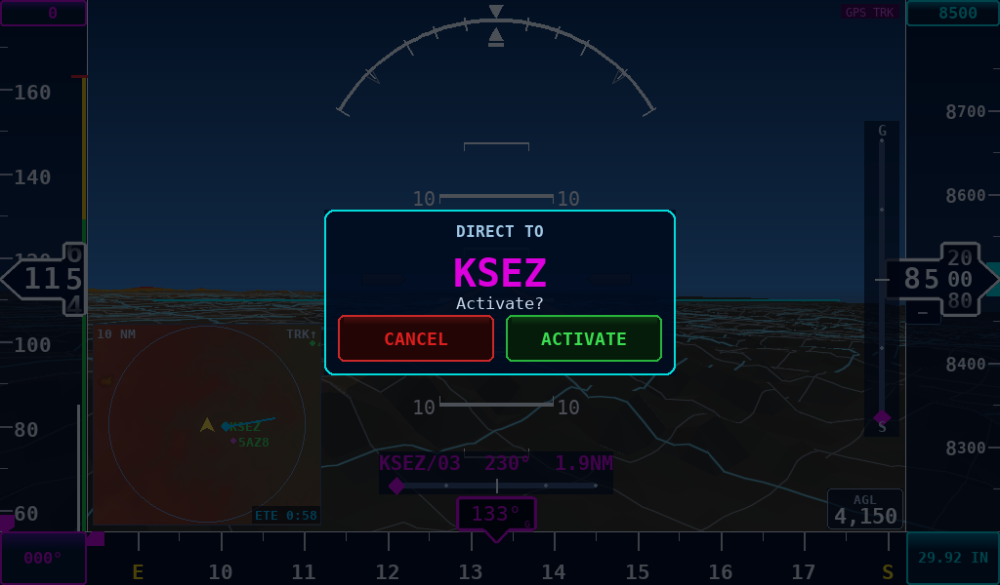

Modal text:
- **DIRECT TO** label.
- The ident in large magenta text.
- **Activate?** prompt.
- **CANCEL** (red) and **ACTIVATE** (green) buttons. Physical ESC = cancel. Physical ENTER = activate.

### Magenta course trace

After activation, a magenta line draws from the **activation point** (your position when you confirmed) to the destination, draped over the SRTM terrain mesh. The line is sampled at 0.2 NM steps with a rolling-max smoothing so it always sits at least 200 ft above the highest terrain in each segment — never cuts through ridges, including in dense terrain like Sedona.

The trace is built **asynchronously** in a background thread and **published progressively** as samples come in: the near end of the line shows up within ~1 s of activation; the rest fills in as the worker walks the SRTM tiles toward the waypoint. No UI freeze on long cross-country activations. If you change the direct-to mid-build, the in-flight worker discovers the mismatch and discards its result so no stale course flashes.

### CDI strip

Above the heading box: a horizontal bar with cross-track-error scale. The magenta diamond shows where the reference course is **relative to your aircraft** — diamond-LEFT means the course is to your left, so steer left to intercept. Right of course → diamond LEFT (fly left). Standard "fly to the needle" CDI.

**Full-scale deflection is mode-dependent**, matching standard avionics:

| Mode | Full-scale | Reference line |
|------|-----------|----------------|
| En-route / Direct-to | ±1.0 NM | Activation point → waypoint great circle |
| Synthetic approach (§16 active) | ±0.3 NM | Extended runway centreline (threshold + published course) |

The tighter approach scale matches RNAV / LPV convention so a half-scale needle on final actually means something. When the ident on the readout includes a runway suffix (e.g. `KSEZ/03`), the approach-mode scaling is in effect.

The line on the bar shows tick marks at ±50 % and ±full-scale. The line itself is dim grey; the diamond magenta. Above the bar a readout shows **ident · BRG · DIST** in magenta (e.g. `KSEZ  155°  3.2 NM`); on approach the runway suffix is appended (`KSEZ/03`).

When no waypoint is active the strip is still drawn but reads **"DIRECT  →"** as a tap target.

### Flight plan (multi-waypoint)

Tap **FPL** (top-right on the MFD, §15) to open the flight-plan editor — an ordered list of waypoints where each leg is one ICAO ident, and each row shows that leg's **course and distance** (e.g. `123°  4.5 nm`). The course follows the **HDG / CRS REF** setting (§10): magnetic by default — bare degrees, matching charts — or true, shown with a `T` suffix (`123°T`). Tap a row to **activate that leg** as the direct-to (the active leg is highlighted green with an **● ACTIVE** badge and its waypoint turns magenta); auto-sequencing advances to the next leg as you pass each waypoint, **leading the turn (fly-by)** — it sequences early using a groundspeed-based turn-anticipation distance so the aircraft rolls onto the next course without overshooting the fix (the final approach leg stays fly-over). Vertical step-downs on an approach are distance-to-threshold based, so leading the lateral turn never advances the altitude profile early.

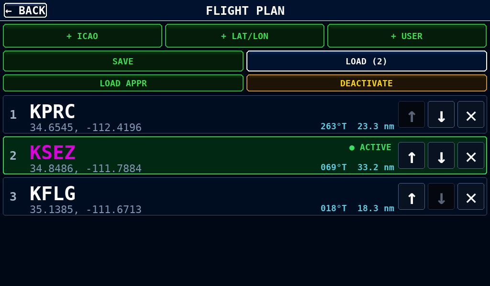

- **+ ICAO** — add a waypoint by ident (opens the keyboard; unknown idents are rejected with a red hint).
- **+ LAT/LON** — add a custom point by coordinates.
- **+ USER** — pick from your saved user-waypoint library.
- **↑ / ↓ / ✕** on each row — reorder or delete that waypoint.
- **REVERSE** — flip the whole route end-for-end (A→…→Z becomes Z→…→A), e.g. to fly the return trip. Needs at least two waypoints. Reversing **deactivates** the active leg (the old leg's course no longer applies to the reversed route), so re-tap a row to activate; the reversed order syncs to the other displays.
- **DEACTIVATE** — stop navigating the plan without deleting it.

### Saving and loading plans

**SAVE** stores the current waypoint list under a name you type; **REVERSE** flips the leg order (above); **LOAD (*n*)** opens the saved-plan picker. Each saved plan shows its leg count and first → last idents; tap **LOAD** to recall it into the editor or **DEL** to remove it. Saved plans (and the user-waypoint library) persist across power cycles and sync to the other displays when **SHARE FPL** is on (§12A).

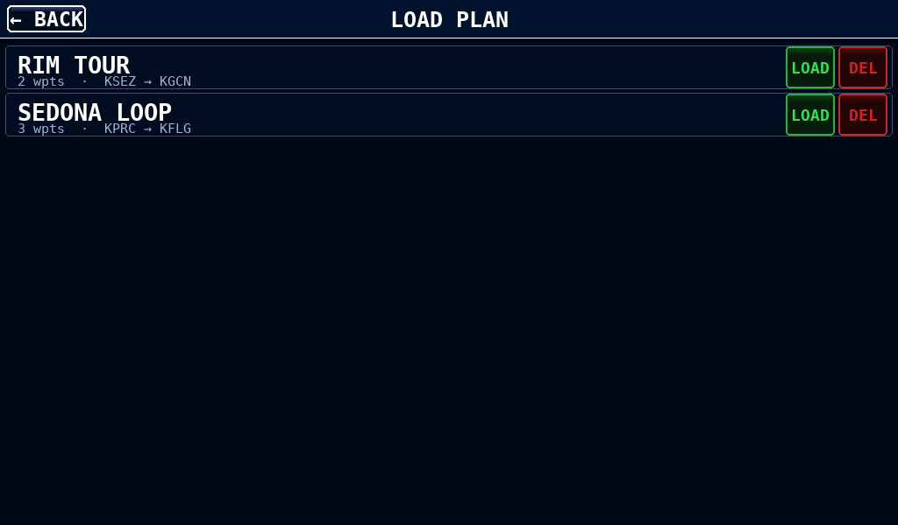

### Custom waypoints

**+ LAT/LON** on the flight-plan page opens the add-user-waypoint entry screen: an **IDENT** field plus **LAT** / **LON** in decimal degrees (e.g. `FISH`, `34.523`, `-111.812`), with **CANCEL** / **SAVE**. The saved point is added to the plan and auto-stored in the user-waypoint library for reuse.

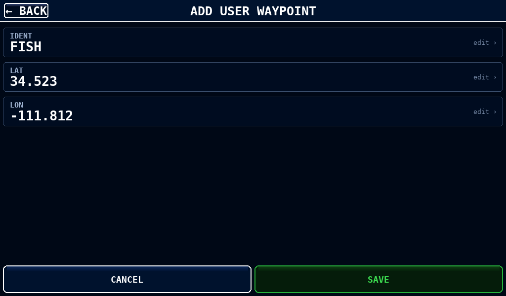

The **+ USER** button picks from the **user-waypoints** library — every point you've made with +LAT/LON, listed with its lat/lon. **ADD** inserts the selected point into the plan; **DEL** removes it from the library. The library persists across power cycles and syncs to the other displays when **SHARE FPL** is on (§12A).

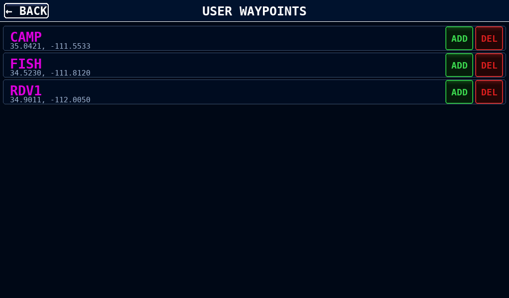

---

### AGL Readout

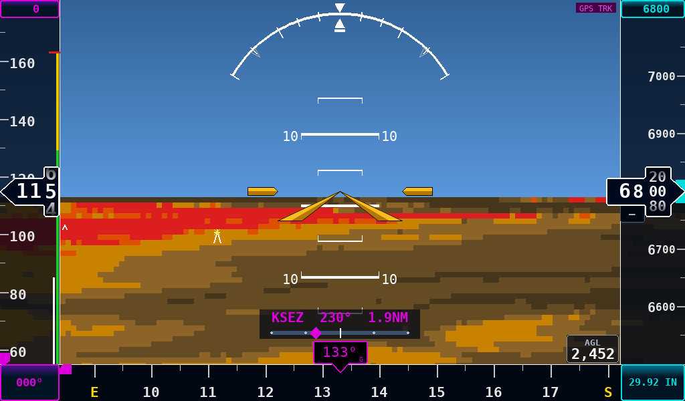

A small box in the lower-right corner of the AI shows your **altitude above the local terrain** in feet — useful as a sanity check against the baro altimeter, especially when overflying mountainous terrain where field elevations vary widely.

Layout: a translucent dark backplate with a 1-px light-grey border, sized 78 × 42 px, sitting just left of the altitude tape and just above the heading tape. Two-line stack:
- Top: **"AGL"** label in dim grey.
- Bottom: numeric value in white (or dashes if invalid), rounded to the nearest 10 ft, e.g. `1230`.

### What it reads

`AGL = round(real_alt − ground_elev_ft_at_lat_lon, 10)`

- `real_alt` is the unclamped sensor altitude (NOT the camera-floor-clamped value used to keep the SVT camera above terrain), so a punched-ground state shows in dashes as a sanity-check warning rather than being silently clamped to ≥0.
- `ground_elev_ft_at_lat_lon` is the SRTM tile sample at your current GPS position, taken once per render frame and shared with the SVT camera-floor calculation.
- The result is rounded to the nearest 10 ft. Both the GPS altitude and the SRTM terrain sample carry ~10–30 ft of real precision, so a 1-ft display would just flicker on GPS/DEM jitter without telling you anything new — same minimum-resolved-value treatment that the altitude tape's rolling drum already uses.

### Display states

| State | Reading | Why |
|-------|---------|-----|
| Above ground | `1230` (white, comma-grouped for ≥1000) | Normal flight, nearest 10 ft. |
| At or below ground | `---` (dim grey) | Sensor / DEM disagreement (baro miss-set, runway elev vs SRTM, missing tile). Not useful info — show dashes rather than a misleading negative. |
| No GPS | (hidden) | No position, no terrain lookup. |
| Outside SRTM coverage | (hidden) | Tile not loaded; would be misleading. |

### Cost

Reuses the same SRTM lookup the SVT renderer does for the camera-floor clamp, so it costs zero additional disk I/O per frame.

---

### Synthetic Approach (HITS + VDI)

The PFD can load a synthetic approach to any runway in the airport database. While an approach is active you get a set of coordinated cues:

- **HITS boxes** (cyan, 3D) along the approach path — fly through them.
- **VDI** (vertical glideslope diamond) on the right side of the AI — fly to the diamond.
- **CDI** scaled to ±0.3 NM full-scale (see §16) — fly to the diamond.
- **Approach-fix sign-posts** — an **amber** 3D diamond at each approach fix, floating at that fix's **published crossing altitude** with a vertical post dropping to the terrain, so you can eyeball whether you're high or low on the step-down profile.
- **Next-fix label** — the fix you're currently flying to is labelled (amber) with its **ident + crossing altitude** above its diamond; only the active fix is labelled, to keep the view clear.
- **Magenta approach course line** — the whole approach (initial fix → threshold, every leg) is drawn on the SVT as a bright-magenta terrain-draped course line, alongside the cyan HITS corridor.

The trace on the moving-map inset turns cyan to match while the approach is active. The PFD also previews the **next flight-plan leg** as a **faded-magenta** 3D trace (the same colour the MFD uses for remaining legs) so you can see the upcoming turn before you get there.

### Loading an approach

1. Tap the **CDI strip** to open the waypoint keyboard.
2. Type the airport ident (e.g. `KSEZ`) and hit ENTER. The "Activate Direct to *XXXX*?" modal appears as usual.
3. **Before tapping ACTIVATE**, look at the bottom row of the keyboard for the **APPR** button. APPR appears when the entered airport has runway data loaded.
4. Tap **APPR**. The runway picker opens — a tile per runway end with the ident, course, and length.

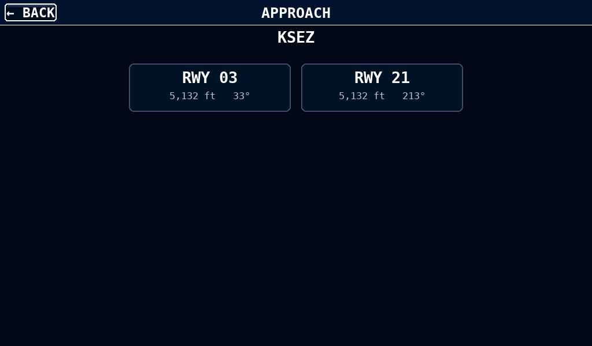

5. Tap a runway tile. The approach activates: HITS boxes draw, the VDI appears, the CDI rescales to ±0.3 NM, the inset trace turns cyan, and the airport ident readout becomes `IDENT/RWY` (e.g. `KSEZ/03`).

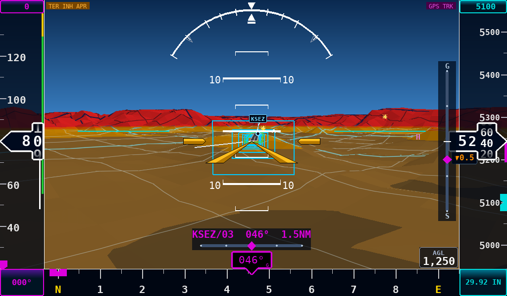

6. Tap **CANCEL APPROACH** at the bottom of the runway picker (only present when an approach is active) to clear the approach and revert to plain D2 to the airport.

Once an approach is loaded, the **FPL page** lists its legs in a read-only block indented under the destination — one row per fix (`↳ IDENT`) showing the published **crossing altitude** plus the **inbound track and distance** to that fix (e.g. `031°  2.4 nm`), in the selected HDG / CRS REF. Cross-check those tracks against the plate; the active leg is boxed green.

### HITS boxes

Cyan rectangles drawn along the approach path at the runway centreline. The corridor spans **threshold → the initial fix (IAF)** and follows the approach's **published step-down crossing altitudes** — not a fixed 3° / 5 NM final (that's only the fallback when a procedure has no published altitudes). Box geometry is unchanged: 300 ft wide × 200 ft tall, spaced 1000 ft apart, capped in count, and depth-tested against the SVT terrain so they're occluded correctly by intervening ridges.

The box centreline is the pilot's eye-line — fly the centre of the box, not the bottom. Each box is one closed-loop polyline (TL → TR → BR → BL → TL), so the geometry is light enough to add zero measurable cost to the SVT render.

### VDI

Vertical bar with a magenta diamond on the right side of the AI, just inside the altitude tape. **Only paints when an approach is active.**

| Diamond | Meaning |
|---------|---------|
| Centre line | On glideslope |
| Above centre | Glideslope is above you — fly up to the diamond |
| Below centre | Glideslope is below you — fly down to the diamond |
| Top dot | ½-scale below GS |
| Top edge | Full-scale (≥ 0.7°) below GS |
| Bottom dot | ½-scale above GS |
| Bottom edge | Full-scale (≥ 0.7°) above GS |

Full-scale deflection is **±0.7°** of glideslope error (LPV / ILS convention), referenced to a 3° GS to the threshold. `G`/`S` markers above and below the bar identify the indicator.

### Cyan inset trace

The lower-left moving-map inset already shows a course trace; while an approach is active the trace is drawn from the **threshold along the reciprocal of the published course** (i.e. the actual extended centreline) and rendered in cyan to match the HITS / VDI / CDI colour cluster. The ETE label in the inset corner also turns cyan in this mode.

### Sim glideslope behaviour

When the simulator is in **FOLLOW FLT PLAN** with an approach active (see §19), the AP captures the GS **only from above**. Below the GS it holds altitude until the GS descends to meet the aircraft, then captures from above — the standard real-world AP convention. This avoids the unphysical "climb to chase the diamond" behaviour and matches what most autopilots will (or won't) do when wired into the real system later.

---

## 17. Moving Map & Overlays

### Moving-Map Inset

A 2D top-down moving map sits at the lower-left of the AI. Off by default — turn it on in DISPLAY setup (`MAP INSET`). When enabled it draws hypsometric terrain, water, state and country boundary lines, runways, airports, obstacles, and the active direct-to course line over a black backplate, with own-ship pinned to the centre and the map rotating in either **TRK↑** or **N↑**.

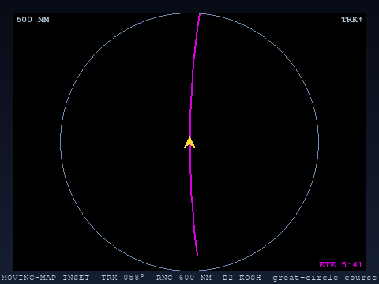

### Course line — great-circle, not rhumb

The magenta direct-to line is drawn as a polyline along the **great circle** from your activation point to the waypoint. On short legs (< 50 NM) the GC and a flat-earth straight line are visually identical, but on transcontinental legs (e.g. AZ → KOSH ≈ 1200 NM) the GC bends meaningfully — the line you see on the inset is the same curve the CDI references and the SVT direct-to trace draws in 3D, so all three views agree on which side of course you're on.

### When an approach is active

The magenta D2 line is replaced by a cyan line drawn from the **threshold along the reciprocal of the published course** (the actual extended centreline), following the published final-approach course that the HITS corridor covers. The ETE label in the corner also turns cyan to match the HITS / VDI / cyan-CDI colour cluster (§16).

### Zoom ranges + orientation

| Range | Orientation | Notes |
|------:|-------------|-------|
| 1 NM | TRK↑ or N↑ (user choice) | Pattern work, taxi survey |
| 2 / 5 / 10 / 20 / 40 NM | TRK↑ or N↑ (user choice) | Everyday flight; default is 5 NM |
| **80 NM** | **N↑ forced** | Whole-leg picture; rotated terrain tint smears at this scale |
| **160 NM** | **N↑ forced** | Cross-country overview |
| **AUTO** | **N↑ forced** | Picks the smallest standard step that contains the active direct-to (capped at 160 NM); destination doesn't spin under the chevron |

At 80 NM and 160 NM the inset forces north-up regardless of the user setting — the whole-leg picture matters more than nose-up orientation at that scale, the rotated terrain tint smears more visibly, and the async tint rebuild only has to run once per quantised centre instead of every heading change. AUTO mode picks the smallest standard step that contains the leg (with 10 % framing margin) and likewise locks to north-up.

### Tap-to-zoom and tap-to-flip-orientation

Tap-zones inside the inset:

- **Tap the left half** → zoom out one snap-point (e.g. 5 → 10 NM). On the largest range with a direct-to active, tap again to switch to **AUTO**.
- **Tap the right half** → zoom in one snap-point. From AUTO, taps zoom in to the largest standard step (160 NM) and continue downward.
- **Pinch** (two-finger spread / pinch) → also walks the snap-points if the touch driver surfaces FINGERMOTION events. Single-tap is the reliable fallback.
- **Tap the orientation label** in the chrome (`TRK↑` / `N↑`) → toggle between the two. The toggle is inert at 80 NM and above (the inset is locked to N↑ there).

Defaults for range and orientation are set in DISPLAY setup (`MAP RANGE`, `MAP INSET` orientation pair). Per-layer visibility (terrain / water / airports / runways / obstacles / state lines / country lines / direct-to) is toggleable from the same setup screen via the `MAP LAYERS` row of pills.

---

### Winds Aloft (WND)

Wind barbs and temperatures aloft can be overlaid on the moving map (both the inset and the full-screen MFD). The data is the GFS pressure-level forecast, pulled from Open-Meteo over the internet — **US-only**, no key required.

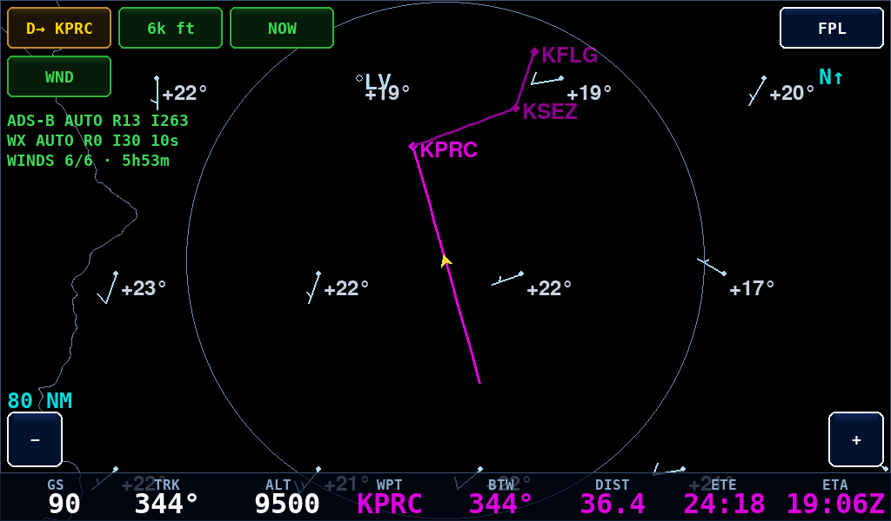

### Turning it on

The map carries a cycle of weather/airspace overlays selected by the **OVLY** label (lower-left corner of the map). Cycle it to **WND** to show winds. The overlay choice persists.

### Reading the barbs

Each barb is a standard meteorological wind barb at a grid point: the shaft points **toward the wind source**, with pennants = 50 kt, full barbs = 10 kt, half barbs = 5 kt. The number beside each barb is the **temperature** (°C) at the selected altitude. `LV` (light/variable) is shown as a small circle when the wind is below ~3 kt.

### Altitude and forecast time

Two buttons appear in the map chrome on the WND page:

- **Altitude** (e.g. `9k ft`) — cycles the barb altitude through **3,000 / 6,000 / 9,000 / 12,000 / 18,000 ft**. (Capped at 18,000 ft — non-pressurised GA altitudes — which also keeps the data pull small.)
- **Forecast time** (`NOW`, `+3h`, `+6h` …) — steps the forecast valid-time ahead; each pull carries 48 h of hourly steps so changing the altitude doesn't re-fetch, but changing the forecast time does.

### Zoom on the WND page

The winds page keeps its **own zoom, limited to 40 / 80 / 160 NM** (winds don't vary enough to need a closer view, and this doesn't disturb your terrain-map zoom when you switch overlays). Barbs render at all three; below 40 NM they're hidden. The barb spread is denser on the big MFD and thinned on the small inset at 160 NM so it stays readable.

### Status line — `WINDS n/6 · age`

A status line under the WX line shows how much of the national grid is loaded and how old it is: e.g. `WINDS 4/6 · 12m` (4 of 6 zones, oldest 12 min old). **Green** when all six zones are loaded, **amber** while it's still filling (with a trailing `…`).

### How the data is fetched — pull on the ground, fly offline

Winds are cached as a **national grid split into 6 zones** and written to disk (`data/winds/conus_winds.json`):

- Whenever the display has internet, it fills any stale zone **one at a time**, the **zone you're in first**, then outward — so you can pull the whole US **on the ground** and then fly with no connection.
- A zone is only re-pulled once it's **more than 3 hours old** (GFS only reissues every ~6 h). A restart reloads the disk cache instantly with **no** network calls.
- If a fetch fails (no signal, server busy, rate-limited) it backs off and retries later; the cached picture keeps showing.

### Sharing between displays (multi-screen panels)

Open-Meteo's free tier is rate-limited **per internet connection**, so three displays each pulling the whole US would trip the limit and starve each other. They now **share over the cabin network** (the same screen-sync link used for bugs/flight-plans): the display with internet fetches each zone and broadcasts it, and the **others adopt it and make no Open-Meteo calls of their own** while a peer is feeding them. One display feeds the whole panel. This is automatic whenever screen-sync is enabled. In the journal you'll see one display log `[WX:winds] fetched zone N` and the others `adopted zone N from peer`.

---

### Weather — Sources and Overlays

Beyond winds aloft (§17), the display can show **METARs, TAFs, AIRMETs/SIGMETs, NEXRAD radar, and NOTAMs**. Weather comes from two independent paths and the display blends them:

- **Internet (INET)** — `aviationweather.gov` (AWC) for METAR/TAF/AIRMET/SIGMET, Open-Meteo for winds, and the FAA NOTAM API (key required, see §12). No subscription; needs an internet path.
- **Radio (FIS-B)** — the 978 MHz UAT uplink decoded from an ADS-B receiver (see `Docs/ADSB_IN.md`). Free over the air, no internet needed.

### Source toggle — RADIO / AUTO / INET

The map's left status strip shows a **WX** line you can tap to cycle the weather source:

- **AUTO** (default) — use both; for any given station FIS-B (radio) wins and the internet backfills everything the radio didn't deliver.
- **RADIO** — FIS-B only (internet poller paused).
- **INET** — internet only (radio ignored).

A parallel **ADS-B** line cycles the *traffic* source the same way (§17). Both persist in `data/settings.json`.

### Status lines and provenance

The status strip reads, e.g., `WX AUTO R3 I12 2m`:

- **mode** — AUTO / RADIO / INET.
- **R*n*** — stations heard on the **R**adio (FIS-B).
- **I*n*** — stations from the **I**nternet.
- **age** — time since the last update (`45s`, `2m`; blank when very fresh).
- **Colour:** green = receiving; amber (with a trailing `…`) = enabled but nothing yet.

Each readout is tagged with its origin — **`FIS-B`** or **`INET`** — and a data-age (e.g. METARs show "Observed 15 min ago"), so you always know how the weather got to you and how old it is.

### The overlay cycle (OVLY)

The map shows **one** weather/airspace overlay at a time, selected by the **OVLY** label in the map's lower-left corner. Tap it to cycle:

**ASP → TFC → MET → WND → NEX → (back to ASP)**

| Label | Overlay |
|-------|---------|
| **ASP** | Airspace (Class B/C/D, MOA, Restricted/Prohibited boundaries) — needs an airspace file (§12 data notes). |
| **TFC** | Traffic-focus — lifts the nearby-only clamp and shows all ADS-B traffic (§17). |
| **MET** | METAR station dots (idents labelled when zoomed in < 160 NM) + the tap-for-readout weather picker. |
| **WND** | Winds aloft (§17). |
| **NEX** | NEXRAD reflectivity. |

(If you turn on more than one layer by hand from the MAP LAYERS pills, OVLY reads **MULTI**; the next tap collapses back to a single overlay.) Traffic is drawn on **every** page (clamped to nearby targets except on TFC), so you never lose collision awareness by looking at weather.

### MET page — METARs and the readout picker

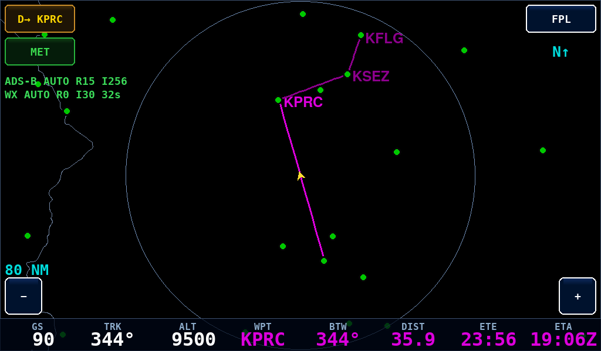

On **MET**, each reporting station is a dot coloured by flight category: **green VFR · blue MVFR · red IFR · magenta LIFR**. When you're zoomed in (map range below 160 NM) each dot is **labelled with its station ident** (hidden at wider zoom so the map stays a clean dot field). Tap a dot (or an airport) and choose **Weather *ICAO*** to open the readout, which has tabs for:

- **METAR** — wind, visibility, ceiling, altimeter, temp/dew, and the raw line, with the observation age.
- **TAF** — the forecast broken into INITIAL / FROM / BECMG / TEMPO / PROB periods.
- **AIRMET / SIGMET** — scrollable bulletins, **nearest-first**, flagged **ON ROUTE** when the hazard is within ~30 NM of your active leg.
- **NOTAM** — scrollable, nearest-first, scoped to a tight zoom-following radius (~10–40 nm) so the list stays local rather than returning every NOTAM for hundreds of miles. Needs the FAA key on **one** display (§12); both the NOTAMs and the key are shared to the other displays over the cabin network.

A tab is greyed out when there's no data for it. If the field you tapped has no METAR/TAF/winds of its own, the display falls back to the **nearest** reporting station and labels it with the distance/bearing. Long readouts scroll (drag, with a scrollbar); tap outside to close.

**Graphical AIRMET/SIGMET:** hazard areas that carry a polygon are shaded on the map; tap inside one to open its bulletin (smallest polygon wins when they nest).

### ASP page — airspace

On **ASP**, airspace boundaries are drawn over the map: a magenta ring for Class C (labelled with the facility name and the floor/ceiling, e.g. `PRESCOTT 45/SFC`) and a blue ring for Class D. ASP is one stop in the OVLY cycle and needs an airspace file loaded (see §14). Individual classes can be hidden with the per-class toggles (§14).

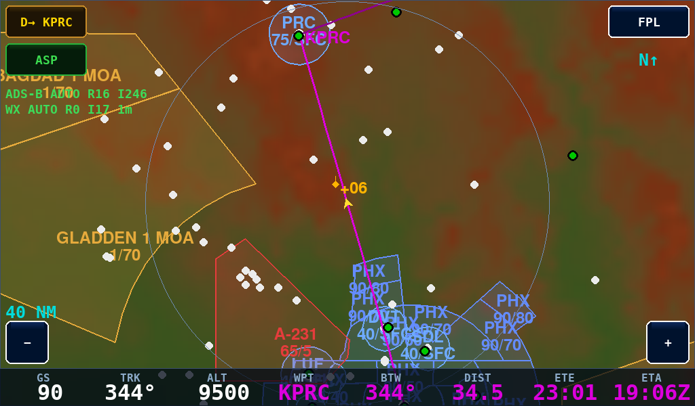

### NEX page — NEXRAD radar

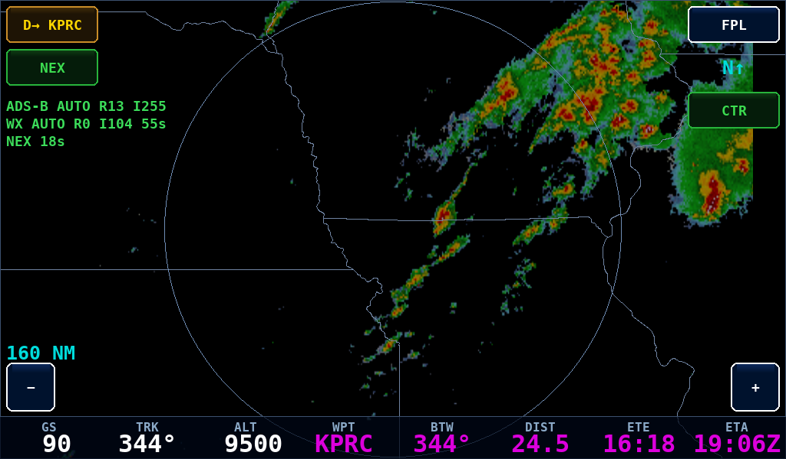

On **NEX**, radar reflectivity is painted as coloured intensity cells. Two ages are badged on the status strip: **`NEX`** = how long since the block was received, and **`NEX RDR valid`** = how stale the radar *mosaic* itself is (green < 10 min, amber 10–20, red > 20) — FIS-B radar can be several minutes older than when you received it, so always read the *valid* age.

---

### Traffic — ADS-B / FIS-B IN

Nearby aircraft are shown on the map (and feed the collision alert) from ADS-B IN — either a radio receiver (1090ES + 978 UAT over GDL90/UDP, port 4000) or the built-in internet feed, blended like weather. Tap the **ADS-B** status line to cycle the traffic source **AUTO / RADIO / INET** (`R`/`I` counts split the two).

**Own-ship echo suppression (INET).** A public ADS-B aggregator has no way to know which hex code is *your* aircraft, so it hands your own transponder back like any other target — an annoying diamond glued to the ownship symbol. A radio receiver avoids this (it decodes the GDL90 Ownship Report and never files it as traffic); the internet feed has no such report, so the display rejects the echo itself: any internet target sitting on top of you (within ~0.6 NM and, when both altitudes are known, ~350 ft) is treated as the echo and dropped. When you're moving, a velocity check keeps a *genuine* close pass visible — a real intruder that near usually isn't also flying your exact speed and heading, whereas the echo carries your own velocity by definition. Once identified, the echo's hex is latched and stays suppressed through the feed's few-seconds position lag. Radio traffic is untouched.

### Reading a target

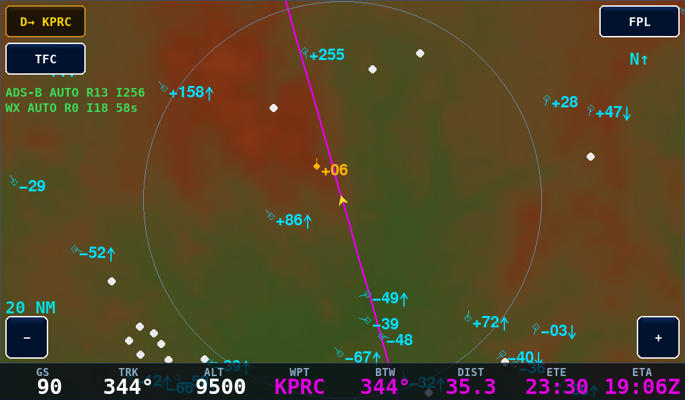

Each target is a **diamond** with a short **leader line** in its direction of travel and a **data tag** showing relative altitude in hundreds of feet (`+05` above, `−12` below) plus `↑`/`↓` when climbing/descending faster than 200 fpm. Colour is the threat tier:

| Tier | Colour | Meaning | Criterion |
|------|--------|---------|-----------|
| **Alert** | Red (filled) | Collision threat (RA) | **closure-based** — actually converging and time-to-closest **tau ≤ 30 s** while within the vertical band (±600 ft), plus a hard floor (anything inside **1 NM / 400 ft** regardless of closure) |
| **Proximate** | Amber (filled) | Caution | within **6 NM** *and* **1200 ft** |
| **Other** | Cyan (outline) | Advisory | beyond the above |

The **Alert** tier is **closure/time-based**, like a real TAS — not a flat ring. Parallel, diverging, or co-altitude-but-not-closing traffic (very common in the pattern) stays **amber proximate** and does *not* trip a red RA or the callout; only traffic that's genuinely converging *and* will be close soon goes red. Closure is estimated over real ADS-B update intervals and smoothed; the RA must persist briefly before it fires (so a borderline target flickers amber, not red) and then latches so the cue stays up and the callout fires once. Tuning lives in `shared/config_base.py` (`ADSB_TAU_S`, `ADSB_ALERT_FLOOR_NM/FT`, `ADSB_RA_ARM_S/HOLD_S`).

On weather/airspace pages and the PFD inset, traffic is **clamped to nearby** (within ~7 NM / 3000 ft) to keep the picture clean; the **TFC** page lifts the clamp and shows everything. **Alert-class traffic is never hidden** — not by the clamp, and not by the declutter filters below.

### Detail card

On the full-screen MFD, tap a diamond to open its detail card: **callsign** (or hex ID), altitude (absolute + relative), groundspeed, track, vertical speed (Climbing/Descending/Level), and range/bearing (e.g. "5.2 NM SE"), with a **RADIO**/**INET** source tag. Tap again to dismiss.

### Declutter filters

Two DISPLAY-setup rows thin distant/irrelevant traffic (alert-class still always shows):

- **TFC ALT** — ALL / ±2k / ±5k / ±10k ft (hide targets beyond that relative-altitude band).
- **TFC RANGE** — ALL / 5 / 10 / 20 / 40 NM.

### Collision alert

When a target becomes an alert (RA) — i.e. it's genuinely converging with tau ≤ 30 s, or inside the 1 NM/400 ft floor — a red **TRAFFIC** banner flashes at 1 Hz: on the PFD it's a compact badge ("TFC 2:00 −200" = 2 o'clock, 200 ft below); on the MFD it's a larger top-centre banner with the range added. On the Pi 4 a **"Traffic, Traffic"** voice callout fires with it (gated by the ALERT AUDIO master switch — §10/§20). The callout is edge-triggered on the nearest **new** threat and the alert **latches** for a few seconds, so it fires once and the cue stays up rather than stuttering on a borderline geometry.

---

## 18. Demo Mode

Scripted Sedona, AZ flight. No hardware needed.

```bash
python3 pi4/pfd.py --demo
python3 pi4/pfd.py --demo --sim   # windowed
```

Cycles: level cruise → climbing left turn → level → descending right turn. SVT terrain renders if Sedona tiles are present.

---

## 19. Flight Simulator

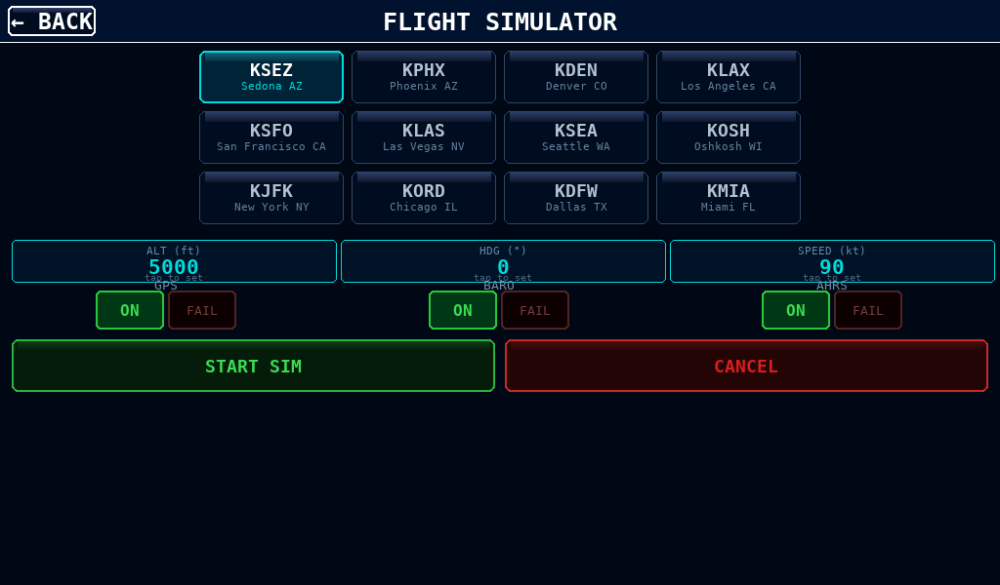

A full-PFD flight simulator is built in. It drives every instrument on the display through an internal autopilot model — so every tape, badge, bug, the SVT background, airport symbols, runway polygons, and TAWS alerting all behave exactly as they would with a live AHRS link. No external aircraft, no Pico W, and no network are needed.

### Starting

Setup → System → **FLIGHT SIMULATOR**. The setup screen lets you pick:

| Control | Purpose |
|---------|---------|
| Airport preset grid | 12 US airports covering mountain, coastal, plains, and desert terrain. Tap to highlight (cyan border). Starts the simulator parked on the field at the runway elevation. |
| **ALT / HDG / SPEED** tiles | Tap a tile to open the numpad and set the initial cruise altitude, heading, and indicated airspeed that the autopilot will fly to once airborne. |
| **GPS / BARO / AHRS** ON / FAIL pairs | Inject a sensor failure before the sim starts. FAIL makes the corresponding badge appear (`NO SIGNAL`, `GPS ALT`, `AHRS FAIL`) and disables that sensor's contribution to the flight model so you can practice partial-panel scenarios. |
| **START SIM** / **CANCEL** | Start drops you at the selected airport and immediately commands a takeoff; the autopilot holds the initial ALT/HDG/SPD. |

### 12 airport presets

KSEZ, KPHX, KDEN, KLAX, KSFO, KLAS, KSEA, KOSH, KJFK, KORD, KDFW, KMIA — chosen for geographic variety so you can watch SVT, TAWS caution/warning thresholds, and obstacle proximity alerting behave naturally in different environments. Sedona (KSEZ) is the default because the surrounding red-rock mesas exercise the clearance-colour banding dramatically.

### While the simulator is running

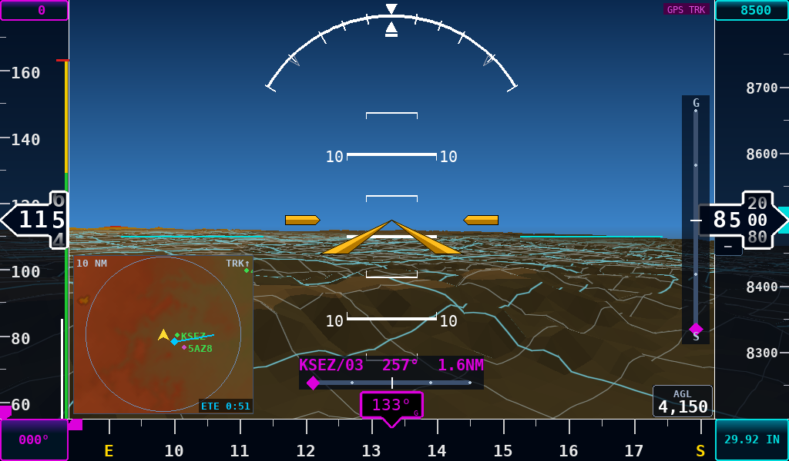

- A small red **SIM ✕** button appears just under the slip/skid bar at the top of the AI (kept clear of the approach corridor below). It serves a dual role: it tells you the simulator is active, and it's the tap target that opens the **SIM CONTROLS** overlay on top of the live PFD. (Without the button it's easy to forget the sim is running and end up killing the PFD process to escape it — the red ✕ is intentional.)
- Tap the SIM ✕ button to open **SIM CONTROLS**:

| Row / button | What it does |
|--------------|--------------|
| **GPS / BARO / AHRS** ON / FAIL pairs | Toggle individual sensor failures mid-flight. Effects mirror SIM SETUP — `NO SIGNAL` / `GPS ALT` / `AHRS FAIL` badges appear, the affected instruments fall back the same way they would in the aircraft. Failures revert as soon as you toggle back to ON. |
| **FOLLOW** — BUGS / FLT PLAN | AP source. BUGS = pure bug-tracker (heading bug + alt bug + speed bug). FLT PLAN = couples the AP to the active direct-to or synthetic approach with a 45° intercept; on an approach it slides down the GS once you're above it. See below for the full intercept logic. |
| **PAUSE** (amber) / **RESUME** (green) | Freezes `_sim_state.tick()` while keeping the rest of the UI live — bugs, baro, units, menus all stay responsive. Useful when you want to set up a scenario without the aircraft drifting away from you. The button label flips to RESUME when paused so the next tap obviously starts time again. |
| **EXIT SETUP** (neutral) | Closes the SIM CONTROLS overlay. **The simulator keeps running** — you're just dismissing the modal. |
| **EXIT SIM** (red) | Kills the simulator and returns to the live AHRS source. If no AHRS unit is connected the display shows stale indications (`NO LINK`); if the Pico W is wired in, live data resumes immediately. |

- All three bug controls (ALT / HDG / SPD) remain active behind the modal — set a new bug and the autopilot will fly to it. This is how you explore heading changes, climbs, descents, and arrivals at other airports.
- Baro setting, display units, filters, and every other adjustment all take effect in real time just as they would in the aircraft.

### AP follow mode — FOLLOW BUGS vs FOLLOW FLT PLAN

The SIM CONTROLS overlay has a **FOLLOW** row with two buttons:

| Mode | Behaviour |
|------|-----------|
| **FOLLOW BUGS** (default) | Pure bug-tracker. The AP holds the heading bug, alt bug, and speed bug. Set a new bug, the AP flies to it. |
| **FOLLOW FLT PLAN** | Couples the AP to the active direct-to or synthetic approach. Heading bug is overridden by a **45° intercept** to the course; altitude is overridden by glideslope tracking when an approach is active. Speed bug still applies. |

#### 45° intercept logic

When a direct-to or approach is active in FOLLOW FLT PLAN, the AP commands a heading that closes on the course at up to a 45° intercept angle. Standard avionics tuning:

- **Cross-track ≥ 1.5 NM** (D2) / **0.5 NM** (approach): full 45° intercept toward the course.
- **Within 0.3 NM** (D2) / **0.1 NM** (approach): gentle proportional correction; rolls out wings-level on track.
- Linear blend between the two zones.

The approach-mode tuning is tighter (gentle band 0.3 → 0.1 NM, full-intercept threshold 1.5 → 0.5 NM, inner-band gain tripled) so the AP actually settles on centreline at ±0.3 NM CDI scaling instead of wallowing at half-scale deflection.

#### Coordinated turn model

The simulated airplane is a coordinated-turn model: bank is the only commanded quantity, and yaw rate is derived from bank via the standard `ω = g·tan(φ)/V` relation. **No bank, no yaw — ever.** The AI airplane never flat-yaws through a turn; you'll always see a bank command preceding any heading change. Bank saturates at ±25° at ~5° heading error and rolls out smoothly as the heading approaches target.

#### Glideslope capture (approach only)

In FOLLOW FLT PLAN with an approach active: the AP captures the GS **only from above**. Below the GS it holds altitude — never commands a climb to chase the GS. This matches real-world AP convention (most APs won't couple to a GS from below) and gives a realistic intercept profile in the simulator.

### Failure injection

Inject a sensor failure either before start (SIM SETUP) or mid-flight (SIM CONTROLS).

| Failure | Effect |
|---------|--------|
| **GPS** | `NO SIGNAL` badge, magenta ground-track tick hidden, GPS-TRK mode forced off, airport and runway overlays dim. |
| **BARO** | `GPS ALT` badge; altitude tape falls back to GPS altitude; baro setting shows `GPS ALT` in magenta. |
| **AHRS** | `AHRS FAIL` badge; attitude freezes (classic AI fail). Tapes still work from GPS. |

All failures revert the moment you toggle back to ON — use them for quick what-if drills and recovery procedures.

### Exit

SIM CONTROLS → **EXIT SIM** returns you to the live PFD. If no AHRS unit is connected the display simply shows stale indications (`NO LINK`). If you're connected to the real Pico W AHRS, live data resumes immediately.

---

## 20. Audio Alerts

The PFD ships with an EGPWS-style voice-callout pipeline. Six short clips are generated once at first boot using `espeak`, cached in `~/.pfd_audio/`, and played through the SDL/ALSA mixer pinned to the HDMI panel speakers (the ROADOM panels carry the audio out alongside HDMI; the Waveshare 3.5" DPI has no speaker pad so audio is silent on that variant).

### Callouts and triggers

| Callout | Voice | Trigger | Band |
|---------|-------|---------|------|
| **Terrain** | `Terrain. Terrain.` | Look-ahead clearance < 500 ft and ≥ 100 ft | Caution |
| **Obstacle** | `Obstacle. Obstacle.` | Obstacle in the forward wedge with clearance < 500 ft and ≥ 100 ft | Caution |
| **Sink rate** | `Sink rate. Sink rate.` | Descent rate exceeds an AGL-scaled curve (1500 fpm at the surface → 5000 fpm at 2500 ft AGL), below 2500 ft AGL. GPWS Mode 1. | Caution |
| **Terrain — pull up** | `Terrain. Terrain. Pull up. Pull up.` | Look-ahead clearance < 100 ft | Warning |
| **Obstacle — pull up** | `Obstacle. Obstacle. Pull up. Pull up.` | Obstacle in the forward wedge with clearance < 100 ft | Warning |
| **Bank angle** | `Bank angle. Bank angle.` | Roll > 60° absolute, AHRS healthy, sim not paused | Attention |
| **Traffic** | `Traffic. Traffic.` | A new ADS-B target becomes a closure-based RA (converging, tau ≤ 30 s, or inside the 1 NM/400 ft floor). Edge-triggered on the nearest new threat; the alert latches so it fires once, not repeatedly. Pairs with the flashing red TRAFFIC banner (§17). | Warning |

Source-identifying phrasing follows real EGPWS / TAWS-B convention: at every band the callout names what the airplane is about to hit, so the pilot doesn't have to guess from a generic "TERRAIN" whether to climb or to scan for a tower. The PULL UP suffix is reserved for the warning band — the action verb only fires when an immediate input is required.

### Priority and rate limits

When several conditions trip at once, the audio pipeline plays only the highest-priority phrase:

1. Pull-up warnings (obstacle, then terrain) — life-critical action cue.
2. Sink rate — root cause that's eroding clearance.
3. Proximity cautions (obstacle, then terrain).

Each callout is independently rate-limited: warnings repeat no faster than every 4 s, cautions every 3 s. The pipeline doesn't queue or stack — a fresh trigger during a clip's hold-off window is silently dropped. This mirrors the cadence on certified avionics so the cockpit doesn't sound like a slot machine in a busy approach.

### Master mute and volume

The full pipeline is gated by ALERT AUDIO (master) and ALERT VOLUME (1–10) on the DISPLAY setup screen (§10). Both persist in `data/settings.json`. Muting cuts in-flight clips immediately. Volume changes take effect on the next callout (the in-flight clip plays through at the previous level).

### Self-test

On startup, with audio enabled, the pipeline fires one `Terrain. Terrain.` callout as a confirmation that the speaker and mixer chain are live. If you don't hear it at power-up and ALERT AUDIO is ON, see Troubleshooting → No audio at boot below.

### Troubleshooting — no audio at boot

```bash
sudo journalctl -u pfd.service -n 100 | grep '\[audio\]'
```

The startup log lines tell you what the mixer ended up doing:

- `[audio] SDL driver in use: alsa` — expected. The audio pipeline forces ALSA before pygame imports so the panel's `~/.asoundrc` redirect actually applies.
- `[audio] mixer state: (frequency, size, channels)` — confirms `pygame.mixer.get_init()` returned a populated tuple.
- `[audio] 6 callouts ready: bank, obstacle, obstacle_pull_up, sink_rate, terrain, terrain_pull_up` — every WAV cached successfully.
- `[audio] startup self-test: chan=<Channel>  busy=1  length=1.30s` — the test ping actually reached the device. If `busy=0` you have the silent-callback bug — typically a stale `/etc/asoundrc` pointing at an unplugged HDMI sink.
- `[audio] espeak not installed` — run `sudo apt install espeak`, then reboot to let the callouts regenerate.

If audio is dead but visual alerts work, the master mute is the right fallback — set ALERT AUDIO to OFF until you can replug or repair the speaker, and the pipeline becomes a no-op without affecting the rest of the PFD.

---

## 21. Unusual-Attitude Recovery Cues

At **|pitch| > 30°** or **|roll| > 60°** the PFD enters an unusual-attitude declutter mode. The SVT mesh, water mask, airport / runway / obstacle / direct-to overlays all come off so the pilot sees nothing but solid sky/ground + the pitch ladder + a pair of red recovery glyphs centred on the aircraft symbol. The same triggers that fire the visual cues also fire the bank-angle voice callout (§20).

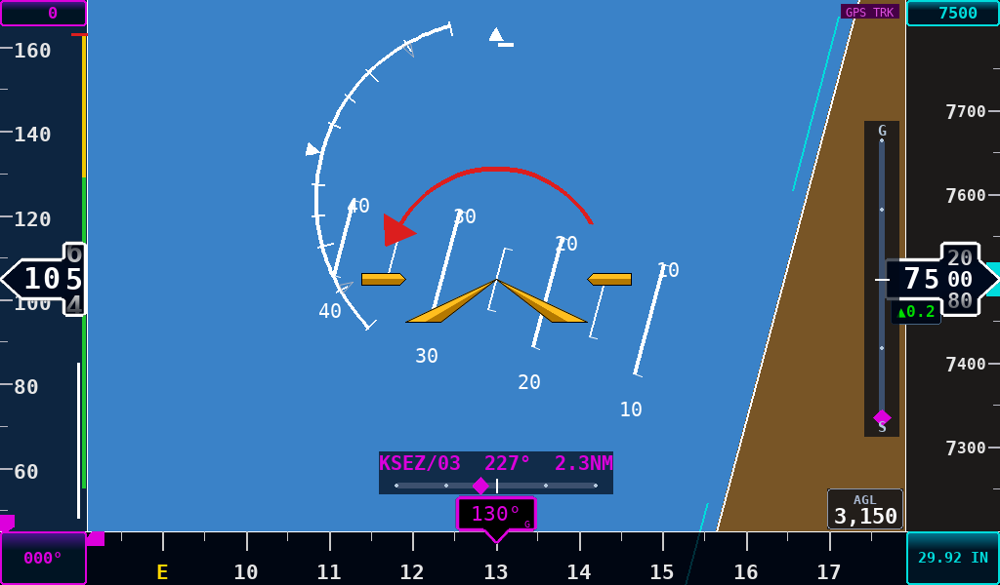

### Pitch-recovery chevron stack

A short stack of three filled red chevrons centred on the ownship.

- **Nose high (pitch > +30°)** — chevrons point **down**. Push to lower the nose; the chevrons disappear once pitch returns inside ±30°.
- **Nose low (pitch < −30°)** — chevrons point **up**. Pull.

The stack is sized to ~4.5 % of the AI's short dimension so it reads at a glance without occluding the pitch ladder behind it. The midline of the stack sits exactly on the ownship, so during a simultaneous pitch + bank recovery the pilot's eye doesn't have to leave the centre of the AI.

### Roll-recovery curved arrow

A curved arrow sweeps over the ownship indicating the rotational direction of needed roll input.

- **Right wing low (roll > +60°)** — arc sweeps left (counter-clockwise) with the arrowhead pointing further along that direction. Roll left.
- **Left wing low (roll < −60°)** — arc mirrors to the right.

Arc radius is large enough that the arrow always reads as a frame around the pitch chevrons rather than colliding with them. Both glyphs can appear simultaneously when both pitch and bank are extreme.

### Recovery exit

The declutter ends — and the SVT, overlays, and direct-to trace come back — as soon as pitch returns inside ±30° AND roll inside ±60°. There is no hysteresis; the chevrons / arc disappear cleanly the moment the airplane is back inside the normal envelope.

### Past-vertical handling

When the AHRS reports pitch outside ±90° (over-the-top loop, split-S, aerobatic inverted flight), `normalize_attitude` in `pi4/pfd.py` re-expresses the pitch as `180° − pitch` and rotates roll by 180° before the renderer touches it. The physical attitude is unchanged; the Euler chart is just folded back into the range the AI math expects. Combined with the roll-aware horizon point (§4) the AI remains drawable end-to-end through inverted flight, with the recovery chevrons / arc continuing to point toward the correct corrective input.

---

## 22. AHRS PCB and Air-Data Hardware

The AHRS sensor head is now a single PCB (rev A) that integrates the Pico W, IMU, GPS, baro and the new SDP33-1500Pa differential-pressure sensor on one board. The bench-breakout build path is documented in the README appendix and remains supported — same firmware, same wiring map.

### Block diagram

```
+----------------------+   I²C1 (GP2 SDA / GP3 SCL)   +----------------+
|                      |<------------------------------>|  BME280  0x76  |  ← static port + OAT
|                      |<------------------------------>|  SDP33   0x21  |  ← pitot − static
|     Pico W           |                                +----------------+
|     RP2040 +         |
|     CYW43439 WiFi    |   UART0 (GP0/GP1, 9600 baud)
|                      |<------------------------------>|  WT901    9-DOF IMU
|                      |   UART1 (GP4/GP5, 9600 baud)
|                      |<------------------------------>|  NEO-6M   GPS
|                      |
|     USB-C (debug +   |   stdio / serial CDC to Pi 4
|     5 V from         |
|     aircraft bus)    |
+----------------------+
```

### Pin map (rev A)

| Function | Pico pin | Pico GP | Direction |
|----------|---------:|--------:|-----------|
| WT901 RX (Pico → WT901) | 1 | GP0 | TX |
| WT901 TX (Pico ← WT901) | 2 | GP1 | RX |
| BME280 + SDP33 SDA | 4 | GP2 | I²C1 SDA |
| BME280 + SDP33 SCL | 5 | GP3 | I²C1 SCL |
| NEO-6M RX (Pico → GPS, UBX config only) | 6 | GP4 | TX |
| NEO-6M TX (Pico ← GPS) | 7 | GP5 | RX |
| LED (heartbeat) | onboard | LED | — |

I²C1 is shared across the BME280 (`0x76`), the SDP33 (`0x21` by default), and the AOA-probe pad reserved for the next board spin (`0x22`; second SDP3x — see AOA-PROBE in `Docs/BUGS_AND_TODO.md`). Each device has a distinct 7-bit address so they coexist without arbitration logic.

### SDP33-1500Pa wiring + pneumatic plumbing

Electrical:

- **VDD** → 3V3(OUT), pin 36
- **GND** → GND, pin 38
- **SDA** → GP2 (shared with BME280), pin 4
- **SCL** → GP3 (shared with BME280), pin 5
- **ADDR** → floating (`0x21`); tied to VDD on the AOA twin (`0x22`)

Pneumatic:

- **`+` port** → pitot tube (ram pressure)
- **`−` port** → static port. Tee the static reference into the BME280's open port so both sensors see the same static pressure.

The SDP33 measures bidirectional differential pressure on the −1500 … +1500 Pa range. Normal-flight IAS at sea level is roughly:

| IAS | dp (Pa) | Fraction of full-scale |
|----:|--------:|----------------------:|
| 30 kt | ~146 | 10 % |
| 60 kt | ~583 | 39 % |
| 80 kt | ~1037 | 69 % |
| 95 kt | ~1463 | 98 % |
| 97 kt | ~1525 (saturates) | top-of-scale |

The 1500 Pa range comfortably covers the S-21's full cruise envelope (slow flight through about 95 kt IAS at sea level). Above ~97 kt IAS at sea level the sensor saturates — the indicated airspeed pegs at the top of scale rather than continuing to rise. At altitude the saturation point moves up with density (TAS keeps climbing but IAS reads against ρ₀, and the underlying dp scales with ρ), so cruise at 100 kt IAS / 8500 ft is still in range. The firmware reports the raw `dp_pa` field on the SSE / USB packet, so a saturated reading is visible in the connectivity diagnostics row (§12) — `dp_pa` pinned near +1500 with a non-rising IAS reading means the sensor is at top of scale and the displayed airspeed is a floor, not a measurement.

### Air-data outputs

The firmware computes the full pitot-static set every sensor tick and broadcasts these fields on the `$AHRS` packet:

| Field | Meaning | Units |
|-------|---------|-------|
| `dp_pa` | Raw differential pressure (pitot − static), zero-offset applied | Pa |
| `ias_kt` | Indicated airspeed against ρ₀ = 1.225 kg/m³ | knots |
| `tas_kt` | True airspeed (density-corrected via BME280 P + T) | knots |
| `oat_c` | Outside air temperature from BME280 | °C |
| `dens_alt_ft` | Density altitude (inverse ISA hypsometric) | feet |
| `wind_dir` | Wind direction in meteorological convention (degrees *from*) | degrees |
| `wind_kt` | Wind speed magnitude | knots |
| `airdata_ok` | `True` while SDP33 + BME280 are both delivering fresh data (5 s window) | bool |

`wind_dir` / `wind_kt` are computed by the wind triangle: with TAS + AHRS heading + GPS GS + GPS track, `wind = ground − air`. Result needs both an SDP33 reading and a GPS fix; when either drops, the firmware holds the last published wind value and the display surfaces the state via `airdata_ok` / `gps_ok`.

### Zero-offset capture

A small temperature-driven offset is normal at boot. The firmware captures a zero offset 2 s after start (`SDP31_AUTO_ZERO_AT_BOOT = True` in `firmware/config.py`) which assumes the aircraft is stationary. For an in-flight reboot or a long ground hold with a temperature swing, recapture the zero from the AHRS / Sensors screen (§11) — point the airplane into wind, cover the pitot, tap **SDP ZERO → CAPTURE**. The capture also has a firmware endpoint at `GET http://192.168.4.1/sdp_zero` for scripted bench cal.

### Power budget

Same as the original breakout build — the AHRS PCB draws ≈ 130 mA at 5 V (Pico W + WT901 + NEO-6M + BME280 + SDP33) and is powered through the Pico's USB-C from the aircraft bus. The SDP33 adds ~6 mA over the previous bench-breakout build; not measurable in normal operation.

---

## Quick-Reference Card

| Action | How |
|--------|-----|
| Open setup | Two-finger hold 0.8 s |
| Close setup | Tap EXIT or `← BACK` |
| Set alt bug | Tap top of alt tape → numpad |
| Set HDG bug | Tap bottom-left of heading strip → numpad |
| Set GS bug | Tap top of speed tape → numpad |
| Set baro | Tap bottom-right of heading strip → numpad |
| Clear a bug | `0` + ENTER on its numpad |
| Tap alt tape | Jumps alt bug to nearest 100 ft |
| Tap heading tape | Jumps HDG bug to tapped heading |
| **Direct-to: enter waypoint** | Tap CDI strip → type ident → ENTER → ACTIVATE |
| **Direct-to: refresh course line from current pos** | Tap CDI strip → ENTER (no typing) → ACTIVATE |
| **Direct-to: nearest** | Setup → AIRPORTS → DIRECT TO → keyboard NEAREST button → ACTIVATE |
| **Cancel direct-to** | Tap CDI strip → keyboard CANCEL FLIGHT PLAN |
| **Load synthetic approach** | Tap CDI strip → type ident → keyboard **APPR** → tap runway tile |
| **Cancel synthetic approach** | Setup → AIRPORTS → DIRECT TO → APPR → CANCEL APPROACH |
| **Sim AP follow flight plan** | SIM CONTROLS → FOLLOW row → **FLT PLAN** |
| **Sim AP follow bugs** | SIM CONTROLS → FOLLOW row → **BUGS** |
| **Run compass cal** | Setup → AHRS / SENSORS → CALIBRATE → walk through N / NE / E / SE / S / SW / W / NW (cal stored on the AHRS) |
| **Reset compass cal** | Setup → AHRS / SENSORS → CALIBRATE → RESET |
| **Set AHRS mounting orientation** | Setup → AHRS / SENSORS → ORIENTATION row (FWD/LEFT/RIGHT/AFT) |
| **Set AHRS upside-down** | Setup → AHRS / SENSORS → MOUNTING → INVERTED |
| **Pitch / roll trim** | Setup → AHRS / SENSORS → ± steppers (0.1° each tap) |
| Read AGL | Bottom-right of AI (`AGL` box, dashes when invalid) |
| Check live AHRS values | Setup → CONNECTIVITY (R/P/Y/ALT on diag row) |
| Check WiFi the Pi is on | Setup → CONNECTIVITY (STATUS row shows SSID) |
| Download nearest terrain | Setup → SYSTEM → TERRAIN → DOWNLOAD CURRENT AREA |
| Brightness | Setup → Display → − / + |
| **Mute / unmute audio** | Setup → DISPLAY → ALERT AUDIO OFF / ON |
| **Set callout volume** | Setup → DISPLAY → ALERT VOLUME − / + |
| **Recapture SDP zero** | Setup → AHRS / SENSORS → SDP ZERO → CAPTURE (aircraft stationary, pitot capped) |
| **Mute TAWS callouts for 2 minutes** | Setup → AHRS / SENSORS → TERRAIN INHIBIT → INHIBIT (auto-clears after 120 s) |
| Start sim | Setup → System → FLIGHT SIMULATOR → START |
| SIM controls | Tap red SIM ✕ button at AI top-centre |
| Pause / resume sim | SIM controls → PAUSE / RESUME |
| Close SIM controls overlay (sim keeps running) | SIM controls → EXIT SETUP |
| Exit sim | SIM controls → EXIT SIM |
| Refresh autostart unit | `sudo bash tools/install_autostart.sh` |

---

*This document covers the Pi 4 version with full SVT. For the Pi Zero 2W version (no SVT), see USER_MANUAL_ZERO.md.*
