# AHRS PFD — Pi Zero 2W Pilot's User Manual

**Software version 0.2 · Hardware: Raspberry Pi Pico W + Pi Zero 2W · Display: Waveshare 3.5" DPI LCD (640×480)**

*No SVT version — plain horizon background with TAWS alerting*

> This manual covers the Pi Zero 2W version. For the full SVT version (Pi 4), see USER_MANUAL_PI4.md.

---

## Contents

1. [Screen Overview](#1-screen-overview)
2. [Airspeed Tape](#2-airspeed-tape)
3. [Altitude Tape and VSI](#3-altitude-tape-and-vsi)
4. [Attitude Indicator](#4-attitude-indicator)
5. [Heading Tape](#5-heading-tape)
6. [Status Badges](#6-status-badges)
7. [Setting Bugs](#7-setting-bugs)
8. [Setup Menu](#8-setup-menu)
9. [Flight Profile — V-Speeds and Callsign](#9-flight-profile--v-speeds-and-callsign)
10. [Display Settings](#10-display-settings)
11. [AHRS / Sensors](#11-ahrs--sensors)
12. [Connectivity](#12-connectivity)
13. [System](#13-system)
14. [Terrain Data Download](#14-terrain-data-download)
15. [Obstacle Data Download](#15-obstacle-data-download)
16. [Airport Data Download](#16-airport-data-download)
17. [Demo Mode](#17-demo-mode)
18. [Flight Simulator](#18-flight-simulator)

---

## 1. Screen Overview

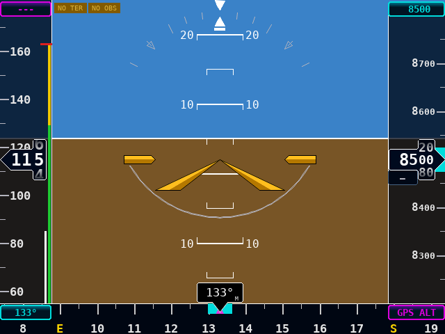

The display is divided into five fixed zones:

| Zone | Width / Height | Content |
|------|---------------|---------|
| Left tape | 74 px wide | Airspeed |
| Right tape | 82 px wide | Altitude + VSI |
| Centre AI | remainder | Attitude (plain horizon) |
| Bottom strip | 44 px tall | Heading tape |
| Top strip | 22 px tall | Bug readouts |

Everything is rendered at 30 fps directly on the framebuffer — there is no operating-system UI underneath.

---

## 2. Airspeed Tape

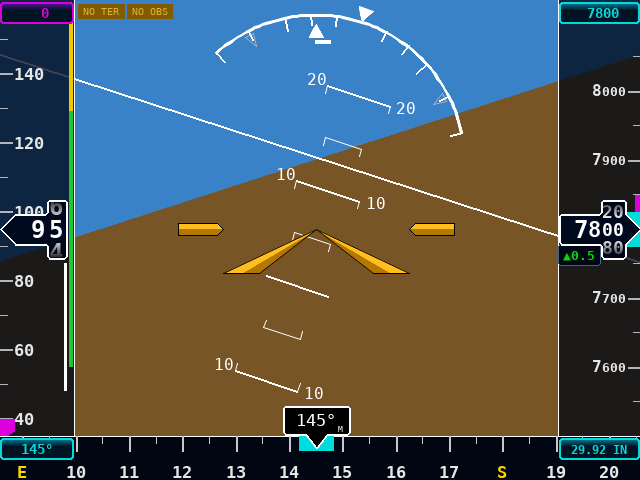

### Reading the tape

The tape scrolls so that current airspeed is always at the centred Veeder-Root drum readout. The drum shows two-digit resolution; the tenths digit rolls smoothly so over-speed trends are obvious at a glance.

### Colour arcs (right edge of tape)

| Arc | Colour | Meaning |
|-----|--------|---------|
| White | White | VS0 – VFE — flap operating range |
| Green | Green | VS1 – VNO — normal operating range |
| Yellow | Yellow | VNO – VNE — caution / structural |
| Red line | Red | VNE — never-exceed |

The drum numerals turn **yellow** above VNO and **red** above VNE to reinforce the overspeed warning.

### Speed bug

A chevron marker on the tape tracks the speed bug. The button at the **top** of the airspeed tape shows the bug value or `---` when not set. Tap it to enter a new value with the numpad.

The bug and its readout button are **colour-coded by data source**:

| Colour | Source |
|--------|--------|
| Magenta | GPS groundspeed (GS) — current hardware default |
| Cyan | IAS sensor — when a pitot/static airspeed transducer is fitted |

---

## 3. Altitude Tape and VSI

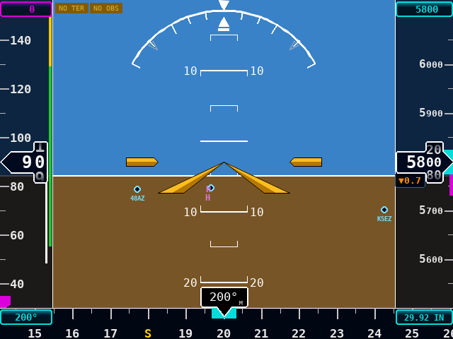

### Altitude tape

Current altitude is shown in the Veeder-Root drum on the right side. The tape scrolls in 50 ft increments with labels every 100 ft.

The **altitude bug** chevron marks the selected target altitude. Tap the bug button at the **top** of the alt tape to change it. Entry is in hundreds of feet — type `85` and the display shows `8500 ft`.

The bug and its readout button are **colour-coded by altitude source**:

| Colour | Source |
|--------|--------|
| Cyan | Barometric altitude (BME280 active) — primary |
| Magenta | GPS altitude (baro sensor failed or absent) — degraded |

### Baro setting

The button at the **bottom-right** of the heading strip shows the current baro setting:

| Display | Colour | Meaning |
|---------|--------|---------|
| `29.92 IN` | Cyan | BME280 active; inHg |
| `1013 hPa` | Cyan | BME280 active; hPa unit selected |
| `GPS ALT` | Magenta | No baro sensor; GPS altitude used |

Tap the box to adjust the baro setting with the numpad when the sensor is active.

### VSI (vertical speed indicator)

A thin green / amber bar runs along the inner edge of the alt tape. It deflects upward for climbs and downward for descents. Scale is ±2000 fpm. The bar turns amber above ±1500 fpm.

---

## 4. Attitude Indicator

### Horizon background

The Pi Zero 2W version uses a **plain horizon background**: solid blue sky above the horizon line and solid brown ground below. Synthetic Vision Terrain (SVT) background rendering is not available on this version due to the Pi Zero 2W's GPU limitations. For SVT terrain rendering, see the Pi 4 version.

**Note:** Although the AI background does not show terrain, SRTM terrain data is still used for **TAWS proximity alerting** (see Section 14). Terrain and obstacle proximity banners function normally when terrain tiles are loaded.

### Pitch ladder

Grey pitch bars are drawn at ±5°, ±10°, ±15°, ±20°, ±30°. The bars narrow as pitch increases, consistent with the GI-275 style. The horizon bar is white.

### Roll arc and pointer

A graduated arc at the top of the AI shows bank angle using the **sky-pointer** convention: the arc and its tick marks (10°, 20°, 30°, 45°, 60° either side) rotate with the sky. The fixed aircraft reference inside the arc stays at the top of the screen and reads the current bank angle directly on the graduated scale. A moving outer doghouse marks the sky's "up" direction.

### Aircraft symbol

An amber swept-delta wing symbol sits fixed at the AI centre.

### Slip/skid indicator

A short white horizontal bar (16×4 px) sits below the roll pointer's doghouse base and slides laterally with uncoordinated flight. Centred under the zero-bank triangle = coordinated flight. Step on the rudder toward the bar to re-centre it — the direction mimics the ball of a conventional turn-coordinator inclinometer.

### Terrain / obstacle proximity alert

A banner appears centred at the top of the display when terrain or an obstacle is within a critical clearance margin:

**TERRAIN CAUTION** (amber, steady) — terrain or obstacle MSL height is within **500 ft** below aircraft altitude.

**PULL UP TERRAIN** (red, 1 Hz flash) — terrain or obstacle MSL height is within **100 ft** below aircraft altitude.

Requires a valid GPS fix and SRTM terrain tiles or obstacle data to be loaded.

---

## 5. Heading Tape

The heading tape runs across the bottom of the screen.

### Heading source modes

**MAG mode (default):** Heading from the Pico W magnetometer. Heading box has a dim border and `M` subscript.

**GPS TRK mode:** Heading slewed to GPS ground track via complementary filter. Heading box border turns **magenta**, subscript changes to `G`. The `GPS TRK` badge appears.

### Track pointer

When GPS fix is valid and in MAG mode, a **magenta** tick mark shows GPS ground track. Drift between heading and track tick indicates wind. Magenta matches the PFD's data-source convention: GPS-derived values and indicators are magenta; sensor-derived values are cyan.

### Heading bug

A chevron marker tracks the HDG bug. Tap the readout button (bottom-left) to enter a new heading. Colour-coded: CYAN (MAG mode) / MAGENTA (GPS TRK mode).

---

## 6. Status Badges

Badges appear **only when something requires attention** — the strip is blank during normal flight.

| Badge | Colour | Meaning |
|-------|--------|---------|
| `AHRS FAIL` | Red | IMU data absent or invalid |
| `NO LINK` | Red | SSE stream not connected |
| `NO TER` | Amber | No SRTM terrain tiles loaded |
| `NO OBS` | Amber | No FAA obstacle data loaded |
| `EXP OBS` | Orange | Obstacle data > 28 days old |
| `NO APT` | Amber | No airport data loaded |
| `EXP APT` | Orange | Airport data older than expiry |
| `GPS TRK` | Magenta | GPS TRK heading mode active |
| `GPS ALT` | Amber | Altitude from GPS (baro failed) |
| `GPS` *N*`sat` | Amber | GPS acquiring — *N* satellites |
| `NO GPS` | Red | No GPS signal |

---

## 7. Setting Bugs

Three settable bugs — altitude, heading, and ground-speed.

### Numpad entry

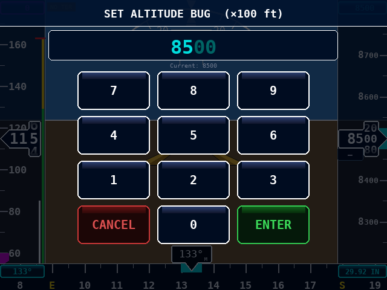

Tap the readout button for the bug you want to change. The numpad overlays the live PFD.

| Key | Action |
|-----|--------|
| `0–9` | Append digit |
| `⌫` | Delete last digit |
| `ENTER` | Accept |
| `CANCEL` | Discard |

**Altitude bug** entry is in hundreds of feet. Type `85` for `8500 ft`.

**Heading bug** is 3 digits (0–360).

**GS bug** is whole-number knots.

### Adjusting baro

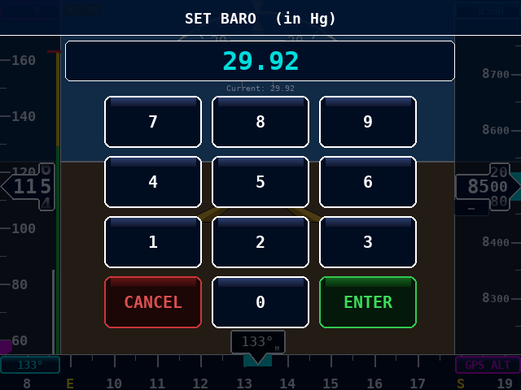

Tap the baro button. **inHg mode**: type four digits, decimal auto-inserted after second digit (e.g. `2992` → `29.92`). **hPa mode**: plain four-digit integer.

### Tapping the tape directly

Tap the **heading tape** to jump the bug to that bearing. Tap the **altitude tape** to set the bug (nearest 100 ft).

### Clearing a bug

Enter `0` and press `ENTER`.

---

## 8. Setup Menu

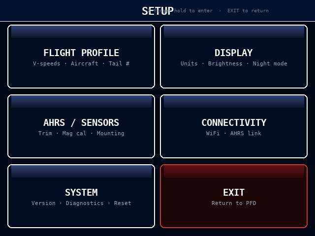

Two-finger press-and-hold anywhere on the PFD for 0.8 seconds.

| Tile | Screen |
|------|--------|
| FLIGHT PROFILE | V-speeds, callsign |
| DISPLAY | Units, brightness |
| AHRS / SENSORS | Trim, mounting, heading/airspeed source |
| CONNECTIVITY | AHRS URL, WiFi |
| SYSTEM | Version, terrain/obstacle data, simulator |
| EXIT | Return to PFD |

---

## 9. Flight Profile — V-Speeds and Callsign

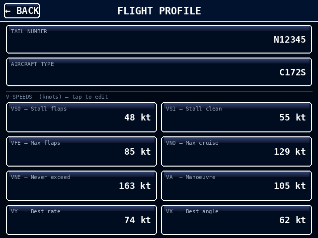

| Field | Default | Meaning |
|-------|---------|---------|
| VS0 | 48 kt | Stall — flaps full |
| VS1 | 55 kt | Stall — clean |
| VFE | 85 kt | Max flap extension |
| VNO | 129 kt | Max structural cruising |
| VNE | 163 kt | Never-exceed |
| VA  | 105 kt | Maneuvering |
| VY  | 74 kt | Best rate of climb |
| VX  | 62 kt | Best angle of climb |

Defaults are Cessna 172S. Tap any V-speed box to enter a new value. **RESET DEFAULTS** restores all values.

### Aircraft callsign

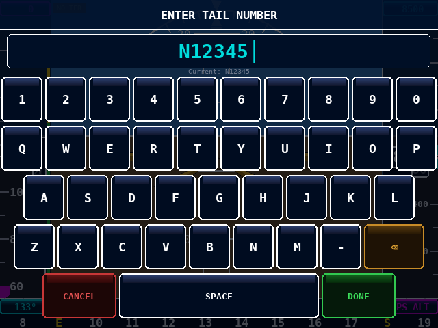

Tap the CALLSIGN box to open the keyboard. Type the tail number and tap DONE.

---

## 10. Display Settings


### Speed units
**KT**, **MPH**, or **KPH**. All V-speed arcs and GS bug scale together.

### Altitude units
**FT** or **M**.

### Pressure units
**inHg** or **hPa**.

### Brightness
Tap **−** or **+** to step between levels 1–10.

---

## 11. AHRS / Sensors

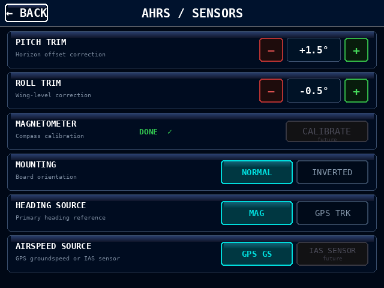

### Pitch trim
Corrects horizon pitch on level ground. ±0.5° steps.

### Roll trim
Corrects horizon tilt. ±0.5° steps.

### Mounting orientation
**NORMAL** (label up) or **INVERTED** (label down).

### Heading source

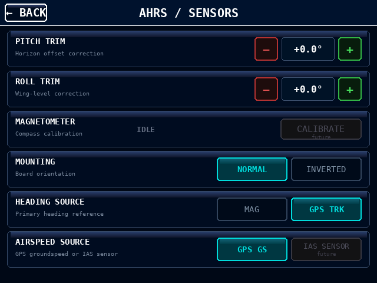

| Option | Behaviour |
|--------|-----------|
| **MAG** | Magnetometer heading. `M` subscript. |
| **GPS TRK** | Heading slaved to GPS track. `G` subscript, magenta border. |

### Airspeed source

| Option | Behaviour |
|--------|-----------|
| **GPS GS** | GPS groundspeed. Magenta readout. |
| **IAS SENSOR** | Pitot/static sensor. Cyan readout. *(Future)* |

---

## 12. Connectivity

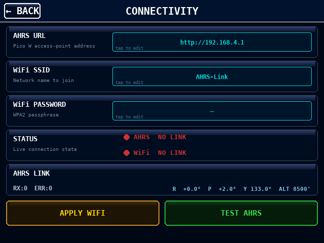

### AHRS URL
Default `http://192.168.4.1`. Tap to edit. SSE stream reconnects on DONE.

### WiFi SSID / PASSWORD
Tap **APPLY WIFI** to write config and switch networks.

### TEST AHRS
Attempts TCP connection to AHRS URL. Shows success/failure message.

---

## 13. System

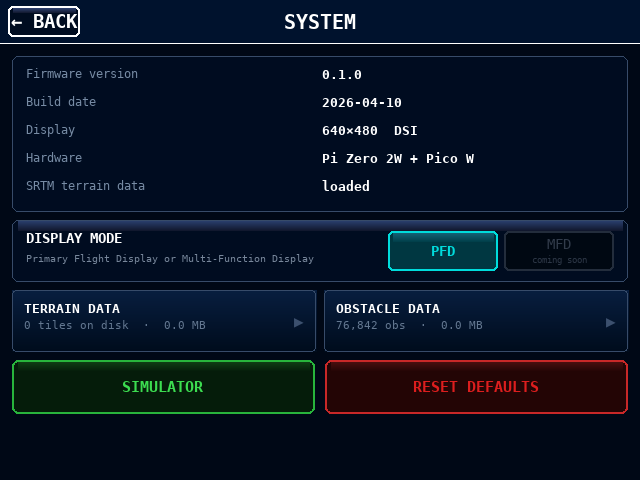

Shows firmware version, build date, display resolution, platform, terrain/obstacle status. Buttons for DIAGNOSTICS (future), RESET DEFAULTS, and FLIGHT SIMULATOR.

All configurable settings — V-speeds, tail number, units, backlight brightness, colour scheme, heading-source mode, Wi-Fi SSID, airport display filters, and the runway/centerline overlay toggles — persist across power cycles in `pi_zero/data/settings.json`. The file is written atomically on a background thread with a 1.5 s debounce, so rapid successive taps produce a single write with no UI stutter. The Wi-Fi password is intentionally *not* stored — it must be re-entered when joining a new network.

---

## 14. Terrain Data Download


SRTM elevation tiles are used on this version for **TAWS proximity alerting only** — they do not render a terrain background on the attitude indicator. (For terrain background rendering, use the Pi 4 version.)

Tiles are stored in `pi_zero/data/srtm/` as `.hgt` files (~1 MB each).

### Downloading a preset region


Six preset regions: US Southwest, US Pacific, US Southeast, US Northeast, Alaska, Canada.

Tap the region button to start. Progress bar and tile count update during download. **CANCEL** aborts; already-downloaded tiles are kept.

### Current area

**CURRENT AREA** downloads ±2° around the current GPS position. Requires GPS fix.

### WiFi requirement

The Pi must be on an internet-reachable network to download. Switch to home WiFi via Connectivity, download here, then switch back to Pico W AP for flight.

---

## 15. Obstacle Data Download

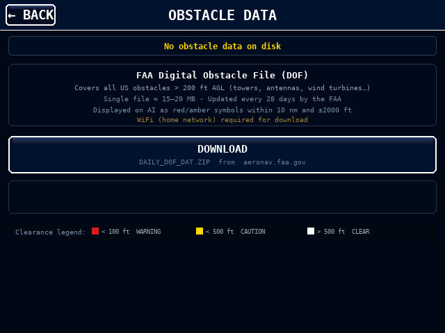

FAA Digital Obstacle File adds tower, antenna, and wind-turbine symbols to the display. Obstacles within **10 nm** and **±2000 ft** are shown.

Tap **DOWNLOAD** to fetch from aeronav.faa.gov. Progress bar updates. After download, file is extracted and parsed automatically.

Once loaded, obstacles appear as coloured symbols:

| Symbol colour | Meaning |
|--------------|---------|
| Red | Within **100 ft** below aircraft |
| Amber/yellow | Within **500 ft** below aircraft |
| White | Cleared by more than 500 ft |

Red dot above symbol = lit obstacle. FAA publishes new data every 28 days.

---

## 16. Airport Data Download

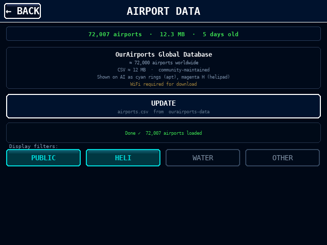

The OurAirports.com global database adds airport and heliport symbols to the attitude indicator within 20 nm of the aircraft. About 72,000 airports worldwide.

### Symbols on the AI

| Symbol | Meaning |
|--------|---------|
| Cyan ring with dark centre | Public airport (small / medium / large) |
| Outer ring added | Medium or large public airport |
| Magenta "H" | Heliport |
| Cyan circle with wavy underscore | Seaplane base |
| Grey triangle | Balloonport |

Airport identifier (e.g. "KSEZ") shown within 15 nm as a small "road sign" — a coloured text box on a thin vertical post above the symbol, so the label rises clear of terrain. Beyond 15 nm only the symbol is drawn (declutter).

### Display filters

The AIRPORT DATA screen has four type filters and two overlay toggles:

| Filter | Controls | Default |
|--------|----------|---------|
| **PUBLIC** | Small / medium / large public airports | On |
| **HELI** | Heliports | On |
| **WATER** | Seaplane bases | Off |
| **OTHER** | Balloonports + uncategorised | Off |
| **RUNWAYS** | Runway polygons (within 8 nm) | On |
| **EXT C/LINES** | Dashed extended centerlines (within 15 nm) | On |

Tap to toggle. Useful for decluttering on dense urban sectional overlay (e.g. disable HELI near cities) or turning off EXT C/LINES en-route.

All filter and toggle states persist across power cycles — the settings file is written atomically on a background thread to avoid flight-display stutters.

### Runways and extended centerlines

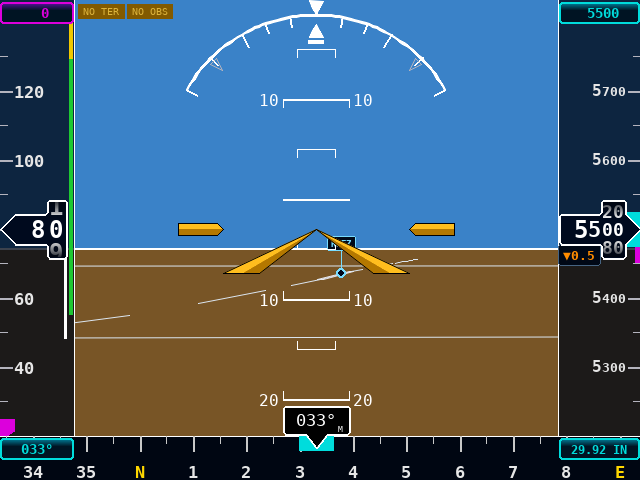

Within 8 nm of an airport, a tan polygon is drawn for each runway, projected from the thresholds' lat/lon/elevation so runways translate, rotate, and scale naturally with aircraft position, bank and pitch. Runway width is taken from the OurAirports database.

Extended centerlines (dashed) project 10 nm outward from each threshold along the runway bearing, visible within 15 nm of the airport. At night, lit runways are distinguishable from unlit by the runway edge colour. The centerlines give an at-a-glance final-approach reference for visual approaches without requiring a flight plan.

Runway data comes from OurAirports `runways.csv` (~14,700 runways worldwide) and is downloaded alongside the airport CSV in a single UPDATE action.

### Downloading

Tap **AIRPORTS** on the System screen → **DOWNLOAD** to fetch `airports.csv` (~12 MB) plus `runways.csv` (~3 MB) from the OurAirports GitHub mirror.

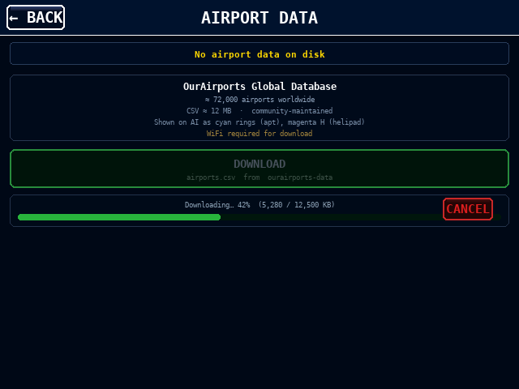

Progress bar + CANCEL work the same as the obstacle download. After download the CSV is parsed into a NumPy cache for fast future loads.

### Update schedule

Community-maintained, updated frequently. Local expiry: 60 days — then the `EXP APT` badge appears as a reminder. Data remains usable past expiry.

### WiFi requirement

The Pi Zero must be on an internet-reachable network to download. Switch to home Wi-Fi via Connectivity, download here, then switch back to Pico W AP for flight.

---

## 17. Demo Mode

Scripted flight over **Sedona, Arizona (KSEZ)** without Pico W hardware.

```bash
python3 pi_zero/pfd.py --demo
```

Windowed mode for development:
```bash
python3 pi_zero/pfd.py --demo --sim
```

Cycles through: level cruise → climbing left turn → level cruise → descending right turn.

Press **D** on a keyboard to toggle demo mode during bench testing.

---

## 18. Flight Simulator

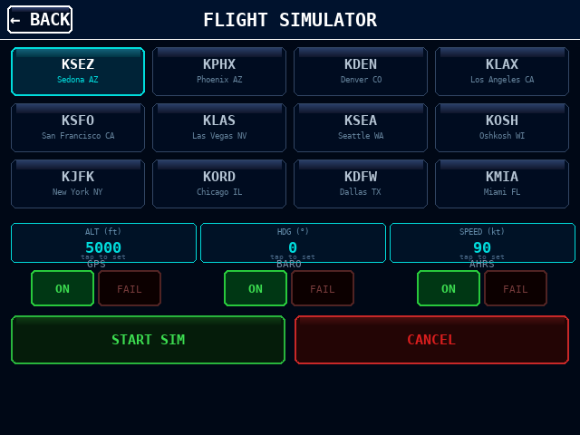

A full-PFD flight simulator is built in. It drives every instrument on the display through an internal physics + autopilot model, so every tape, badge, bug, terrain-awareness alert, and airport / runway overlay behaves exactly as it would with a live AHRS link. No Pico W and no network are needed.

### Starting

Setup → System → **FLIGHT SIMULATOR**. The setup screen lets you pick:

| Control | Purpose |
|---------|---------|
| Airport preset grid | 12 US airports covering mountain, coastal, plains, and desert terrain. Tap to highlight (cyan border). Starts the simulator parked on the field at the runway elevation. |
| **ALT / HDG / SPEED** tiles | Tap a tile to open the numpad and set the initial cruise altitude, heading, and indicated airspeed the autopilot will fly to once airborne. |
| **GPS / BARO / AHRS** ON / FAIL pairs | Inject a sensor failure before the sim starts. FAIL makes the corresponding badge appear (`NO GPS`, `GPS ALT`, `AHRS FAIL`) and disables that sensor's contribution to the flight model so you can practice partial-panel scenarios. |
| **START SIM** / **CANCEL** | Start drops you at the selected airport and immediately commands a takeoff; the autopilot holds the initial ALT / HDG / SPD targets. |

### 12 airport presets

KSEZ, KPHX, KDEN, KLAX, KSFO, KLAS, KSEA, KOSH, KJFK, KORD, KDFW, KMIA — chosen for geographic variety so you can watch TAWS caution/warning thresholds and obstacle proximity alerts behave naturally in different environments. Sedona (KSEZ) is the default because the surrounding red-rock mesas exercise the terrain proximity alerting dramatically.

### While the simulator is running

- A small `SIM` watermark appears at the centre of the AI.
- Tap the watermark to open the **SIM CONTROLS** overlay on top of the live PFD — here you can toggle GPS/BARO/AHRS failures mid-flight and exit back to the setup screen.
- All three bug controls (ALT / HDG / SPD) remain active — set a new bug and the autopilot will fly to it. That's how you explore turns, climbs, descents, and arrivals at other airports.
- Baro setting, display units, filters, and every other adjustment take effect in real time just as they would in the aircraft.

### Failure injection

Inject a sensor failure either before start (SIM SETUP) or mid-flight (SIM CONTROLS).

| Failure | Effect |
|---------|--------|
| **GPS** | `NO GPS` badge, magenta ground-track tick hidden, GPS-TRK mode forced off, airport and runway overlays dim. |
| **BARO** | `GPS ALT` badge; altitude tape falls back to GPS altitude; baro setting shows `GPS ALT` in magenta. |
| **AHRS** | `AHRS FAIL` badge; attitude freezes (classic AI fail). Tapes still work from GPS. |

All failures revert the moment you toggle back to ON — use them for quick what-if drills and recovery procedures.

### Exit

SIM CONTROLS → **EXIT SIM** returns you to the live PFD. If no AHRS unit is connected the display simply shows stale indications (`NO LINK`). If you're connected to the Pico W AHRS, live data resumes immediately.

---

## Quick-Reference Card

| Action | How |
|--------|-----|
| Open setup menu | Two-finger hold 0.8 s |
| Close setup menu | Tap EXIT |
| Set altitude bug | Tap top of alt tape → numpad |
| Set heading bug | Tap bottom-left of heading strip → numpad |
| Set GS bug | Tap top of speed tape → numpad |
| Tap altitude tape | Jumps alt bug to tapped altitude |
| Tap heading tape | Jumps HDG bug to tapped heading |
| Adjust baro | Tap bottom-right of heading strip → numpad |
| Adjust brightness | Setup → Display → − / + |
| Start simulator | Setup → System → FLIGHT SIMULATOR → START |
| SIM controls | Tap SIM watermark on AI |
| Exit simulator | SIM controls → EXIT SIM |

---

*This document covers the Pi Zero 2W version (no SVT). For the Pi 4 version with full SVT, see USER_MANUAL_PI4.md.*
