# AHRS PFD — Pi Zero 2W Pilot's User Manual

**Software version 0.3 · Hardware: AHRS PCB rev A (Pico W + WT901 + NEO-6M + BME280 + SDP33-1500Pa) + Pi Zero 2W · Display: Waveshare 3.5" DPI LCD (640×480)**

*No SVT version — plain horizon background with TAWS alerting*

> This manual covers the Pi Zero 2W version. For the full SVT version (Pi 4), see USER_MANUAL_PI4.md.

---

## Contents

1. [Screen Overview](#1-screen-overview)
2. [Airspeed Tape](#2-airspeed-tape)
3. [Altitude Tape and VSI](#3-altitude-tape-and-vsi)
4. [Attitude Indicator](#4-attitude-indicator)
5. [Heading Tape](#5-heading-tape)
6. [Status Badges](#6-status-badges)
7. [Setting Bugs](#7-setting-bugs)
8. [Setup Menu](#8-setup-menu)
9. [Flight Profile — V-Speeds and Callsign](#9-flight-profile--v-speeds-and-callsign)
10. [Display Settings](#10-display-settings)
11. [AHRS / Sensors](#11-ahrs--sensors)
12. [Connectivity](#12-connectivity)
13. [System](#13-system)
14. [Terrain Data Download](#14-terrain-data-download)
15. [Obstacle Data Download](#15-obstacle-data-download)
16. [Airport Data Download](#16-airport-data-download)
16A. [Full-Screen MFD](#16a-full-screen-mfd)
16B. [Weather](#16b-weather)
16C. [Traffic (ADS-B / FIS-B IN)](#16c-traffic-ads-b--fis-b-in)
17. [Demo Mode](#17-demo-mode)
18. [Flight Simulator](#18-flight-simulator)
19. [AHRS PCB and Air-Data Hardware](#19-ahrs-pcb-and-air-data-hardware)

---

## 1. Screen Overview

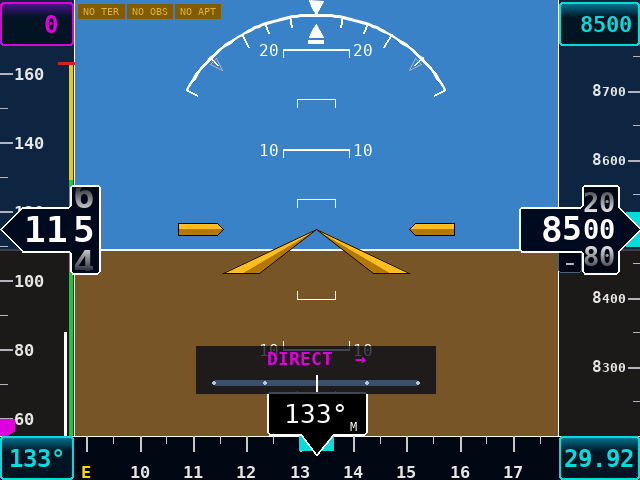

The display is divided into five fixed zones:

| Zone | Width / Height | Content |
|------|---------------|---------|
| Left tape | 74 px wide | Airspeed |
| Right tape | 82 px wide | Altitude + VSI |
| Centre AI | remainder | Attitude (plain horizon) |
| Bottom strip | 44 px tall | Heading tape |
| Top strip | 22 px tall | Bug readouts |

Everything is rendered at 30 fps directly on the framebuffer — there is no operating-system UI underneath.

---

## 2. Airspeed Tape

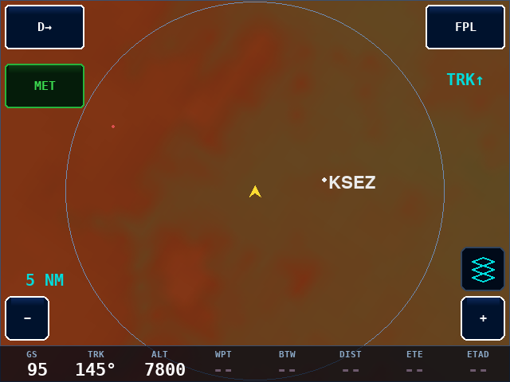

### Reading the tape

The tape scrolls so that current airspeed is always at the centred **Veeder-Root drum** readout. The drum shows two-digit resolution: the **ones** digit rolls smoothly on a narrow inner cell to the right, and the **tens** digit cascades one slot up when the ones cross 9 → 0. A faint preview of the next digit (and the digit two slots above) peeks in from the top of the box so crossings through 10 / 100 are obvious at a glance.

### Colour arcs (right edge of tape)

| Arc | Colour | Meaning |
|-----|--------|---------|
| White | White | VS0 – VFE — flap operating range |
| Green | Green | VS1 – VNO — normal operating range |
| Yellow | Yellow | VNO – VNE — caution / structural |
| Red line | Red | VNE — never-exceed |

The drum numerals turn **yellow** above VNO and **red** above VNE to reinforce the overspeed warning.

### Speed bug

A chevron marker on the tape tracks the speed bug. The button at the **top** of the airspeed tape shows the bug value or `---` when not set. Tap it to enter a new value with the numpad.

The bug and its readout button are **colour-coded by data source**:

| Colour | Source |
|--------|--------|
| Cyan | IAS — SDP33-1500Pa differential-pressure sensor with BME280 density correction. Default when the AHRS reports `airdata_ok = True`. |
| Magenta | GPS groundspeed (GS) — fallback when the SDP33 isn't healthy or AIRSPEED SOURCE is forced to GPS GS in AHRS / Sensors. |

---

## 3. Altitude Tape and VSI

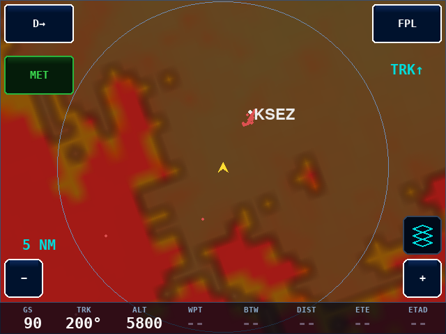

### Altitude tape

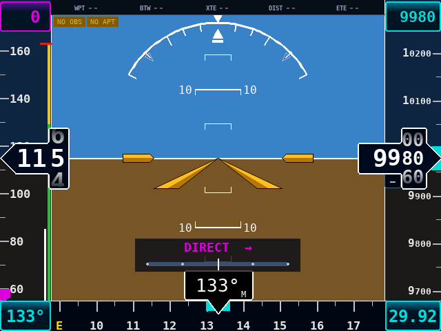

Current altitude is shown in the Veeder-Root drum on the right side. The tape scrolls in 50 ft increments with labels every 100 ft. The drum renders as two (below 100 ft) or three (above) independent cells that cascade at the correct rates — the altitude value is always the number vertically centred in the large outer cell, and the leading column reveals the next digit one slot above so transitions through 1000 / 10000 ft stay readable.

The **altitude bug** chevron marks the selected target altitude. Tap the bug button at the **top** of the alt tape to change it. Entry is in hundreds of feet — type `85` and the display shows `8500 ft`.

The bug and its readout button are **colour-coded by altitude source**:

| Colour | Source |
|--------|--------|
| Cyan | Barometric altitude (BME280 active) — primary |
| Magenta | GPS altitude (baro sensor failed or absent) — degraded |

### Baro setting

The button at the **bottom-right** of the heading strip shows the current baro setting:

| Display | Colour | Meaning |
|---------|--------|---------|
| `29.92 IN` | Cyan | BME280 active; inHg |
| `1013 hPa` | Cyan | BME280 active; hPa unit selected |
| `GPS ALT` | Magenta | No baro sensor; GPS altitude used |

Tap the box to adjust the baro setting with the numpad when the sensor is active.

### VSI (vertical speed indicator)

A thin green / amber bar runs along the inner edge of the alt tape. It deflects upward for climbs and downward for descents. Scale is ±2000 fpm. The bar turns amber above ±1500 fpm.

---

## 4. Attitude Indicator

### Horizon background

The Pi Zero 2W version uses a **plain horizon background**: solid blue sky above the horizon line and solid brown ground below. Synthetic Vision Terrain (SVT) background rendering is not available on this version due to the Pi Zero 2W's GPU limitations. For SVT terrain rendering, see the Pi 4 version.

**Note:** Although the AI background does not show terrain, SRTM terrain data is still used for **TAWS proximity alerting** (see Section 14). Terrain and obstacle proximity banners function normally when terrain tiles are loaded.

### Pitch ladder

Grey pitch bars are drawn at ±5°, ±10°, ±15°, ±20°, ±30°. The bars narrow as pitch increases, consistent with the GI-275 style. The horizon bar is white.

### Roll arc and pointer

A graduated arc at the top of the AI shows bank angle using the **sky-pointer** convention: the arc and its tick marks (10°, 20°, 30°, 45°, 60° either side) rotate with the sky. The fixed aircraft reference inside the arc stays at the top of the screen and reads the current bank angle directly on the graduated scale. A moving outer doghouse marks the sky's "up" direction.

### Aircraft symbol

An amber swept-delta wing symbol sits fixed at the AI centre.

### Slip/skid indicator

A short white horizontal bar (16×4 px) sits below the roll pointer's doghouse base and slides laterally with uncoordinated flight. Centred under the zero-bank triangle = coordinated flight. Step on the rudder toward the bar to re-centre it — the direction mimics the ball of a conventional turn-coordinator inclinometer.

### Terrain / obstacle proximity alert

A banner appears centred at the top of the display when terrain or an obstacle is within a critical clearance margin:

**TERRAIN CAUTION** (amber, steady) — terrain or obstacle MSL height is within **500 ft** below aircraft altitude.

**PULL UP TERRAIN** (red, 1 Hz flash) — terrain or obstacle MSL height is within **100 ft** below aircraft altitude.

**Low-speed inhibit**: alerts are silenced below **VS0** (default 48 kt). Taxi, takeoff roll and landing rollout don't trip a continuous alert — the alert pipeline only arms above the configured stall speed. (The Pi 4 also adds forward look-ahead and voice callouts on top of this; the Pi Zero variant has neither because it doesn't run an audio stack and the spot-sampled terrain check is adequate for the slower airframes this build typically serves.)

Requires a valid GPS fix and SRTM terrain tiles or obstacle data to be loaded.

---

## 5. Heading Tape

The heading tape runs across the bottom of the screen.

### Heading source modes

**MAG mode (default):** Heading from the Pico W magnetometer. Heading box has a dim border and `M` subscript.

**GPS TRK mode:** Heading slewed to GPS ground track via complementary filter. Heading box border turns **magenta**, subscript changes to `G`. The `GPS TRK` badge appears.

### Track pointer

When GPS fix is valid and in MAG mode, a **magenta** tick mark shows GPS ground track. Drift between heading and track tick indicates wind. Magenta matches the PFD's data-source convention: GPS-derived values and indicators are magenta; sensor-derived values are cyan.

### Heading bug

A chevron marker tracks the HDG bug. Tap the readout button (bottom-left) to enter a new heading. Colour-coded: CYAN (MAG mode) / MAGENTA (GPS TRK mode).

---

## 6. Status Badges

Badges appear **only when something requires attention** — the strip is blank during normal flight.

| Badge | Colour | Meaning |
|-------|--------|---------|
| `AHRS FAIL` | Red | IMU data absent or invalid |
| `NO LINK` | Red | SSE stream not connected |
| `NO TER` | Amber | No SRTM terrain tiles loaded |
| `NO OBS` | Amber | No FAA obstacle data loaded |
| `EXP OBS` | Orange | Obstacle data > 28 days old |
| `NO APT` | Amber | No airport data loaded |
| `EXP APT` | Orange | Airport data older than expiry |
| `GPS TRK` | Magenta | GPS TRK heading mode active |
| `GPS ALT` | Amber | Altitude from GPS (baro failed) |
| `GPS` *N*`sat` | Amber | GPS acquiring — *N* satellites |
| `NO GPS` | Red | No GPS signal |

---

## 7. Setting Bugs

Three settable bugs — altitude, heading, and ground-speed — plus the baro setting. All four use the same numpad overlay.

### Bug buttons on the PFD

The bug buttons fill the full heading-strip height so they're easy to hit without looking away from the horizon.

| Button | Location | Opens |
|--------|----------|-------|
| **Speed bug** | Top of airspeed tape | SET SPD BUG |
| **Altitude bug** | Top of altitude tape | SET ALTITUDE BUG |
| **HDG bug** | Bottom-left of heading strip | SET HDG BUG |
| **Baro** | Bottom-right of heading strip | SET BARO inHg / SET BARO hPa |

### Numpad entry

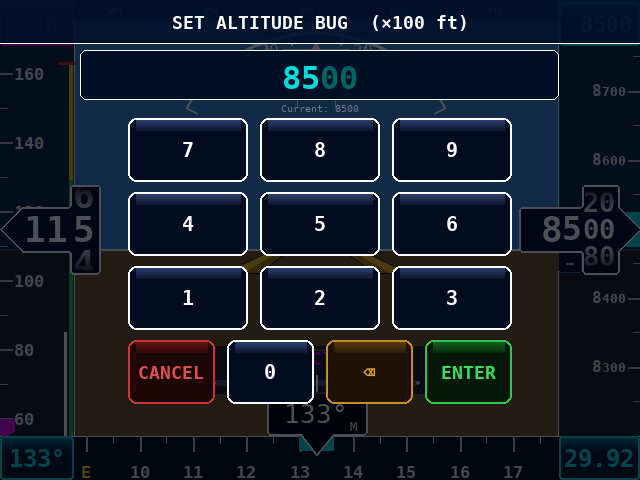

Tap the readout button for the bug you want to change. The numpad overlays the live PFD. **The current value is shown as a dim placeholder** under the entry field — the input starts empty so tapping ENTER without typing keeps the previous value.

| Key | Action |
|-----|--------|
| `0–9` | Append digit to buffer |
| `⌫` | Delete last digit |
| `ENTER` | Commit (or keep current value if buffer empty) |
| `CANCEL` | Discard |

| Target | Entry | Example |
|--------|-------|---------|
| Altitude | hundreds of feet | `85` → `8500 ft` |
| Heading | 3 digits | `270` → `270°` |
| Speed | whole knots | `90` → `90 kt` |

### Adjusting baro

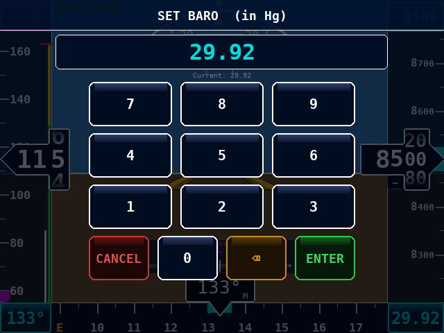

Tap the baro button. The numpad title switches between **SET BARO inHg** and **SET BARO hPa** based on the unit selected in Display Settings, and pre-populates the placeholder with the current baro value.

- **inHg mode**: type four digits, decimal auto-inserted after second digit (`2992` → `29.92`).
- **hPa mode**: plain four-digit integer (`1013`).

### Tapping the tape directly

Tap the **heading tape** to jump the bug to that bearing. Tap the **altitude tape** to set the bug (nearest 100 ft).

### Clearing a bug

Enter `0` and press `ENTER`. (Baro resets to 29.92 in / 1013 hPa.)

---

## 8. Setup Menu

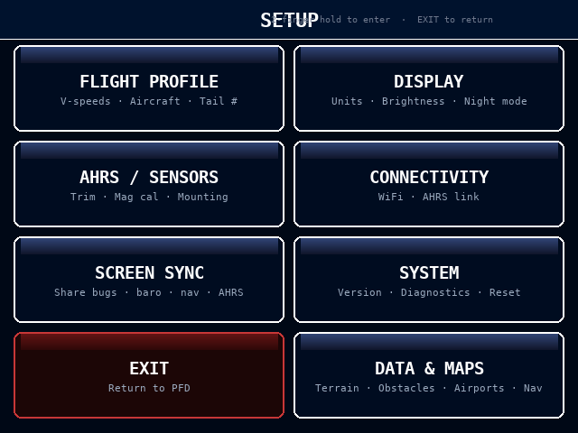

Two-finger press-and-hold anywhere on the PFD for 0.8 seconds.

| Tile | Screen |
|------|--------|
| FLIGHT PROFILE | V-speeds, callsign |
| DISPLAY | Units, brightness, map layers |
| AHRS / SENSORS | Trim, mounting, heading/airspeed source |
| CONNECTIVITY | AHRS URL, WiFi |
| SYSTEM | Version, ENABLE MFD, terrain/obstacle data, simulator |
| EXIT | Return to PFD |

### Gestures — multi-finger holds

Two distinct multi-finger gestures exist on the PFD/MFD view; the count of fingers held disambiguates them. The number of fingers is locked in by the *peak* count during the hold, so a stray third finger after 0.8 s won't accidentally fire the setup hold.

| Gesture | Duration | Effect |
|---------|---------:|--------|
| 2-finger hold | 0.8 s | Enter Setup menu (this screen) |
| 3-finger hold | 2.0 s | Swap PFD ↔ MFD view (only when ENABLE MFD is ON — see §13) |

A short, deliberate gesture for entering setup and a longer, harder-to-misfire gesture for the in-flight view swap. The MFD's own top-right **PFD** button is still a valid tap-back; the gesture is the workflow-friendly version that works from either side without hunting for a button.

---

## 9. Flight Profile — V-Speeds and Callsign

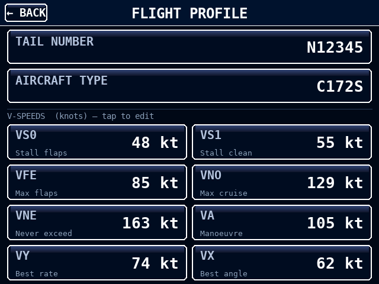

| Field | Default | Meaning |
|-------|---------|---------|
| VS0 | 48 kt | Stall — flaps full |
| VS1 | 55 kt | Stall — clean |
| VFE | 85 kt | Max flap extension |
| VNO | 129 kt | Max structural cruising |
| VNE | 163 kt | Never-exceed |
| VA  | 105 kt | Maneuvering |
| VY  | 74 kt | Best rate of climb |
| VX  | 62 kt | Best angle of climb |

Defaults are Cessna 172S. Tap any V-speed box to enter a new value. **RESET DEFAULTS** restores all values.

### Aircraft callsign and A/C type

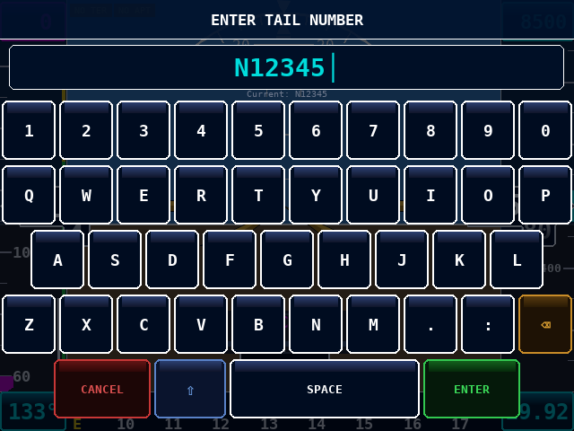

Tap the **CALLSIGN** or **A/C TYPE** box to open the on-screen keyboard. The current field value is pre-populated so you can edit in place.

Rows:

1. `1 2 3 4 5 6 7 8 9 0`
2. `Q W E R T Y U I O P`
3. `A S D F G H J K L`
4. `Z X C V B N M . : ⌫`

Action row: **CANCEL**, hyphen (`-`), **SPACE**, **DONE**. The period (`.`) and colon (`:`) keys are useful when editing the AHRS URL from the Connectivity screen, which uses this same keyboard. **⌫** deletes one character from the end of the buffer.

---

## 10. Display Settings

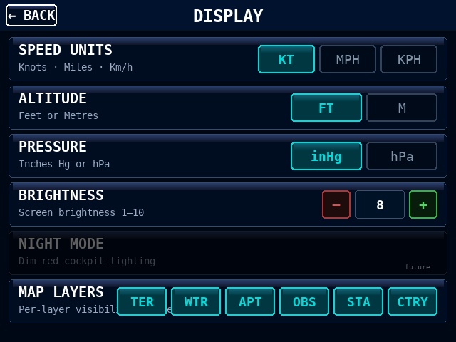

### Speed units
**KT**, **MPH**, or **KPH**. All V-speed arcs and GS bug scale together.

### Altitude units
**FT** or **M**.

### Pressure units
**inHg** or **hPa**.

### Brightness
Tap **−** or **+** to step between levels 1–10. Routed to a hardware-PWM channel on **GPIO 18** (configured by the `dtoverlay=pwm,pin=18,func=2` line in `/boot/firmware/config.txt`); `pfd.service`'s `ExecStartPre` block runs as root once at boot to export the channel, set the period (1 kHz) and polarity (inversed — the Waveshare 3.5" DPI backlight is active-low), and hand a group-writable `duty_cycle` node to the unprivileged PFD process. The slider value is persisted in `data/settings.json` and restored on every boot.

The 1–10 scale maps to PWM duty via a hand-tuned non-linear curve, not a linear ramp: the LED driver in the Waveshare panel doesn't conduct below ~22 % duty (anything dimmer is indistinguishable from off), so level 1 lives at the conduction floor and the bottom of the slider has 4–5 % steps for fine control in a dim cockpit. The top half steps at ~11 % so each click is daylight-visible.

| Level | Duty | Use |
|------:|-----:|-----|
| 1 | 22 % | Dimmest visible — night cockpit floor |
| 2 | 26 % | |
| 3 | 30 % | |
| 4 | 35 % | |
| 5 | 44 % | |
| 6 | 55 % | |
| 7 | 67 % | |
| 8 | 78 % | Default |
| 9 | 89 % | |
| 10 | 100 % | Full bright — daylight |

If the slider doesn't change panel output, check `journalctl -u pfd.service -b | grep '\[BL\]'`. The expected line is `[BL] Using PWM backlight: /sys/class/pwm/pwmchip0/pwm0/duty_cycle (period=1000000 ns)`. If you see `[BL] No backlight control available` instead, either the `dtoverlay=pwm,...` line isn't in `config.txt` or `pfd.service` was installed before the backlight-PWM patch landed (re-run `sudo bash pi_zero/setup.sh`).

### MAP LAYERS

A row of six toggle pills that gate which optional layers render on the MFD (and, in future, the moving-map inset). Each pill is independently on/off and persists in `data/settings.json`.

| Pill | Layer |
|------|-------|
| **TER** | Hypsometric terrain tint (SRTM elevation → colour ramp) |
| **WTR** | Water mask (oceans + lakes rasterised from Natural Earth, painted blue) |
| **APT** | Airport / heliport / seaplane base symbols |
| **OBS** | FAA DOF obstacles (towers, antennas, wind turbines) |
| **STA** | State / province boundary polylines (Natural Earth admin_1), appears at ≥ 20 NM range |
| **CTRY** | Country boundary polylines (Natural Earth admin_0), tan colour distinct from STA's slate-blue, also ≥ 20 NM |

Toggling a pill takes effect on the next frame. Layers that aren't available because their data hasn't been downloaded yet (e.g. CTRY before the first water-mask download) silently no-op — the pill stays in whatever state you left it.

### Winds aloft (WND overlay)

Wind barbs + temperatures aloft can be overlaid on the MFD. Cycle the **OVLY** label (lower-left of the map) to **WND**. The data is the GFS pressure-level forecast from Open-Meteo (internet, US-only, no key). Identical to the Pi 4 — see the Pi 4 manual §16E for the full description. In brief:

- **Barbs** are standard met barbs (pennants 50 kt / full 10 kt / half 5 kt), shaft toward the source, with the temperature (°C) tagged beside each.
- **Altitude button** cycles **3k / 6k / 9k / 12k / 18k ft**; **forecast-time button** steps `NOW` / `+3h` / … (48 h carried per pull).
- The WND page keeps its **own zoom (40 / 80 / 160 NM only)**; barbs hide below 40 NM.
- A **`WINDS n/6 · age`** status line shows grid fill + age (green when all six zones are loaded, amber while filling).
- Winds are a **cached national grid (6 zones), pulled on the ground and written to disk** (`data/winds/conus_winds.json`), re-pulled only when a zone is **> 3 h** stale — so they survive a restart and work with no in-flight connection.
- **Multi-display sharing:** when more than one screen is on the cabin network with screen-sync enabled, the one with internet fetches and broadcasts each zone and the others **adopt it without calling Open-Meteo** — one display feeds the whole panel and the per-IP rate limit is never an issue.

(Pi Zero has no flight-path-vector marker yet — that's pi4 + iPhone only for now.)

---

## 11. AHRS / Sensors

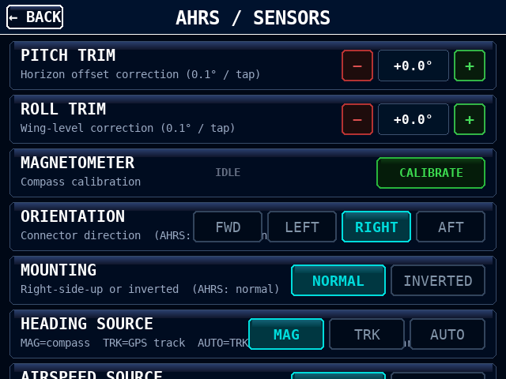

### Pitch trim
Corrects horizon pitch on level ground. ±0.5° steps.

### Roll trim
Corrects horizon tilt. ±0.5° steps.

### Mounting orientation
**NORMAL** (label up) or **INVERTED** (label down).

### Heading source

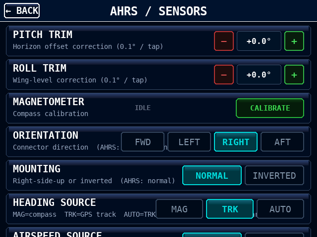

| Option | Behaviour |
|--------|-----------|
| **MAG** | Magnetometer heading. `M` subscript. |
| **GPS TRK** | Heading slaved to GPS track. `G` subscript, magenta border. |

### Airspeed source

| Option | Behaviour |
|--------|-----------|
| **IAS SENSOR** | SDP33-1500Pa differential pressure + BME280 density correction. Cyan readout. Default when the AHRS reports `airdata_ok`. |
| **GPS GS** | GPS groundspeed. Magenta readout. Auto fallback when SDP33 is absent / unhealthy. |

---

## 12. Connectivity

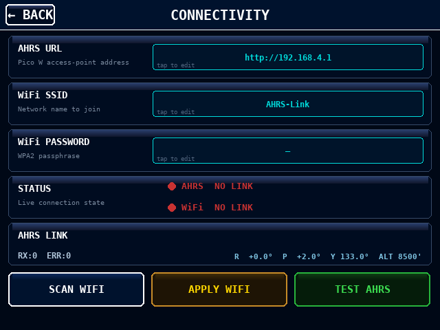

### AHRS URL
Default `http://192.168.4.1`. Tap to edit — the keyboard lets you enter URLs directly (`.` and `:` are on the main QWERTY). The SSE stream reconnects when you tap DONE.

### WiFi SSID / PASSWORD
Tap either box to edit. Tap **APPLY WIFI** to write the config and switch networks. The Wi-Fi password is intentionally **not** persisted in `settings.json` — it must be re-entered when joining a new network.

### NOTAM CLIENT ID / SECRET
Optional. Paste a free FAA NOTAM API key (**client_id** / **client_secret**, from **api.faa.gov**) to enable NOTAMs in the MET readout picker (§16B). The secret is masked; the poller reads them live (no reboot). Blank = NOTAMs off, rest of weather unaffected.

### STATUS row
Two coloured badges:

- **AHRS** — green "CONNECTED" when the SSE link is up; red "NO LINK" otherwise.
- **WiFi** — when up, shows `WiFi: <ssid>` with the actual network name the Pi is associated to (from `iwgetid`, truncated with `…` if longer than 18 chars); red "NO LINK" otherwise.

### AHRS LINK diagnostics row
Second status row, visible even when the AHRS badge is red so you can see **why**:

- Transport + port on the left (typically `WIFI http://192.168.4.1` on the Pi Zero 2W — USB serial fallback is Pi 4 only).
- **RX:** counter — frames received since boot (should tick ~20×/s on a healthy link).
- **ERR:** counter — parse failures.
- Last error string (truncated).
- Live **R / P / Y / ALT** on the right — confirms sensor output is sane. If RX climbs but R/P/Y stay at `+0.0°` the firmware is alive but the WT901 isn't talking (check TX→RX wiring).

### TEST AHRS
Issues a one-shot HTTP GET to the AHRS URL and reports success/failure. Use after APPLY WIFI to verify the Pi actually reaches the Pico W.

---

## 13. System

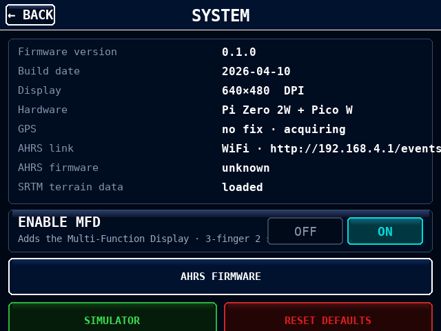

Shows firmware version, build date, display resolution, platform, terrain/obstacle status. Buttons for DIAGNOSTICS (future), RESET DEFAULTS, and FLIGHT SIMULATOR.

### ENABLE MFD

A single OFF / ON toggle row that gates the Multi-Function Display feature. The MFD is a full-screen 2D moving-map view (terrain, airports, obstacles, state + country boundaries) that replaces the AI horizon when active.

- **OFF** (default): the 3-finger swap gesture (§8) is disarmed and `display_mode` is pinned to `pfd`. The MFD is unreachable.
- **ON**: the 3-finger 2 s hold on either the PFD or the MFD flips between them. Once enabled the gesture is the day-to-day mode swap — you don't need to come back into Setup to change views.

The default is OFF so a fresh install boots straight to the PFD. If an older settings file already had `display_mode = "mfd"` (the legacy toggle), the system auto-migrates it to `mfd_enabled = True` on first boot after upgrade so existing piZ users don't have to re-find the option.

Disabling ENABLE MFD also forces the runtime view back to PFD immediately — a stale "I was on the MFD when I last shut down" state can't strand you in a view the feature gate now says shouldn't exist.

### Persistence

All configurable settings — V-speeds, tail number, units, backlight brightness, colour scheme, heading-source mode, Wi-Fi SSID, airport display filters, runway/centerline overlay toggles, ENABLE MFD, MAP LAYERS — persist across power cycles in `pi_zero/data/settings.json`. The file is written atomically on a background thread with a 1.5 s debounce, so rapid successive taps produce a single write with no UI stutter. The Wi-Fi password is intentionally *not* stored — it must be re-entered when joining a new network.

---

## 14. Terrain Data Download

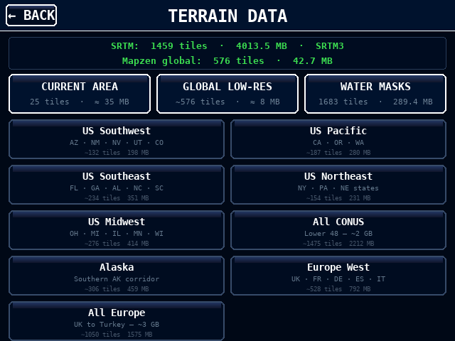

SRTM elevation tiles are used on this version for **TAWS proximity alerting only** — they do not render a terrain background on the attitude indicator. (For terrain background rendering, use the Pi 4 version.)

Tiles are stored in `pi_zero/data/srtm/` as `.hgt` files (~1 MB each).

### Downloading a preset region

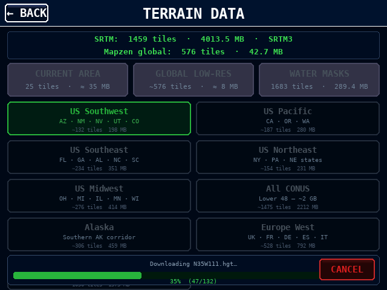

Nine preset regions. Each tile shows coverage, approximate tile count, and estimated disk size:

| Region | Coverage | ~Tiles | ~Size |
|--------|----------|-------:|------:|
| US Southwest | AZ · NM · NV · UT · CO | 132 | 198 MB |
| US Pacific | CA · OR · WA | 187 | 280 MB |
| US Southeast | FL · GA · AL · NC · SC | 234 | 351 MB |
| US Northeast | NY · PA · NE states | 154 | 231 MB |
| US Midwest | OH · MI · IL · MN · WI | 276 | 414 MB |
| All CONUS | Lower 48 — single-tap | ~1,475 | ~2 GB |
| Alaska | Southern AK corridor | 306 | 459 MB |
| Europe West | UK · FR · DE · ES · IT | 528 | 792 MB |
| All Europe | UK to Turkey | ~1,050 | ~3 GB |

Tap the region button to start. Progress bar and tile count update during download. **CANCEL** aborts; already-downloaded tiles are kept. Re-tapping a region after a partial download resumes (existing tiles are skipped).

### Current area

**DOWNLOAD CURRENT AREA** at the top of the screen downloads a 5°×5° box (~25 tiles, ~35 MB) centred on the current GPS position — the fastest way to get alerting data for an unfamiliar area. Requires GPS fix.

### WiFi requirement

The Pi must be on an internet-reachable network to download. Switch to home WiFi via Connectivity, download here, then switch back to Pico W AP for flight.

---

## 15. Obstacle Data Download

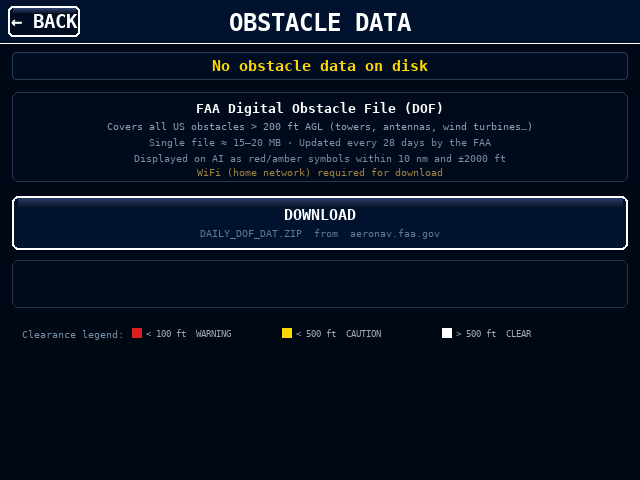

FAA Digital Obstacle File adds tower, antenna, and wind-turbine symbols to the display. Obstacles within **10 nm** and **±2000 ft** are shown.

Tap **DOWNLOAD** to fetch from aeronav.faa.gov. Progress bar updates. After download, file is extracted and parsed automatically.

Once loaded, obstacles appear as coloured symbols:

| Symbol colour | Meaning |
|--------------|---------|
| Red | Within **100 ft** below aircraft |
| Amber/yellow | Within **500 ft** below aircraft |
| White | Cleared by more than 500 ft |

Red dot above symbol = lit obstacle. FAA publishes new data every 28 days.

---

## 16. Airport Data Download

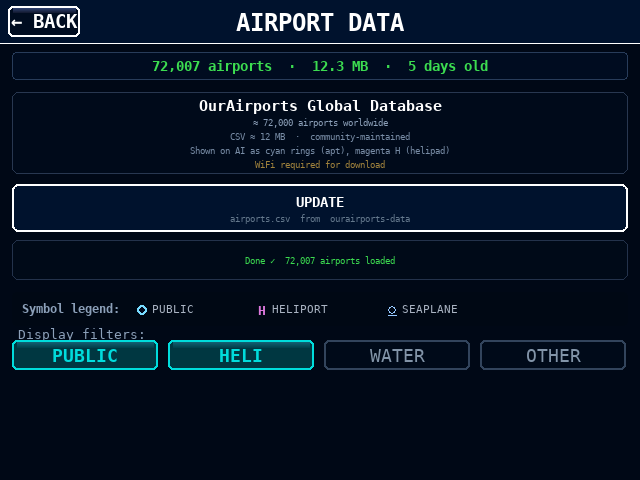

The OurAirports.com global database adds airport and heliport symbols to the attitude indicator within 20 nm of the aircraft. About 72,000 airports worldwide.

### Symbols on the AI

| Symbol | Meaning |
|--------|---------|
| Cyan ring with dark centre | Public airport (small / medium / large) |
| Outer ring added | Medium or large public airport |
| Magenta "H" | Heliport |
| Cyan circle with wavy underscore | Seaplane base |
| Grey triangle | Balloonport |

Airport identifier (e.g. "KSEZ") shown within 15 nm as a small "road sign" — a coloured text box on a thin vertical post above the symbol, so the label rises clear of terrain. Beyond 15 nm only the symbol is drawn (declutter).

### Display filters

The AIRPORT DATA screen has four type filters and two overlay toggles:

| Filter | Controls | Default |
|--------|----------|---------|
| **PUBLIC** | Small / medium / large public airports | On |
| **HELI** | Heliports | On |
| **WATER** | Seaplane bases | Off |
| **OTHER** | Balloonports + uncategorised | Off |
| **RUNWAYS** | Runway polygons (within 8 nm) | On |
| **EXT C/LINES** | Dashed extended centerlines (within 15 nm) | On |

Tap to toggle. Useful for decluttering on dense urban sectional overlay (e.g. disable HELI near cities) or turning off EXT C/LINES en-route.

All filter and toggle states persist across power cycles — the settings file is written atomically on a background thread to avoid flight-display stutters.

### Runways and extended centerlines

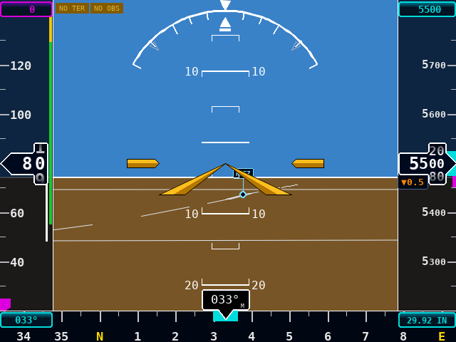

Within 8 nm of an airport, a tan polygon is drawn for each runway, projected from the thresholds' lat/lon/elevation so runways translate, rotate, and scale naturally with aircraft position, bank and pitch. Runway width is taken from the OurAirports database.

Extended centerlines (dashed) project 10 nm outward from each threshold along the runway bearing, visible within 15 nm of the airport. At night, lit runways are distinguishable from unlit by the runway edge colour. The centerlines give an at-a-glance final-approach reference for visual approaches without requiring a flight plan.

Runway data comes from OurAirports `runways.csv` (~14,700 runways worldwide) and is downloaded alongside the airport CSV in a single UPDATE action.

### Downloading

Tap **AIRPORTS** on the System screen → **DOWNLOAD** to fetch `airports.csv` (~12 MB) plus `runways.csv` (~3 MB) from the OurAirports GitHub mirror.

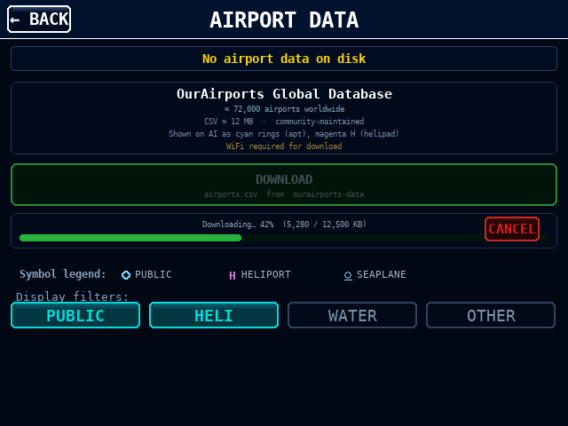

Progress bar + CANCEL work the same as the obstacle download. After download the CSV is parsed into a NumPy cache for fast future loads.

### Update schedule

Community-maintained, updated frequently. Local expiry: 60 days — then the `EXP APT` badge appears as a reminder. Data remains usable past expiry.

### WiFi requirement

The Pi Zero must be on an internet-reachable network to download. Switch to home Wi-Fi via Connectivity, download here, then switch back to Pico W AP for flight.

---

## 16A. Full-Screen MFD

The Pi Zero has a full-screen moving-map MFD in addition to the PFD.

- **Swap PFD ↔ MFD:** a **3-finger hold (~2 s)** (the 2-finger 0.8 s hold opens the setup menu — §8). The swap is gated by **ENABLE MFD** (§13); the unit boots to the PFD.
- **Chrome:** **D→** (direct-to) top-left, **FPL** top-right, the **TRK↑/N↑** orientation label, **OVLY** overlay cycle, the **RNG** label, **−/+** zoom buttons, and a **CTR** recenter button that appears when the map is panned. Drag the map to pan; tap **CTR** (or the own-ship chevron) to recenter.
- **Data strip:** a bottom row of **8 readout slots** (GS · TRK · ALT · WPT · BTW · DIST · ETE · ETA by default); tap a slot to reassign it. Persists in `data/settings.json`.

The map's **MAP LAYERS** (§10) and the **winds (WND)** overlay (§10) render here, plus the weather and traffic overlays below.

## 16B. Weather

The Pi Zero shows the same internet + FIS-B weather as the Pi 4 — METARs, TAFs, AIRMETs/SIGMETs, NEXRAD, NOTAMs, and winds aloft. **See Pi 4 manual §16F for the full description**; the Pi Zero behaves the same. In brief:

- **Source toggle** — tap the **WX** status line to cycle **RADIO / AUTO / INET** (a parallel **ADS-B** line does the same for traffic). Status reads e.g. `WX AUTO R3 I12 2m` (mode · radio count · internet count · age; green = receiving, amber = none yet). Readouts are tagged `FIS-B` / `INET` with a data-age.
- **OVLY cycle** — tap the **OVLY** label to step the single active overlay: **ASP → TFC → MET → WND → NEX**.
- **MET page** — station dots coloured by category (**green VFR · blue MVFR · red IFR · magenta LIFR**); tap a dot for the **METAR / TAF / AIRMET / SIGMET / NOTAM** readout picker (nearest-first, scrollable, ON-ROUTE flags). Graphical AIRMET/SIGMET areas are tappable.
- **NEX page** — NEXRAD reflectivity with receipt-age and **valid**-age badges (green < 10 min, amber < 20, red beyond).
- **Winds (WND)** — see §10.

NOTAMs need the free FAA key entered in Connectivity (§12).

## 16C. Traffic (ADS-B / FIS-B IN)

Nearby aircraft from ADS-B IN (radio GDL90/UDP or the built-in internet feed; tap the **ADS-B** status line to cycle the source). Behaviour matches Pi 4 §16G:

- **Diamonds** with a heading leader and a relative-altitude tag; colour by threat — **red alert** (≤ 3 NM and ≤ 600 ft), **amber proximate** (≤ 6 NM and ≤ 1200 ft), **cyan** advisory.
- On non-traffic pages traffic is clamped to nearby; the **TFC** page shows everything. **Alert-class is never hidden.** Tap a target for the detail card; declutter with **TFC ALT** / **TFC RANGE** (§10).
- **Collision alert:** a flashing red **TRAFFIC** banner when a new target enters the alert envelope. **The Pi Zero is visual-only — there is no "Traffic, Traffic" voice callout** (no audio stack); the banner is the alert.

---

## 17. Demo Mode

Scripted flight over **Sedona, Arizona (KSEZ)** without Pico W hardware.

```bash
python3 pi_zero/pfd.py --demo
```

Windowed mode for development:
```bash
python3 pi_zero/pfd.py --demo --sim
```

Cycles through: level cruise → climbing left turn → level cruise → descending right turn.

Press **D** on a keyboard to toggle demo mode during bench testing.

---

## 18. Flight Simulator

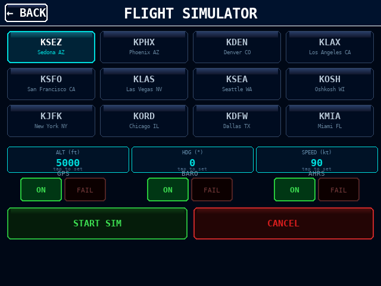

A full-PFD flight simulator is built in. It drives every instrument on the display through an internal physics + autopilot model, so every tape, badge, bug, terrain-awareness alert, and airport / runway overlay behaves exactly as it would with a live AHRS link. No Pico W and no network are needed.

### Starting

Setup → System → **FLIGHT SIMULATOR**. The setup screen lets you pick:

| Control | Purpose |
|---------|---------|
| Airport preset grid | 12 US airports covering mountain, coastal, plains, and desert terrain. Tap to highlight (cyan border). Starts the simulator parked on the field at the runway elevation. |
| **ALT / HDG / SPEED** tiles | Tap a tile to open the numpad and set the initial cruise altitude, heading, and indicated airspeed the autopilot will fly to once airborne. |
| **GPS / BARO / AHRS** ON / FAIL pairs | Inject a sensor failure before the sim starts. FAIL makes the corresponding badge appear (`NO GPS`, `GPS ALT`, `AHRS FAIL`) and disables that sensor's contribution to the flight model so you can practice partial-panel scenarios. |
| **START SIM** / **CANCEL** | Start drops you at the selected airport and immediately commands a takeoff; the autopilot holds the initial ALT / HDG / SPD targets. |

### 12 airport presets

KSEZ, KPHX, KDEN, KLAX, KSFO, KLAS, KSEA, KOSH, KJFK, KORD, KDFW, KMIA — chosen for geographic variety so you can watch TAWS caution/warning thresholds and obstacle proximity alerts behave naturally in different environments. Sedona (KSEZ) is the default because the surrounding red-rock mesas exercise the terrain proximity alerting dramatically.

### While the simulator is running

- A small `SIM` watermark appears at the centre of the AI.
- Tap the watermark to open the **SIM CONTROLS** overlay on top of the live PFD — here you can toggle GPS/BARO/AHRS failures mid-flight and exit back to the setup screen.
- All three bug controls (ALT / HDG / SPD) remain active — set a new bug and the autopilot will fly to it. That's how you explore turns, climbs, descents, and arrivals at other airports.
- Baro setting, display units, filters, and every other adjustment take effect in real time just as they would in the aircraft.

### Failure injection

Inject a sensor failure either before start (SIM SETUP) or mid-flight (SIM CONTROLS).

| Failure | Effect |
|---------|--------|
| **GPS** | `NO GPS` badge, magenta ground-track tick hidden, GPS-TRK mode forced off, airport and runway overlays dim. |
| **BARO** | `GPS ALT` badge; altitude tape falls back to GPS altitude; baro setting shows `GPS ALT` in magenta. |
| **AHRS** | `AHRS FAIL` badge; attitude freezes (classic AI fail). Tapes still work from GPS. |

All failures revert the moment you toggle back to ON — use them for quick what-if drills and recovery procedures.

### Exit

SIM CONTROLS → **EXIT SIM** returns you to the live PFD. If no AHRS unit is connected the display simply shows stale indications (`NO LINK`). If you're connected to the Pico W AHRS, live data resumes immediately.

---

## 19. AHRS PCB and Air-Data Hardware

The AHRS sensor head is shared with the Pi 4 build — a single PCB carrying the Pico W, WT901 IMU, NEO-6M GPS, BME280 baro and SDP33-1500Pa differential-pressure sensor. The Pi Zero 2W consumes the same `$AHRS` packet over USB serial (or SSE over Wi-Fi).

### Pin map (AHRS PCB rev A)

| Function | Pico pin | Pico GP |
|----------|---------:|--------:|
| WT901 (UART0 TX/RX) | 1 / 2 | GP0 / GP1 |
| BME280 + SDP33 (I²C1 SDA/SCL) | 4 / 5 | GP2 / GP3 |
| NEO-6M (UART1 TX/RX) | 6 / 7 | GP4 / GP5 |

I²C1 carries the BME280 at `0x76`, the SDP33 at `0x21`, and reserves `0x22` for the future AOA twin (see `Docs/BUGS_AND_TODO.md → AOA-PROBE`).

### Speed tape source

With the SDP33 installed and `airdata_ok` reported, the Pi Zero speed tape and bug switch to cyan (IAS) and stop being a re-skin of GPS groundspeed. The numpad entry units don't change — knots in, knots out — but the value now responds to airspeed instead of crab-corrupted ground speed. In wind the tape will read differently from the magenta GPS tick on the heading bar; the difference *is* the wind, and a healthy reading is also visible on the AHRS LINK diagnostics row of the Connectivity screen (`ias_kt` value, `airdata_ok` badge).

### SDP33 range note

The SDP33-1500Pa saturates around 97 kt IAS at sea level — comfortably above S-21 cruise. At altitude the saturation point moves up with density, so a 100 kt IAS / 8500 ft cruise stays in range. See the Pi 4 manual §21 for the full saturation table and the `dp_pa` diagnostics.

### Recapturing the zero offset

The firmware captures a zero offset 2 s after boot, assuming the aircraft is stationary. For an in-flight reboot or a long ground hold with a temperature swing, recapture from the Pi Zero AHRS / Sensors screen if the **SDP ZERO** row is present, or hit `GET http://192.168.4.1/sdp_zero` from any browser on the Pico W AP.

---

## Quick-Reference Card

| Action | How |
|--------|-----|
| Open setup menu | Two-finger hold 0.8 s |
| Close setup menu | Tap EXIT |
| Set altitude bug | Tap top of alt tape → numpad |
| Set heading bug | Tap bottom-left of heading strip → numpad |
| Set GS bug | Tap top of speed tape → numpad |
| Tap altitude tape | Jumps alt bug to tapped altitude |
| Tap heading tape | Jumps HDG bug to tapped heading |
| Adjust baro | Tap bottom-right of heading strip → numpad |
| Adjust brightness | Setup → Display → − / + |
| Start simulator | Setup → System → FLIGHT SIMULATOR → START |
| SIM controls | Tap SIM watermark on AI |
| Exit simulator | SIM controls → EXIT SIM |

---

*This document covers the Pi Zero 2W version (no SVT). For the Pi 4 version with full SVT, see USER_MANUAL_PI4.md.*
